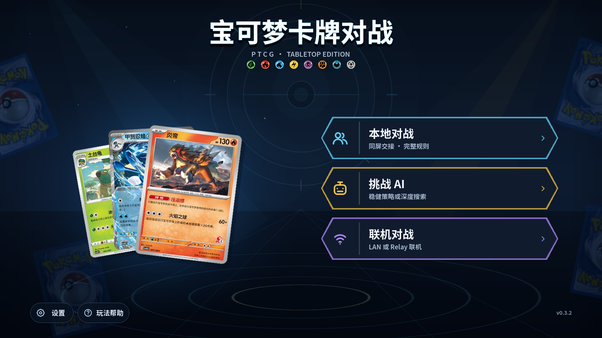

# PokemonTCG

基于 Godot 4.7 的宝可梦卡牌对战游戏，当前版本为 0.8.0。产品支持本地双人、
Challenge AI、ENet LAN 与 WebSocket Relay；协议与存档边界保持 Action 4、
ChoiceView 2、Protocol 6、Snapshot 3、Journal 1 和 RNG 2。



## 代码边界

- `native/ptcg_core`：无 Godot/Python 业务依赖的权威规则与内容编译器。
- `native/challenge_core`：唯一的产品 AI 策略与 `ChallengeController`。
- `native/relay_server`：独立发布的 Boost.Beast Protocol v6 Relay。
- `godot/native/bindings`：Godot 类型转换及 `NativeContentCompiler` 等绑定。
- `godot/authoring`：卡牌、牌组、策略和 VM 描述符的唯一 JSON 作者源。
- `godot`：发布客户端、UI、网络、生成数据与唯一卡图资源。
- `research/deep_ai`：独立 Python 研究项目，不进入产品构建、客户端包或常规 CI。

产品业务不再包含 Python。Python 只作为 SCons 的构建解释器；Deep AI 的 Python 依赖和
产物全部留在研究目录。版本、Android versionCode、发布牌组和 schema 的唯一清单是
[`godot/data/release_manifest.json`](godot/data/release_manifest.json)。
Godot 继续使用 SCons 的背景见其
[build-system FAQ](https://docs.godotengine.org/en/latest/about/faq.html#why-does-godot-use-the-scons-build-system)。

## 开发与验证

```powershell
python -m pip install "scons==4.10.1"
.\tools\setup_godot_toolchain.ps1
.\tools\setup_native_ai_deps.ps1
.\tools\test_fast.ps1
.\tools\test_standard.ps1
.\tools\test_godot_ai.ps1
```

卡牌内容统一通过 Godot headless + C++ 编译：

```powershell
.\tools\content.ps1 lint
.\tools\content.ps1 status -Json
.\tools\content.ps1 test -CardId svi-chim
.\tools\content.ps1 export
.\tools\content.ps1 check
```

启动和打包独立 Relay：

```powershell
.\tools\build_relay.ps1 -Configuration release
.\native\relay_server\bin\ptcg_relay_server.exe `
  --host 127.0.0.1 --port 8766 --threads 2 --max-rooms 100
.\tools\package_relay.ps1
```

公网 `wss://` 由 Caddy/Nginx 终止 TLS，示例见
[`deploy/relay`](deploy/relay)。Relay 不会放入客户端发布包。

构建 Windows/Android 客户端与发布包：

```powershell
.\tools\setup_android_toolchain.ps1
.\tools\build_native_ai.ps1 -Target all -Configuration all
.\tools\build_godot.ps1 -Target all -Configuration debug
.\tools\package_release.ps1 -AndroidSigning test
.\tools\test_release.ps1
```

Deep AI 研究说明见 [`research/deep_ai/README.md`](research/deep_ai/README.md)，
手动验证入口为 `research/deep_ai/tools/test_research_smoke.ps1`。

更多资料：[`docs/README.md`](docs/README.md)、
[`docs/GODOT_DEVELOPMENT_GUIDE.md`](docs/GODOT_DEVELOPMENT_GUIDE.md)、
[`docs/RULES.md`](docs/RULES.md)。

卡牌名称、规则和图片仅供学习交流。
