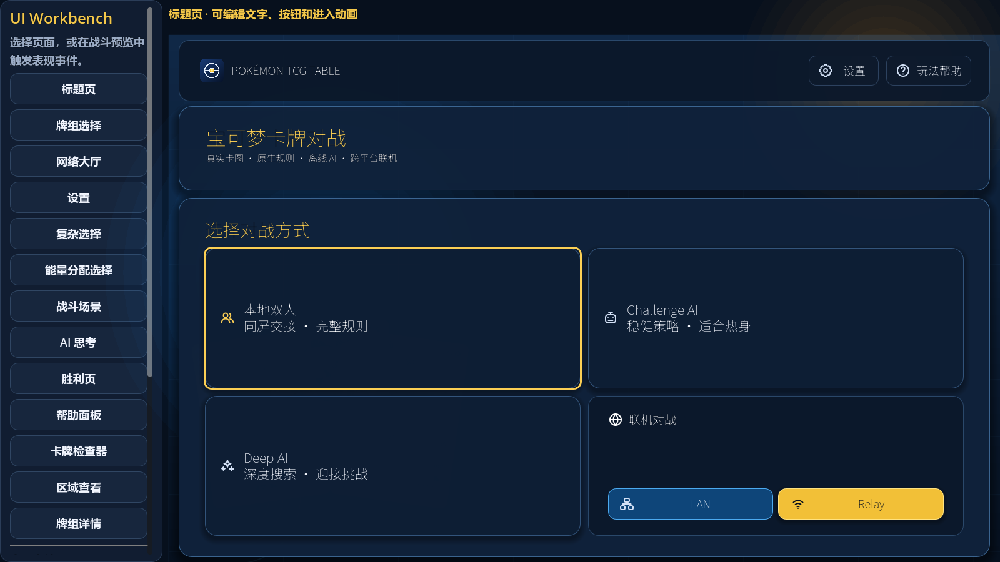
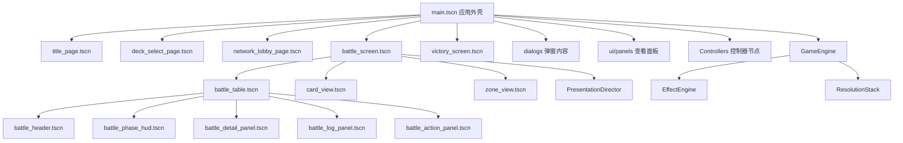
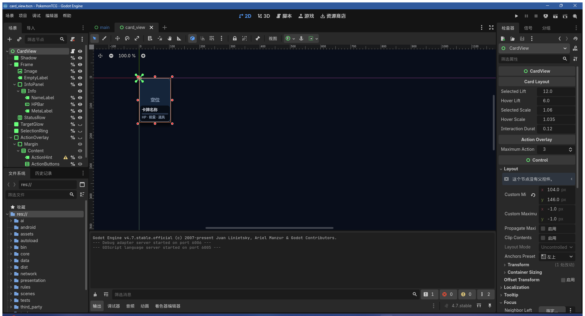
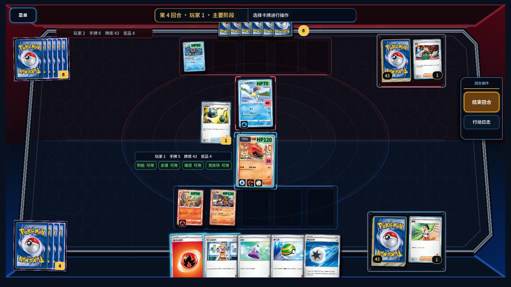
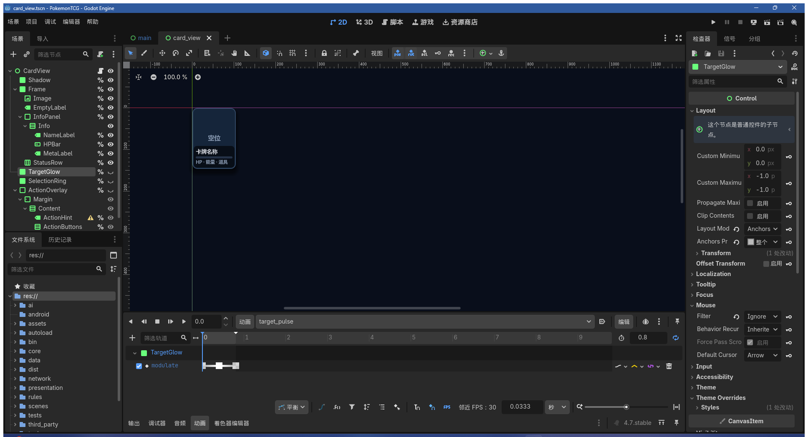
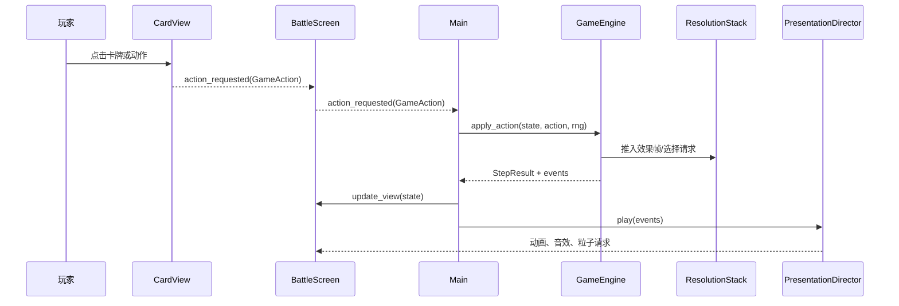
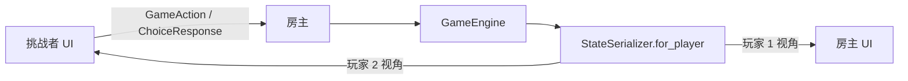
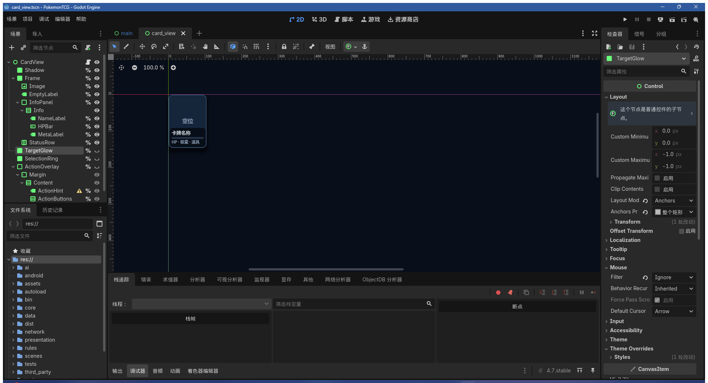

# Pokémon TCG Godot 4.7 新手开发手册

本手册面向会使用变量、函数、条件语句和数组，但没有 Godot 开发经验的维护者。
目标不是让你背下所有 API，而是让你能够在编辑器中安全地修改场景、UI、动画和
游戏逻辑，并知道每次修改后应该怎样验证。

> 项目使用 Godot 4.7。Godot 4 已经移除 VisualScript，因此复杂规则不会变成
> “拖节点编程”。本项目的分工是：场景树编辑结构，Inspector 编辑参数，
> AnimationPlayer 编辑固定时间轴，信号连接用户意图，GDScript 实现可测试的规则。

## 1. 第一次打开工程

在仓库根目录执行：

```powershell
.\tools\setup_godot_toolchain.ps1
.\.tools\godot-4.7\Godot_v4.7-stable_win64.exe --editor --path .\godot
```

工具链安装在 `.tools/`，不会修改系统 `PATH`。编辑器打开后，先认识这些区域：

| 区域 | 你会用它做什么 | 新手提示 |
|---|---|---|
| Scene | 查看和选择当前场景的节点树 | 节点越靠上越像“容器”，节点越靠下越像具体文字、按钮、图片 |
| FileSystem | 打开 `res://` 下的场景、脚本和资源 | `res://` 就是仓库里的 `godot/` 目录 |
| Viewport | 拖动、缩放和预览可视化界面 | 只要节点在 Container 下，拖动位置通常会被父容器重新排版 |
| Inspector | 修改选中节点的属性、导出参数和主题覆盖 | 本项目很多可调参数都放在根节点的 Inspector 分组中 |
| Node | 查看信号、分组和节点连接 | 想知道按钮点击连到哪里，先看这里的 Signals |
| Animation | 预览和编辑 `AnimationPlayer` 时间轴 | 先选中 `AnimationPlayer` 节点，底部才会出现动画列表 |
| Debugger | 看报错、断点、变量和调用栈 | 红色错误通常要先处理；黄色警告可以按影响逐个排查 |
| Remote Scene Tree | 运行游戏时查看真实节点 | 运行后在 Scene 面板顶部从 Local 切到 Remote |

运行方式：

- `F6`：运行当前场景，适合单独调试页面或组件。
- `F5`：从 `main.tscn` 运行完整游戏。
- 点击停止按钮或按 `F8`：停止运行。

`F6` 和 `F5` 的差别很重要。`F6` 只跑你当前打开的 `.tscn`，适合看标题页、
卡牌组件或 Workbench；如果这个场景依赖 `Main` 注入数据，它可能只能显示占位内容。
`F5` 会从项目主场景启动完整游戏，适合验证按钮跳转、设置保存、AI、联机和真实对局。

第一次建议在 FileSystem 中双击 `res://tools/ui_workbench.tscn`，再按 `F6`。
这是安全预览工作台，不会保存设置、创建网络房间或修改正式对局。



Workbench 顶部可以切换标题、选牌、网络、设置、选择、能量分配、帮助、卡牌检查器、
区域查看、牌组详情、战斗和胜利页面；右侧按钮可以单独触发抽牌、进化、攻击、伤害、
击倒和胜利演出。它使用固定种子的预览状态，不读取正式存档，也不会连接网络。预览宿主
比 1600×900 主窗口窄，可快速发现前台 compact 布局问题；但设置、帮助等面板在 Workbench
中是直接装入预览容器的，仍要按 `F5` 验证 `ModalSpec` 的主题切换、遮罩、焦点恢复与安全区。

### 常见文件和路径

| 写法 | 含义 | 什么时候会碰到 |
|---|---|---|
| `res://scenes/title/title_page.tscn` | Godot 工程内路径 | FileSystem、脚本 preload、Inspector 资源引用 |
| `godot/scenes/title/title_page.tscn` | Windows 仓库路径 | VS Code、PowerShell、Git diff |
| `.tscn` | 场景文件，保存节点树和可视化属性 | 修改页面、组件、弹窗、动画节点 |
| `.gd` | GDScript 脚本 | 修改信号、导出参数、布局计算和游戏逻辑 |
| `.tres` | Godot 资源文件 | 修改主题、StyleBox、字体变体等资源 |
| `.import` | Godot 自动生成的导入记录 | 不手工编辑，资源重新导入时会变化 |

脚本中常见的 `%NodeName` 表示“唯一节点名”引用。它依赖场景树中某个节点启用了
`Unique Name in Owner`，所以这类节点可以移动和调样式，但不要随意改名或取消唯一标记。
普通节点路径如 `"SafeContent/PageFrame/HeaderPanel"` 则依赖父子层级；移动节点前要搜索脚本中是否引用了这条路径。

## 2. 工程地图



最常编辑的文件：

| 目的 | 场景或文件 |
|---|---|
| 应用背景、安全区、弹窗和加载层 | `scenes/main/main.tscn` |
| 标题与模式按钮 | `scenes/title/title_page.tscn` |
| 牌组选择 | `scenes/decks/deck_select_page.tscn` |
| 网络大厅 | `scenes/network/network_lobby_page.tscn` |
| 战斗界面兼容门面 | `scenes/battle/battle_screen.tscn` |
| 牌桌、固定牌位、手牌和表现层 | `scenes/battle/components/battle_table.tscn` |
| 战斗顶部栏、阶段 HUD、动作、详情和日志 | `scenes/battle/components/` |
| 单张卡牌的显示结构 | `ui/card_view.tscn` |
| 牌库、弃牌和奖品区 | `ui/zone_view.tscn` |
| 设置、选择、隐私与暂停弹窗 | `ui/dialogs/` |
| 帮助、卡牌检查器、区域查看和牌组详情 | `ui/panels/` |
| 前台专用主题 | `ui/frontend/front_end_theme.tres` |
| 战斗与兼容基础主题 | `ui/game_theme.tres` |
| 语义颜色和运行时样式 | `ui/design_tokens.gd` |
| 前台背景、动效和弹窗规格 | `ui/frontend/` |
| 前台字体与原创线性图标 | `assets/ui/fonts/`、`assets/ui/icons/` |
| 安全预览 | `tools/ui_workbench.tscn` |

帮助、卡牌检查器、弃牌/隐藏区域查看和牌组详情现在位于 `ui/panels/`。入口仍在
可编辑页面中，例如标题页的 `HelpButton`、暂停面板的 `HelpButton`、牌组选择页的
`DetailsButton`；`Main` 只负责打开通用 `ModalLayer`
并把 `CardCatalog`、`GameState` 或 context 传给面板。这样既能在 Godot 中单独编辑面板，
又不会在 `.tscn` 中写死实时对局数据。

发布运行时统一使用 `CardDatabase.catalog`（与 `CardCatalog.shared()` 是同一只读实例）。
新 UI 组件应接受 catalog 注入，默认回退到 `CardCatalog.shared()`；只有需要写入合成卡牌的
测试夹具才使用可变的 `CardCatalog.new(true)`，不要修改运行时仓库。

`main.tscn` 根节点下还有 `Controllers`，里面放着 `ScreenRouter`、`MatchSession`、
`AIMatchDriver`、`NetworkSessionDriver` 和 `ModalHost`。它们是主流程职责的可见入口；
当前仍由 `Main` 保留兼容门面，后续扩展时优先把对应职责放到这些控制器。

### 前台视觉框架与兼容边界

标题、牌组、网络、设置、帮助、牌组详情和胜利页使用
`res://ui/frontend/front_end_theme.tres`。这个 Theme 只挂在前台页面根节点，或由
`ModalHost` 在打开前台弹窗时临时应用；`res://ui/game_theme.tres` 继续服务战斗界面和
兼容控件。不要把 `front_end_theme.tres` 设置到 `Main`、`BattleScreen` 或牌桌根节点，
否则会让本次明确隔离的战斗 HUD 继承前台样式。

前台 Theme 使用语义 variation，而不是逐按钮复制覆盖。例如主操作、次操作和危险操作
分别使用 `FrontPrimaryButton`、`FrontSecondaryButton`、`FrontDangerButton`；模式卡、
分区面板和状态面板也有对应 variation。新增控件时先复用现有 variation，确实需要新的
交互语义时再扩展 Theme，并同时补齐 normal、hover、pressed、focus 和 disabled 状态。

前台资源位置：

| 资源 | 路径 | 说明 |
|---|---|---|
| 中文字体 | `assets/ui/fonts/NotoSansCJKsc-VF.ttf` | Noto Sans CJK SC 2.004 完整可变 TTF |
| 字重变体 | `assets/ui/fonts/noto_sans_cjk_sc_*.tres` | Regular 400、Medium 500、Bold 700 |
| 字体来源与授权 | `assets/ui/fonts/SOURCE.md`、`assets/ui/fonts/OFL.txt` | 包含上游、SHA-256 与 SIL OFL 1.1 |
| 前台图标 | `assets/ui/icons/` | 项目原创 24×24 圆角描边 SVG；用户操作中应与可见文字并列 |

`res://ui/frontend/frontend_backdrop.tscn` 提供 `title`、`neutral`、`victory` 三种
`FrontendBackdrop` 背景。它根据画质和减少动画设置削减卡图装饰与漂浮效果；不要在页面里
再叠加高成本模糊 Shader。页面入场统一只改变透明度和缩放，Container 子节点的位置应始终
交给布局系统。

项目基准仍是 1600×900、`canvas_items`、`expand`，不要为了适配单个页面改全局 stretch。
前台布局使用安全区内的可用尺寸，而不是物理窗口尺寸：安全区宽度至少 1360 且纵横比至少
1.5 时为 wide，否则为 compact landscape；内容最大宽度为 1480。compact 会重排、隐藏
次要装饰或在画廊/详情间切换，不应把 wide 页面整体等比缩小。`Main._apply_safe_area()` 会把
平台安全区同步到页面、弹窗、加载层和提示层；新增全屏层时也要接入这条路径。

通用弹窗通过 `res://ui/frontend/modal_spec.gd` 描述 `preferred_size`、前台/战斗 surface、
遮罩透明度、可取消性、初始焦点和堆栈行为。调用 `ModalSpec.frontend(...)` 时 `ModalHost` 临时应用前台 Theme，
关闭后恢复继承主题；战斗选择、隐私和暂停弹窗使用 `ModalSpec.battle(...)`，继续保持原有
遮罩与不可取消语义。compact 下前台 Modal 会占满安全内容区，战斗 Modal 仍保持自己的首选
尺寸。Modal 正文共用一个纵向 ScrollContainer，横向滚动被禁用，页脚按钮位于滚动区外；
面板不要再嵌套整页滚动。前台“牌组详情 → 卡牌检查器”通过 `Main` 的返回动作恢复详情滚动和
卡牌焦点，面板本身不要私自创建第二个 ModalLayer。

节点上的 `editor_description` 会在 Inspector 中解释用途。标有“不要删除”的节点
是运行时和自动测试的稳定契约，可以移动或调样式，但不要随意改名。



上图左侧是 `card_view.tscn` 的静态节点契约，右侧是根节点导出的布局与交互参数。
编辑器中的卡牌文字是有意义的占位内容，运行时会由 `configure(...)` 注入真实数据。

## 3. 节点、场景和实例

节点是一个功能单元，例如 `Label`、`Button`、`TextureRect`。场景是一棵可保存、
可复用的节点树。一个场景可以实例化另一个场景：

- `battle_screen.tscn` 是兼容门面，内部实例化 `components/battle_table.tscn`。
- `battle_table.tscn` 实例化固定的 `CardView`、`ZoneView` 和多个战斗 UI 子组件。
- 动态手牌也实例化 `card_view.tscn`，但数量取决于实时手牌。
- `main.gd` 根据页面状态实例化标题、选牌、战斗或胜利场景。

修改复用组件时要记住：修改 `card_view.tscn` 会影响场上宝可梦、手牌和选择弹窗。

判断一个文件该怎么打开：

- 想改“看起来是什么样”：优先打开 `.tscn`，在 Scene、Viewport 和 Inspector 中编辑。
- 想改“这个页面收到什么数据”：看同名 `.gd` 的 `configure(...)`。
- 想改“用户点击后通知谁”：看同名 `.gd` 的 `signal` 和 `_ensure_connections()`。
- 想改“前台按钮、面板的默认风格”：打开 `res://ui/frontend/front_end_theme.tres`。
- 想改“战斗与兼容控件的默认风格”：打开 `res://ui/game_theme.tres`。
- 想改“实时规则结果”：不要从场景开始，先看 `GameEngine`、`EffectEngine` 和 Python 权威数据。

### Container 与锚点

`VBoxContainer`、`HBoxContainer` 和 `MarginContainer` 会自动排列子节点。放在
Container 里的控件，不要主要依赖手工坐标；应修改：

- `custom_minimum_size`
- `size_flags_horizontal` / `size_flags_vertical`
- Container 的 `separation`
- MarginContainer 的四边 margin

布局修改先按这个顺序判断：

| 你看到的现象 | 先检查 | 推荐修改 |
|---|---|---|
| 拖动控件后又弹回原位 | 父节点是不是 `VBoxContainer`、`HBoxContainer`、`GridContainer` 或 `MarginContainer` | 改 `custom_minimum_size`、size flags、父容器 separation 或 margin |
| 想让按钮更高、更宽 | 按钮本身和父容器 | 按钮 `custom_minimum_size`，必要时改父容器 separation |
| 想让一组控件整体离边缘远一点 | 最近的 `MarginContainer` | `theme_override_constants/margin_*` |
| 控件不在 Container 下 | Inspector 的 Layout、Anchors、Offsets、Position、Size | 先设置锚点，再调 offsets 或 size |
| 运行时位置和编辑器不一致 | 对应脚本是否有布局函数 | 搜索 `_layout`、`_place`、`custom_minimum_size` |

最安全的操作习惯：

1. 在 Scene 树中选中目标节点。
2. 看它的父节点类型。
3. 如果父节点名字带 `Container`，优先改尺寸、间距和 margin。
4. 如果父节点是普通 `Control` 或 `Panel`，再考虑 anchors、position 和 size。
5. 改完按 `F6` 看当前场景；如果是主流程跳转，再按 `F5` 看完整游戏。

牌桌中的固定牌位位于 `components/battle_table.tscn` 的 `BoardCanvas` 下，运行时由
`BattleTable._layout_board()` 根据窗口尺寸定位。场景中的坐标用于编辑器预览，真正运行时
尺寸由 `BattleTable` 根节点 Inspector 中的 `Table Layout` 参数控制。想改战斗宝可梦、
备战宝可梦、手牌和 HUD 的尺寸时，先选 `BattleTable` 根节点改导出参数；只有想移动牌库、
弃牌、奖品和竞技场的算法位置时，才进入 `_layout_board()` 和 `_place_zone(...)`。

## 4. 第一个练习：修改标题页

先做一个最小闭环：打开场景、选节点、改 Inspector、运行当前场景、再从 Workbench 验证。

1. 打开 `res://scenes/title/title_page.tscn`。
2. 在 Scene 树中展开 `SafeContent/PageFrame/BodyGrid/HeroPanel`，选择 `TitleLabel`。
3. 在 Inspector 修改 Text、字体大小或颜色。
4. 选择 `ModesPanel`，修改 `custom_minimum_size` 或 Theme Type Variation。
5. 选择 `ModesContent/ModeGrid`，修改 separation，让模式卡之间更松或更紧。
6. 选择 `LocalTwoPlayerButton`，修改 `custom_minimum_size.y`，观察按钮高度变化。
7. 按 `Ctrl+S` 保存场景。
8. 按 `F6` 查看当前标题页。
9. 再运行 `ui_workbench.tscn`，检查标题页在较窄预览宿主中的 compact 效果。

如果希望让文字成为脚本可配置参数，选择根节点 `TitlePage`，查看
`Editable Copy` 分组。它来自：

```gdscript
@export_category("Editable Copy")
@export var game_title := "宝可梦卡牌对战"
@export var subtitle := "真实卡图 · 原生规则 · 离线 AI · 跨平台联机"
```

`@export` 会把普通脚本变量暴露到 Inspector。适合导出的内容包括尺寸、间距、
动画速度和默认文字；不要导出规则状态或网络密钥。

标题页常改项：

| 想改什么 | 选中节点 | 推荐改法 |
|---|---|---|
| 大标题 | `TitleLabel` | Inspector 的 Text、Label Settings 或 Theme Overrides |
| wide 品牌区 | `HeroPanel`、`HeroMargin` | 最小尺寸、margin 与 `title_page.gd` 响应式参数 |
| 模式卡区 | `ModesPanel`、`ModeGrid` | Theme variation、列数与 separation |
| 主模式按钮高度 | `LocalTwoPlayerButton`、`ChallengeAIButton`、`DeepAIButton` | `custom_minimum_size.y` |
| LAN / Relay 并排按钮间距 | `NetworkRow` | separation |
| 设置 / 帮助按钮 | `HeaderRow`、`SettingsButton`、`HelpButton` | separation、文字、最小尺寸 |

如果 Inspector 里找不到某个属性，可以用顶部搜索框输入 `custom`、`separation`、
`margin` 或 `font`。Godot 的属性很多，搜索比一层层展开更稳。

## 5. 修改卡牌与牌桌

### CardView

打开 `ui/card_view.tscn` 可以看到：

- `Shadow`：卡牌阴影。
- `Frame/Image`：边框与卡图。
- 运行时覆盖层：`HPPill`、`DamageBadge`、`EnergyRow` 和 `ToolBadge` 显示场上 HP、伤害、能量和道具。
- `StatusRow`：运行时生成中毒、灼伤等状态徽章。
- `TargetGlow`：合法目标高亮。
- `SelectionRing`：选中状态。
- `ActionOverlay`：卡牌上的上下文动作按钮。
- `AnimationPlayer`：选中脉冲和合法目标脉冲时间轴。

卡图、HP 和状态不是写死在场景中的。控制器调用：

```gdscript
card_view.configure(card_id, pokemon_state, hidden, hand_index, player, slot)
```

静态结构在场景中编辑，动态数据在脚本中绑定。这是本项目最重要的 UI 模式。

常见修改入口：

| 想改什么 | 选中节点或位置 | 注意事项 |
|---|---|---|
| 卡牌阴影 | `Shadow` | 改 StyleBox、透明度和偏移，不影响规则 |
| 卡图区域 | `Frame/Image` | 运行时会注入真实 Texture，场景中只调拉伸方式和边距 |
| 场上 HP、伤害、能量、道具 | `CardView.gd` 的 `_ensure_overlay_nodes()`、`_layout_battle_overlay()` | 这些徽章运行时创建；样式和位置在脚本中统一调整 |
| 选中边框 | `SelectionRing` | 和 `selected_pulse` 动画一起看 |
| 合法目标高亮 | `TargetGlow` | 和 `target_pulse` 动画一起看 |
| 卡上动作按钮 | `ActionOverlay`、`ActionButtons` | 按钮由 `set_actions(...)` 生成；布局在场景中调 |
| 选中抬升和悬停缩放 | 根节点 `CardView` | Inspector 的 `Card Layout` 导出参数 |
| 同时显示几个卡上动作 | 根节点 `CardView` | Inspector 的 `Action Overlay / maximum_action_buttons` |

### BattleScreen

`scenes/battle/battle_screen.tscn` 现在是兼容门面：它只实例化
`scenes/battle/components/battle_table.tscn`，并保留旧的 `BattleScreen.update_view()`、
`play_presentation()`、`capture_presentation_snapshot()` 等 API。日常可视化编辑应打开
`components/battle_table.tscn` 或其中的子组件。

打开 `scenes/battle/components/battle_table.tscn`，可以直接看到：

- 双方战斗区和五个备战位。
- 双方牌库、弃牌、奖品和竞技场。
- 手牌滚动区域。
- 右侧贴边回合阶段 HUD，以及不占用牌桌宽度的详情/日志浮层。
- 表现效果层与输入遮挡层。

选择 `BattleTable` 根节点后，Inspector 的 `Table Layout` 可以修改：

- HUD 贴边窄轨宽度。
- 牌桌边距和手牌底部预留。
- 战斗宝可梦尺寸。
- 备战宝可梦尺寸和间距。
- 牌区尺寸。
- 手牌尺寸、最小重叠间距和扇形角度。

`Presentation` 分组还可以修改动态飞牌的最低弧线、距离比例、错峰高度、错峰时间，
以及主要/次要操作按钮的触控高度。`PresentationDirector` 节点则暴露电影、标准、
快速和减少动画四档速度。保持默认值即可获得当前节奏；修改后应重跑截图回归。

修改后运行 Workbench 的“战斗场景”，同时观察 16:9 与超宽屏截图，避免只在
自己的窗口尺寸上看起来正确。

战斗界面从 0.4.x 起采用“组件组合”的结构：

| 想改什么 | 打开哪里 |
|---|---|
| 顶部菜单、标题和回合文字 | `scenes/battle/components/battle_header.tscn` |
| 牌桌、牌位、牌区、手牌和表现层 | `scenes/battle/components/battle_table.tscn` |
| 右侧阶段 HUD | `scenes/battle/components/battle_phase_hud.tscn` |
| 预留动作面板 | `scenes/battle/components/battle_action_panel.tscn` |
| 战斗内卡牌详情浮层 | `scenes/battle/components/battle_detail_panel.tscn` |
| 右侧行动日志面板 | `scenes/battle/components/battle_log_panel.tscn` |

`BattleHUD` 位于右侧边栏，包含阶段轨和 `LogPanel` 行动日志；日志不覆盖牌桌或手牌。
`DetailPanel` 位于 `battle_table.tscn` 根节点下的 `OverlayPanels`，由脚本定位成浮层。
如果要调详情或日志外观，优先打开对应组件场景；如果要调详情浮层在牌桌上的位置，
再看 `BattleTable._layout_overlay_drawers()`。

战斗界面最容易误解的一点：`OpponentActive`、`OwnActive`、`OpponentBench0` 等固定卡位
虽然在场景树里能拖动，但运行时会被 `_layout_board()` 重新计算位置。想调整体比例时，
先选根节点 `BattleTable`，修改 Inspector：

| 导出参数 | 影响 |
|---|---|
| `hud_width` | 右侧贴边阶段 HUD 的宽度 |
| `table_side_margin` / `table_top_margin` / `table_bottom_margin` | 牌桌边缘安全距离 |
| `hand_bottom_padding` | 手牌与底部边缘的额外距离 |
| `active_card_size` | 双方战斗宝可梦大小 |
| `bench_card_size` | 双方备战宝可梦大小 |
| `zone_size` | 牌库、弃牌、奖品和竞技场大小 |
| `bench_spacing` | 备战区卡牌间距 |
| `hand_card_size` | 手牌卡牌大小 |
| `hand_minimum_spacing` | 手牌最小重叠间距 |
| `hand_rotation_degrees` | 手牌扇形角度 |

只有当这些参数不能表达你的目标时，再改 `battle_screen.gd`。例如“把双方弃牌区放到另一侧”
属于布局算法变化，需要看 `_layout_board()` 中的 `_place_zone(...)` 调用。



## 6. 信号：让 UI 报告用户意图

页面不应直接启动规则或网络。它只发出信号：

```gdscript
signal mode_selected(mode: String)

func _ready() -> void:
    %LocalTwoPlayerButton.pressed.connect(mode_selected.emit.bind("local"))
```

`Main` 实例化页面后接收信号：

```gdscript
var page := TITLE_SCENE.instantiate() as TitlePage
screen_host.add_child(page)
page.mode_selected.connect(_show_deck_select)
```

推荐的数据方向：

```text
Main.configure(page)  -> 页面显示数据
用户点击              -> 页面发出信号
Main 接收信号         -> 调用规则、AI 或网络
Main.update_view()    -> 页面重新显示状态
```

不要在 Button 脚本里直接修改 `GameState`。这样才能保证本地、AI 和联网模式使用
同一套规则。

什么时候只改场景，什么时候必须改脚本：

| 目标 | 改哪里 | 稳定边界 |
|---|---|---|
| 调整前台文字、间距、面板外观 | `.tscn`、Inspector、`front_end_theme.tres` | 不改变信号和规则，也不影响战斗 Theme |
| 调整战斗控件默认外观 | 战斗 `.tscn`、Inspector、`game_theme.tres` | 不把前台 variation 引入 `BattleScreen` |
| 调整可配置尺寸或动画速度 | 场景根节点的 `@export` 参数 | 参数可被 Inspector 保存 |
| 调整运行时布局算法 | 对应 `.gd` 的 `_layout_*`、`_place_*` 函数 | 改完要看多种窗口比例 |
| 新增用户交互 | 页面 `.tscn` 新增控件，页面 `.gd` 新增或连接 `signal`，`Main` 处理 | 页面只报告意图，不改规则状态 |
| 新增规则动作或卡牌效果 | Python 权威数据、Godot `GameEngine` / `EffectEngine`、测试 | UI 不能伪造伤害、抽牌或随机数 |
| 新增联网行为 | `NetworkMatchController` 和协议层 | 客户端只提交动作/选择，不提交完整状态 |

本项目稳定接口的使用边界：

- 页面输入使用 `configure(...)`。
- 页面输出使用 `signal`。
- 用户动作使用 `GameAction` 表达。
- 对局状态只通过 `GameEngine.apply_action()` 或 `GameEngine.apply_choice()` 修改。
- 可视化动画只消费 `PresentationEvent` 和表现事件，不得直接修改 `GameState`。

牌组页仍用 `configure(catalog, mode)` 输入数据，并用
`start_requested(mode, first_deck_key, second_deck_key, forced_first_player)` 输出开始意图。
页面内部已不再用两个可见 `OptionButton` 作为状态来源；`Main` 和测试只能使用以下公开接口：

```gdscript
page.deck_count()
page.selected_deck_key(0)
page.select_deck(1, "water")
```

玩家索引为 0 或 1，`select_deck(...)` 返回是否成功；两个槽位允许选择同一套牌。不要读取
隐藏的 `DeckOneOption` / `DeckTwoOption` 兼容节点，它们只用于迁移旧调用方。

## 7. AnimationPlayer 与 Tween

使用 AnimationPlayer 的场景：

- 页面淡入。
- 弹窗打开。
- 卡牌选中脉冲。
- 胜利面板入场。
- 固定节点上可反复预览的动画。

在底部切换到 Animation 面板，选择 `enter`、`modal_open`、`modal_close`、
`selected_pulse` 或 `target_pulse`，即可移动关键帧、修改时长和缓动。`RESET`
动画保存编辑器和运行时的默认值，不要轻易删除。

前台页面还有 `res://ui/frontend/frontend_motion.gd` 作为统一动效策略。它读取
`AppSettings.animation_mode` 和画质档位，页面入场只允许动画 `modulate:a` 与 `scale`；
不要给 Container 管理的子节点写 `position` 轨道，否则 wide/compact 切换时会和布局互相覆盖。

固定动画的新手工作流：

1. 打开目标场景，例如 `res://ui/card_view.tscn` 或 `res://scenes/title/title_page.tscn`。
2. 在 Scene 树中选中 `AnimationPlayer`。
3. 在底部 Animation 面板左侧选择动画名，例如 `enter`、`selected_pulse` 或 `target_pulse`。
4. 点击播放按钮预览当前效果。
5. 想改时长，在时间轴右侧或动画设置里修改 Length。
6. 想改关键帧，先把时间指针拖到目标时间，再选中被动画控制的节点。
7. 在 Inspector 修改属性后，点击属性旁边的小钥匙图标写入关键帧。
8. 想改缓动，选中关键帧后调整 Transition / Easing。
9. 保存场景，再按 `F6` 或在 Workbench 中预览。

`RESET` 动画代表“默认状态”。Godot 会用它记录运行前应该恢复到什么值。删除或乱改
`RESET` 后，常见症状是卡牌高亮残留、页面打开前位置不对、动画播放一次后回不去。



`target_pulse` 只负责合法目标的固定呼吸效果；目标是否合法仍由规则结果决定。
不要在动画轨道中写规则状态、调用伤害逻辑或切换当前玩家。

使用 Tween 的场景：

- 抽牌从实时牌库位置飞向实时手牌位置。
- 根据当前目标计算的攻击、换位和击倒轨迹。
- 浮动伤害、动态镜头冲击。

判断方法：动画目标在编辑时已知，用 AnimationPlayer；必须读取实时对局坐标，
用 Tween。

项目中的典型对应关系：

| 想改的效果 | 推荐位置 | 原因 |
|---|---|---|
| 标题与胜利页淡入 | 对应场景的 `AnimationPlayer / enter` | 只写透明度与缩放，并检查 animation mode |
| 牌组、网络等前台入场 | `frontend_motion.gd` 或页面内遵循同一策略的 Tween | 统一 reduced/low-quality 行为 |
| 弹窗打开和关闭 | `main.tscn` 的 ModalLayer 与 `ModalHost` | 前台/战斗规格共享外壳但隔离 Theme |
| 卡牌选中呼吸 | `card_view.tscn` 的 `selected_pulse` | 复用组件固定状态 |
| 合法目标闪烁 | `card_view.tscn` 的 `target_pulse` | 复用组件固定状态 |
| 抽牌飞向手牌 | `battle_screen.gd` 的 `_on_card_motion_requested()` 和导出参数 | 起点终点来自实时对局 |
| 攻击、击倒、奖品飞牌 | `PresentationDirector` + `BattleTable` | 事件和目标位置运行时才知道 |

减少动画模式下不要强制播放时间轴。前台优先使用共享策略：

```gdscript
if FrontendMotion.is_reduced():
    FrontendMotion.settle(page)
else:
    FrontendMotion.play_enter(page)
```

## 8. 一次点击如何进入规则引擎



核心类型：

- `GameAction`：玩家要做什么以及来源、目标。
- `StepResult`：动作是否成功、提示、待处理选择和表现事件。
- `ChoiceRequest` / `ChoiceResponse`：复杂效果中的显式选择。
- `GameState`：完整规则状态。
- `ResolutionStack`：可序列化的效果与继续执行帧。

`GameEngine.apply_action()` 会先保存 `state.snapshot()`。动作失败时恢复快照，因此
UI 不能在调用规则前自行移动卡牌或扣除资源。

## 9. EffectEngine 与嵌套选择

卡牌效果由 `EffectEngine` 根据 `effect_type` 分派。典型流程：

1. 训练家卡或招式把效果帧推入 `ResolutionStack`。
2. `EffectEngine` 处理栈顶效果。
3. 如果需要玩家选择，生成 `ChoiceRequest` 并暂停。
4. UI 展示 `choice_panel.tscn`。
5. `GameEngine.apply_choice()` 验证 request ID 和选项。
6. 结算栈继续执行，直到为空或出现下一次选择。

结算栈必须可序列化，因为它用于：

- 动作失败回滚。
- 联机状态同步。
- 嵌套选择。
- AI 模拟。

新增效果时不要保存 Callable、匿名回调或节点引用。应保存字符串操作名、实体引用和
普通 Dictionary/Array 数据。

### 隐藏信息

`StateSerializer.for_player()` 负责玩家视角：

- 自己的手牌身份可见。
- 对手手牌只显示数量。
- 双方牌库顺序和奖品身份不可见。

表现事件还会经过 `PresentationEvent.for_player()`。新增抽牌、搜索或奖品动画时，
必须测试事件中没有泄漏隐藏卡牌 ID。

## 10. AI 与联机

AI 通过 `AICoordinator` 在线程中运行。主线程只提交可序列化请求并轮询结果：

```text
Main -> AICoordinator.start(request)
后台 Thread -> Challenge/Deep AI
Main._process() -> poll_result()
Main -> GameEngine.apply_action/apply_choice()
```

不要把 Node、Texture 或其他 Godot 场景对象传入 AI 线程。Deep AI 模型不可用时，
运行时会回退到 Challenge AI，并在 UI 中显示原因。

联机采用房主权威：



客户端不能提交伤害、抽牌结果、随机数或完整状态。UI 改造不得绕过
`NetworkMatchController.submit_action()` 和 `submit_choice()`。

网络大厅的视觉状态由 `NetworkLobbyPage.ConnectionState` 表达：

```text
IDLE -> VALIDATING -> CONNECTING -> WAITING -> CONNECTED
                                     \-----> ERROR
```

状态区、字段锁定和 Relay 房间码统一通过
`set_connection_state(state, message, room_code)` 更新；`connect_requested` 信号的参数和
房主权威校验保持不变。页面先做字段级提示，`Main` 仍必须做第二层权威校验。离开网络路由后
`Main` 会清空页面引用，因此异步回调更新 UI 前必须同时确认当前路由和实例仍有效，不能缓存
控件节点后跨页面写入。

## 11. 新增卡牌或效果

`godot/data/*.json` 是生成文件，不要直接修改。权威数据仍在 Python 工程。

推荐流程：

1. 在 Python 数据与规则中加入卡牌或效果。
2. 为 Python 行为补测试。
3. 如有新 `effect_type`，在 Godot `EffectEngine` 增加相同语义。
4. 更新规则黄金 fixture。
5. 导出 Godot 数据：

```powershell
.\.tools\python311\python.exe -B .\python\scripts\export_godot_data.py
```

6. 检查生成数据是否同步：

```powershell
.\.tools\python311\python.exe -B .\python\scripts\export_godot_data.py --check --skip-images
```

7. 运行 Godot、AI 和网络回归。

新效果至少测试：

- 合法动作是否正确出现。
- 非法目标是否被拒绝。
- 选择的最小/最大数量。
- 取消时是否恢复动作前快照。
- 联机视角是否泄漏隐藏信息。
- AI 是否能完成选择。
- 表现事件是否只描述结果，不修改规则。

## 12. 调试方法

### 断点

在脚本编辑器行号左侧点击设置断点。推荐断点：

- `Main._execute_action()`
- `GameEngine.apply_action()`
- `GameEngine.apply_choice()`
- `EffectEngine` 对应效果分支
- `BattleScreen.update_view()`

运行后查看 Debugger 的 Variables、Stack Trace 和 Errors。



### 远程场景树

游戏运行时，Scene 面板顶部从 Local 切换为 Remote，可以查看真实节点：

- 动态手牌是否持续累积。
- 弹窗关闭后内容是否释放。
- 表现效果和飞行卡牌是否清理。
- 当前页面是否只有一个实例。

### 常见问题

| 症状 | 优先检查 |
|---|---|
| 编辑器能看到，运行时消失 | `visible`、Container 尺寸、脚本是否覆盖属性 |
| 控件位置不听拖拽 | 它是否位于 Container 下 |
| `%NodeName` 为 null | 是否删除或重命名了唯一节点；是否在 `_ready()` 前访问 |
| 点击没有反应 | Button 信号是否连接；遮挡层的 mouse filter |
| 动作完成但画面没更新 | 是否调用 `BattleScreen.update_view()` |
| 动画重复播放 | Presentation event ID 是否去重 |
| 联机显示错误卡牌 | `StateSerializer.for_player()` 和事件可见性 |

本项目部分页面会在 `_ready()` 前调用 `configure()`。对应脚本使用显式
`get_node()` 解析关键节点，避免仅依赖尚未赋值的 `@onready`。

## 13. 测试、截图与构建

日常修改至少执行：

```powershell
.\tools\test_godot.ps1
```

该入口包含前台布局 contract，会在 1280×720、1600×900、1024×768、2000×900、
窄 Workbench 宿主和模拟四边 48px 安全区下检查关键控件边界、重叠、横向滚动与最小命中区。
它还覆盖同一页面跨 wide/compact 阈值后的焦点修复、弹窗历史恢复、Theme 隔离和关键对比度。
布局 contract 是结构回归，仍需配合截图观察视觉层级、长文案与卡图构图。

涉及 AI、规则或网络时执行：

```powershell
.\tools\test_godot_ai.ps1
.\tools\test_godot_network.ps1
```

生成固定 UI 截图需要图形渲染器，不能使用 dummy headless：

```powershell
.\.tools\godot-4.7\Godot_v4.7-stable_win64.exe `
  --path .\godot `
  --script res://tests/ui_preview.gd
```

`ui_preview.gd` 在截图期间临时固定为 reduced motion，并在页面切换后等待布局帧完成，
避免入场 Tween 造成标题或弹窗只截到半透明中间态；结束时会恢复原设置。新增前台截图也必须
走同一段 settle 流程，不要用“多等一个不确定的秒数”掩盖竞态。

截图输出到 `build/ui-preview/`，包括 wide/compact 标题、牌组和网络页，网络等待/错误、
设置顶部/底部、帮助、详情、加载、Toast、隐私交接、16:9/20:9 战斗、复杂选择、
战斗动画、胜利页和 Workbench。截图用于检查遮挡、溢出和布局，不能代替 Android
真机帧率测试。

本手册使用的稳定图片位于 `docs/images/godot-guide/`。修改场景结构或动画面板后，
应重新生成运行时截图，并在 Godot 4.7 编辑器中更新对应界面截图；不要直接引用
会被清理的 `build/ui-preview/` 文件。

Windows 与 Android 调试构建：

```powershell
.\tools\build_godot.ps1 -Target all -Configuration debug
.\tools\smoke_godot_build.ps1
```

发布前执行：

```powershell
.\tools\package_release.ps1 -AndroidSigning test
.\tools\test_release.ps1
```

## 14. Windows 和 Android 打包发布教程

发布打包分两层：

- 开发调试包：用于自己测试，输出到 `godot/dist/windows/` 和 `godot/dist/android/`。
- 正式发布包：用于分发，输出到 `godot/dist/release/`，并生成 ZIP、APK 和 SHA-256 清单。

本项目发布版包含 Godot 客户端、ONNX Runtime 原生库和 10 个离线 Deep AI 模型；不会打包
Python 运行时、PyTorch、训练脚本、测试脚本或工具链目录。

### 第一次发布前准备

从仓库根目录执行：

```powershell
.\tools\setup_godot_toolchain.ps1
.\tools\setup_android_toolchain.ps1
.\tools\setup_ai_toolchain.ps1
.\tools\setup_native_ai_deps.ps1
```

这些脚本把 Godot、JDK、Android SDK/NDK、Python AI 工具链、`godot-cpp` 和
ONNX Runtime 下载到 `.tools/`。它们不要求你手工配置系统 `PATH`。

Windows 原生 AI 还需要本机安装 Visual Studio C++ Build Tools。脚本会通过
`vswhere.exe` 寻找 `Microsoft.VisualStudio.Component.VC.Tools.x86.x64`；如果报
`Visual C++ Build Tools are missing`，先安装 Visual Studio Build Tools 的
“Desktop development with C++”工作负载。

发布前先确认基础检查通过：

```powershell
.\tools\test_godot.ps1
.\tools\test_godot_ai.ps1
.\tools\test_godot_network.ps1
```

如果刚改过卡牌、卡组或模型，也先确认生成数据和 ONNX 模型同步：

```powershell
.\.tools\python311\python.exe -B .\python\scripts\export_godot_data.py --check --skip-images
.\tools\export_onnx_models.ps1
```

Deep AI GPU 训练使用精确锁定的 `DL` Conda 环境；发布 ONNX 的导出/校验则使用
`python/environment-export.yml` 或 `tools/setup_ai_toolchain.ps1` 创建的 CPU 环境。
两种环境都固定禁用用户目录包：

```powershell
$env:PYTHONNOUSERSITE = '1'
conda run -n DL python -c "import torch; assert torch.cuda.is_available(); print(torch.cuda.get_device_name(0))"
conda run -n DL python -c "import onnx, onnxruntime; print(onnx.__version__, onnxruntime.__version__)"
```

当前 `alpha_zero_rl` 训练器可以训练任一已导出的卡组；正式 league gate 需要同卡组
已有 verified checkpoint 作为对手。它从已有 checkpoint warm start，使用神经网络与
MCTS 自对弈生成 policy target，并用终局结果训练 value；不会加载 distill 数据，
也不会进入 teacher bootstrap 或 DAgger。长跑示例：

```powershell
$env:PYTHONNOUSERSITE = '1'
conda run -n DL python -B .\python\scripts\train_deep_ai.py `
  --trainer alpha_zero_rl `
  --deck fire `
  --games 800 `
  --device cuda `
  --league-dir data\ai_league `
  --league-eval-games 600 `
  --min-score-rate 0.53 `
  --min-elo-delta 25 `
  --progress-jsonl build\ai_training\fire_alpha_zero.jsonl
```

默认只有自对弈训练使用 MCTS；league eval 评估部署时的 raw model policy。
需要慢速分析 MCTS 决策时再加 `--league-use-mcts`。

只做 smoke 时把局数压到最小，并输出到 `build/`，不要提交生成的 `.pt` 或 `.onnx`：

```powershell
$env:PYTHONNOUSERSITE = '1'
conda run -n DL python -B .\python\scripts\train_deep_ai.py `
  --trainer alpha_zero_rl `
  --deck fire `
  --games 1 `
  --league-eval-games 0 `
  --rollout-batch-games 1 `
  --updates-per-rollout 1 `
  --mcts-simulations 1 `
  --max-steps 40 `
  --device cuda `
  --output build\ai_training\fire_alpha_zero_smoke.pt

.\tools\export_onnx_models.ps1 -Check
```

### 生成开发调试包

调试包适合自己快速验收，不适合作为最终分发包：

```powershell
.\tools\build_native_ai.ps1 -Target all -Configuration debug
.\tools\build_godot.ps1 -Target all -Configuration debug
.\tools\smoke_godot_build.ps1
```

输出位置：

| 平台 | 输出 |
|---|---|
| Windows | `godot/dist/windows/PokemonTCG.exe`、`godot/dist/windows/PokemonTCG.pck` |
| Android | `godot/dist/android/PokemonTCG.apk` |

只想导出 Windows：

```powershell
.\tools\build_native_ai.ps1 -Target windows -Configuration debug
.\tools\build_godot.ps1 -Target windows -Configuration debug
```

只想导出 Android：

```powershell
.\tools\build_native_ai.ps1 -Target android -Configuration debug
.\tools\build_godot.ps1 -Target android -Configuration debug
```

Android 调试 APK 可以用 ADB 安装：

```powershell
.\.tools\android-sdk\platform-tools\adb.exe install -r .\godot\dist\android\PokemonTCG.apk
```

如果设备上已有不同签名的同包名版本，覆盖安装会失败。测试机上可以先卸载：

```powershell
.\.tools\android-sdk\platform-tools\adb.exe uninstall com.pokemontcg.game
```

卸载会清掉该包名下的设置和存档；发布验收时要记录这一点。

### 生成 Windows 发布 ZIP

如果只想打 Windows 发布包，不生成 Android APK：

```powershell
.\tools\package_release.ps1 -AndroidSigning none
```

脚本会执行：

1. `build_native_ai.ps1 -Target all -Configuration release`。
2. `build_godot.ps1 -Target windows -Configuration release`。
3. Windows release 冒烟启动。
4. 复制 `PokemonTCG.exe`、`PokemonTCG.pck`、Windows Deep AI 原生库、ONNX Runtime DLL、发布说明和许可证。
5. 压缩为发布 ZIP。
6. 写出 `SHA256SUMS.json`。

输出位置：

| 文件 | 用途 |
|---|---|
| `godot/dist/release/PokemonTCG-Windows-x86_64-0.3.2.zip` | 可分发 Windows ZIP |
| `godot/dist/release/windows/PokemonTCG.exe` | 未压缩 Windows release 可执行文件 |
| `godot/dist/release/windows/PokemonTCG.pck` | Godot 资源包 |
| `godot/dist/release/SHA256SUMS.json` | ZIP、EXE、PCK、DLL 和模型校验清单 |

给玩家分发 Windows 版时，优先发 ZIP，不要只发 `.exe`。ZIP 中还包含 `.pck`、AI 原生库、
ONNX Runtime、许可证和 `BUILD_INFO.json`。

### 生成 Android 测试签名 APK

用于内部测试、真机验收和发给测试者：

```powershell
.\tools\package_release.ps1 -AndroidSigning test
.\tools\test_release.ps1
```

测试签名模式会在 `.tools/signing/` 下生成本地测试 keystore 和随机密码。它只适合本项目本机测试，
不要当作正式应用商店签名。脚本会输出：

| 文件 | 用途 |
|---|---|
| `godot/dist/release/PokemonTCG-Android-arm64-0.3.2-test.apk` | Android 9+ ARM64 测试签名 APK |
| `godot/dist/release/android/PokemonTCG.apk` | Godot 导出的原始 release APK |
| `godot/dist/release/SHA256SUMS.json` | 发布校验清单 |

安装测试签名 APK：

```powershell
.\.tools\android-sdk\platform-tools\adb.exe install -r .\godot\dist\release\PokemonTCG-Android-arm64-0.3.2-test.apk
```

查看设备是否连接：

```powershell
.\.tools\android-sdk\platform-tools\adb.exe devices
```

查看应用日志：

```powershell
.\.tools\android-sdk\platform-tools\adb.exe logcat -s godot PokemonTCG AndroidRuntime
```

测试签名和正式签名不能互相覆盖安装。同一台设备从测试包切到正式包时，通常需要先卸载：

```powershell
.\.tools\android-sdk\platform-tools\adb.exe uninstall com.pokemontcg.game
```

### 生成 Android 正式签名 APK

正式发布前需要你自己准备 Android release keystore。密钥文件和密码不要提交到仓库，
只通过当前 PowerShell 会话或 CI Secret 注入：

```powershell
$env:GODOT_ANDROID_KEYSTORE_RELEASE_PATH = "D:\secure\pokemontcg-release.jks"
$env:GODOT_ANDROID_KEYSTORE_RELEASE_USER = "your-key-alias"
$env:GODOT_ANDROID_KEYSTORE_RELEASE_PASSWORD = "your-keystore-password"
.\tools\package_release.ps1 -AndroidSigning production
```

正式签名输出文件名：

```text
godot/dist/release/PokemonTCG-Android-arm64-0.3.2-production.apk
```

正式签名注意事项：

- keystore 丢失后，应用商店同包名升级会非常麻烦，必须离线备份。
- `GODOT_ANDROID_KEYSTORE_RELEASE_PASSWORD` 当前同时作为 store password 和 key password 使用。
- 不要把 keystore 放到 `godot/`、`docs/`、`tools/` 或任何会被提交的目录。
- 正式包仍然固定包名 `com.pokemontcg.game`、`versionCode=5`、`versionName=0.3.2`、仅 `arm64-v8a`。

### 发布后校验

每次生成测试签名完整发布包后运行：

```powershell
.\tools\test_release.ps1
```

它会检查：

- Windows release 可执行文件能启动 release 冒烟测试。
- Windows ZIP 中包含 `.exe`、`.pck`、Deep AI DLL、ONNX Runtime、发布说明和许可证。
- Windows ZIP 不包含 Python、PyTorch、测试、工具目录或 console exe。
- Android APK 包名、版本号、SDK、ABI 正确。
- Android APK 签名可验证。
- Android APK 包含 manifest 指定的全部 10 个 ONNX 模型、`libpokemon_ai` 和 `libonnxruntime.so`。
- `SHA256SUMS.json` 中每个文件的 SHA-256 与实际文件一致。

`test_release.ps1` 从 `release_manifest.json` 读取版本和 Android versionCode，默认检查
`test` 签名 APK。若生成的是 `production` 正式签名 APK，仍需对实际产物再做一次签名和
元数据检查。

手工抽查校验值：

```powershell
Get-FileHash .\godot\dist\release\PokemonTCG-Windows-x86_64-0.3.2.zip -Algorithm SHA256
Get-FileHash .\godot\dist\release\PokemonTCG-Android-arm64-0.3.2-test.apk -Algorithm SHA256
Get-Content .\godot\dist\release\SHA256SUMS.json
```

正式签名 APK 的手工验签示例：

```powershell
.\.tools\android-sdk\build-tools\35.0.0\apksigner.bat verify `
  --verbose `
  --print-certs `
  .\godot\dist\release\PokemonTCG-Android-arm64-0.3.2-production.apk
```

如果本地 Build Tools 版本不是 `35.0.0`，以 `.tools/android-sdk/build-tools/` 下实际目录为准。

### Android 真机发布验收

APK 构建成功不等于 Android 发布完成。至少按 `docs/ANDROID_TEST_CHECKLIST.md` 做一轮真机验收，
其中最重要的是：

- 冷启动、横屏、安全区、返回键和设置保存。
- 本地双人、Challenge AI、Deep AI 离线对局。
- 10 套 Deep AI 模型都必须完成真实 load+infer 冒烟，且不得出现 NaN/Inf 或静默 fallback。
- 标题和战斗音乐各保持前台至少 3 分钟，确认没有音频崩溃。
- 抽牌、攻击、击倒、奖品、胜利演出在目标设备帧率可接受。
- 切后台、锁屏、恢复、断网、网络切换和覆盖安装。
- Win↔Android、Android↔Android 的 LAN/Relay 对局，如果这次发布包含联网验收。

记录设备型号、Android 版本、APK SHA-256、平均/最低 FPS、峰值内存、温度和复现步骤。
截图或日志中不得出现对手手牌、牌库顺序或奖品身份。

### 常见打包问题

| 症状 | 原因 | 处理 |
|---|---|---|
| `Godot 4.7 is not installed` | 没跑工具链安装 | 运行 `.\tools\setup_godot_toolchain.ps1` |
| `JDK 17 is missing` | Android 工具链未安装 | 运行 `.\tools\setup_android_toolchain.ps1` |
| `Android NDK 28.1 is missing` | SDK/NDK 不完整 | 重跑 `setup_android_toolchain.ps1`，必要时加 `-Force` |
| `AI Python toolchain is missing` | AI Python 未安装 | 运行 `.\tools\setup_ai_toolchain.ps1` |
| `godot-cpp is missing` | 原生 AI 依赖未安装 | 运行 `.\tools\setup_native_ai_deps.ps1` |
| `Visual C++ Build Tools are missing` | Windows 原生库缺 C++ 编译器 | 安装 Visual Studio Build Tools 的 C++ 工作负载 |
| `Production Android signing requires ...` | 正式签名环境变量缺失 | 设置 keystore 路径、alias 和密码 |
| ADB 覆盖安装失败 | 设备上已有不同签名包 | 卸载 `com.pokemontcg.game` 后再安装 |
| `test_release.ps1` 找不到 APK | 只打了 Windows 包或签名模式不匹配 | 用 `-AndroidSigning test` 重新完整打包，或按实际产物调整验收流程 |
| APK 过大 | 内置卡图、ONNX 模型和原生库 | 发布前不要手工删除资源；先确认是否真的需要裁剪 |

## 15. 建议的学习路线

按顺序完成以下练习：

1. 修改标题文字和按钮高度。
2. 调整牌组选择页的画廊/详情间距，并在 Workbench 检查 compact 切换。
3. 修改 `front_end_theme.tres` 中一个语义按钮 variation 的圆角。
4. 在 `CardView` Inspector 中调整选中抬升高度。
5. 编辑标题页 `enter` 动画。
6. 给 TitlePage 增加一个只发信号的新按钮。
7. 在 Workbench 中加入一个新的样例表现事件。
8. 跟踪一次 `GameAction` 到 `StepResult`。
9. 阅读一个简单 EffectEngine 分支并补测试。
10. 在不改规则的前提下，为一个表现事件增加动画。

每完成一步都运行 `test_godot.ps1`。这种节奏略显谨慎，但它能让你大胆试验，而不必
担心一处 UI 修改悄悄破坏 AI、联机或隐藏信息。

## 16. 操作配方：修改 UI 排布

Godot UI 修改先判断节点属于哪一种布局：

| 场景 | 主要修改方式 | 注意事项 |
|---|---|---|
| 标题、选牌、网络、设置 | Container 自动排布 | 改 `custom_minimum_size`、`separation`、margin，不要硬拖坐标 |
| 战斗牌桌固定卡位 | `BattleTable._layout_board()` | 场景坐标只供预览；运行时由脚本按窗口重排 |
| 手牌 | `BattleTable` 的 Hand 导出参数 | 改 `hand_card_size`、`hand_minimum_spacing`、`hand_rotation_degrees` |
| 卡牌组件 | `card_view.tscn` + `CardView` 导出参数 | 改复用组件会影响手牌、场上和选择面板 |
| 弹窗内容 | `ModalLayer` + 动态节点 | 改外壳在 `main.tscn`，改内容在 `main.gd` 或对应 panel 脚本 |

常用流程：

1. 在 Workbench 中打开对应预览，确认要改的是哪个页面。
2. 在 Scene 树中选择容器节点，先看 Inspector 的 `custom_minimum_size`、margin 和 separation。
3. 如果拖动位置没有效果，说明它在 Container 下，应修改父容器参数。
4. 如果运行时位置和编辑器不同，搜索对应脚本中的布局函数，例如 `_layout_board()`。
5. 改完运行 `tools/test_godot.ps1`；涉及前台/弹窗或战斗画面时再运行 UI 截图脚本。

### 配方：修改标题页按钮和面板

1. 打开 `res://scenes/title/title_page.tscn`。
2. 选择 `HeaderPanel`，调整品牌条和设置/帮助辅助按钮。
3. 选择 `HeroPanel/HeroMargin`，修改 wide 模式品牌内容的内边距。
4. 选择 `ModesPanel/ModesMargin/ModesContent/ModeGrid`，修改 2×2 模式卡的间距。
5. 选择 `LocalTwoPlayerButton`、`ChallengeAIButton` 或 `DeepAIButton`，修改 `custom_minimum_size.y`。
6. 选择 `OnlineCard/OnlineContent/NetworkRow`，调整 LAN 与 Relay 两个明确入口。
7. wide/compact 的列数、Hero 显隐和外边距由 `title_page.gd::_apply_responsive_layout()` 决定；
   不要只在 `.tscn` 写死宽度覆盖它。
8. 按 `F6` 预览 wide 标题页；再用 Workbench 看 compact 效果。

如果你只是改按钮文字，可以直接改 Button 的 Text。但如果按钮文字由脚本覆盖，运行时会以脚本为准；
这时要搜索对应脚本，例如 `title_page.gd`。

### 配方：修改牌组画廊与详情布局

1. 打开 `res://scenes/decks/deck_select_page.tscn`。
2. 选择 `SlotPanel/Slots`，调整玩家 1 与玩家 2（或 AI）的槽位切换按钮。
3. 选择 `MasterDetail/GalleryPanel`，调整单一牌组画廊；tile 场景位于
   `res://ui/frontend/deck_gallery_tile.tscn`。
4. 选择 `MasterDetail/DetailPanel`，调整选中牌组的摘要和最多四张核心卡。
5. 选择 `ActionBar`，调整独立底部 CTA 与 AI 先手选项，不要把它放入画廊滚动区。
6. wide 模式使用画廊/详情主从布局；compact 在全幅画廊与详情之间切换并恢复滚动位置。
   切换逻辑在 `deck_select_page.gd::_apply_responsive_layout()`。
7. 按 `F6` 预览；再从标题页用 `F5` 分别进入本地和 AI 模式，验证两个槽位、同牌组选择、
   先手参数和 `start_requested` 参数顺序。

十套发布牌组的代表卡配置位于 `res://ui/frontend/deck_visual_catalog.gd`。新增发布牌组时优先
在这里显式配置；缺失时才走稳定回退算法。不要在 `.tscn` 写死卡组列表，也不要读取隐藏的
`DeckOneOption` / `DeckTwoOption`；脚本和测试使用 `selected_deck_key()`、`select_deck()` 和
`deck_count()`。

### 配方：修改战斗界面 HUD、卡位和手牌

1. 打开 `res://scenes/battle/components/battle_table.tscn`。
2. 选择根节点 `BattleTable`。
3. 在 Inspector 的 `Table Layout / HUD` 中调整右侧贴边阶段轨的 `hud_width`。
4. 在 `Table Layout / Table Margins` 中调整牌桌安全边距和手牌底部预留。
5. 在 `Table Layout / Board Cards` 中调整 `active_card_size`、`bench_card_size`、`zone_size` 和 `bench_spacing`。
6. 在 `Table Layout / Hand` 中调整 `hand_card_size`、`hand_minimum_spacing` 和 `hand_rotation_degrees`。
7. 如果要改详情或日志浮层，打开 `battle_detail_panel.tscn` 或 `battle_log_panel.tscn`。
8. 如果要改“全部动作”抽屉按钮高度，打开 `battle_action_panel.tscn`，在根节点调整 `action_button_height`。
9. 按 `F6` 或在 Workbench 选择“战斗场景”。
10. 运行 UI 截图脚本检查 16:9 和 20:9。

不要只拖 `OpponentActive`、`OwnActive`、`OwnDeck` 或 `Stadium` 来定最终位置。
这些节点运行时会由 `_layout_board()` 重排。拖动只适合改善编辑器里的预览摆放。

### 示例：调整战斗区尺寸和手牌弧度

1. 打开 `res://scenes/battle/components/battle_table.tscn`。
2. 选择根节点 `BattleTable`。
3. 在 Inspector 的 `Table Layout / Board Cards` 中调整：
   - `active_card_size`：战斗宝可梦卡牌尺寸。
   - `bench_card_size`：备战区卡牌尺寸。
   - `bench_spacing`：备战区间距。
4. 在 `Table Layout / Hand` 中调整：
   - `hand_card_size`：手牌卡牌尺寸。
   - `hand_minimum_spacing`：手牌重叠的最小间距。
   - `hand_rotation_degrees`：扇形旋转幅度。
5. 按 `F6` 运行战斗场景或打开 Workbench 的“战斗场景”预览。

如果想改牌库、弃牌、奖品的位置，不要只拖场景节点；应修改
`BattleTable._layout_board()` 中的 `_place_zone(...)` 调用。修改后检查 16:9 和 20:9
截图，避免宽屏或移动端遮挡。

详情与日志浮层由 `_layout_overlay_drawers()` 定位。它们不参与 `Body` 的
`HBoxContainer` 排版，所以调整浮层尺寸时要同时检查右侧牌库、弃牌和手牌是否仍可读。

### 配方：修改 CardView 卡牌组件

1. 打开 `res://ui/card_view.tscn`。
2. 选择根节点 `CardView`，在 Inspector 调整 `selected_lift`、`hover_lift`、`selected_scale` 和 `hover_scale`。
3. 选择 `Shadow`，修改阴影 StyleBox 或颜色透明度。
4. 选择 `Frame`，修改卡牌边框、圆角或背景。
5. 如需调整场上 HP、伤害、能量或道具徽章，编辑 `CardView.gd` 的 `_ensure_overlay_nodes()` 和 `_layout_battle_overlay()`。
6. 选择 `TargetGlow` 和 `SelectionRing`，调整合法目标和选中效果的静态样式。
7. 选择 `ActionOverlay`，调整卡上动作按钮面板的位置、内边距和按钮排列。
8. 按 `F6` 看组件占位内容；再打开 Workbench 的战斗页，确认真实数据下也正常。

`CardView` 是复用组件。一次修改会影响场上宝可梦、手牌、选择弹窗和检查器中的卡牌预览。
改前先确认你想要的是全局统一变化，而不是只改某一个页面。

### 配方：修改设置、暂停、选择和隐私弹窗

1. 打开 `res://ui/dialogs/settings_panel.tscn` 修改设置内容。
2. 打开 `res://ui/dialogs/pause_panel.tscn` 修改暂停内容。
3. 打开 `res://ui/dialogs/choice_panel.tscn` 修改复杂选择内容。
4. 打开 `res://ui/dialogs/privacy_panel.tscn` 修改本地热座隐私交接提示。
5. 设置是前台 surface；暂停、选择和隐私是战斗 surface。不要因为共用外壳就给后者套前台 Theme。
6. 这些面板大多是 `VBoxContainer` 根节点，优先改 `custom_minimum_size`、separation 和子节点最小高度。
7. 通用弹窗外壳在 `res://scenes/main/main.tscn` 的 `ModalLayer`，尺寸、遮罩、可取消性和初始焦点
   由调用处的 `ModalSpec.frontend(...)` / `ModalSpec.battle(...)` 决定。
8. 内容改完后先在 Workbench 切换“设置”“选择”“能量分配”，再按 `F5` 检查真实弹窗 Theme 与返回键。

弹窗按钮的“确认”“取消”“关闭”通常由 `Main` 的通用 ModalLayer 管理。面板内容负责显示字段，
不要在面板场景里直接写保存设置、提交选择或关闭对局的规则。

### 配方：修改帮助、检查器和查看面板

1. 打开 `res://ui/panels/help_panel.tscn` 修改快速开始、回合流程、卡牌与区域、联机四类内容。
2. 打开 `res://ui/panels/card_inspector_panel.tscn` 修改卡牌检查器的大图、卡文和附属卡布局。
3. 打开 `res://ui/panels/zone_inspector_panel.tscn` 修改弃牌/牌库/奖品/竞技场查看布局。
4. 打开 `res://ui/panels/deck_detail_panel.tscn` 修改牌组详情统计、核心卡和完整列表布局。
5. `Main` 负责按 `ModalSpec` 打开通用 `ModalLayer`、设置标题和关闭按钮；面板只接收 context 并显示内容。
6. 修改后在 Workbench 切换“帮助”“卡牌检查器”“区域查看”“牌组详情”四个预览页。

隐藏区域的规则不要在面板里绕过。`zone_inspector_panel.tscn` 对 `hidden=true` 的区域只展示数量和卡背；
如果要显示真实卡牌，必须确认它来自公开区域或当前玩家允许查看的私有区域。

### 配方：修改前台或战斗主题

1. 先判断目标属于前台还是战斗：标题、牌组、网络、设置、帮助、详情和胜利使用
   `res://ui/frontend/front_end_theme.tres`；战斗 HUD 与战斗弹窗使用 `res://ui/game_theme.tres`。
2. 在 Inspector 中选择 Button、Label、PanelContainer、OptionButton 等类型，再选择或修改对应
   Theme Type Variation。
3. 修改字体大小、颜色、StyleBox、圆角、边框或默认间距，并补齐 hover、pressed、focus、disabled。
4. 保存后运行 Workbench，切换同一 surface 的多个页面确认影响范围。
5. 修改前台 Theme 后运行 `test_godot.ps1` 的隔离检查，并人工打开一次战斗预览，确认 HUD 未变化。
6. 如果只想改单个控件，优先选用已有语义 variation；仍无法表达时再做局部 Theme Override。

这里没有一个同时控制整个项目的“全局 Theme”。前台主题挂载在页面根节点，并由 `ModalHost`
临时应用到前台弹窗；关闭后会恢复继承主题。不要把前台 Theme 提升到 `Main` 根节点来追求省事。

### 配方：判断主题覆盖写在哪里

| 目标 | 推荐位置 |
|---|---|
| 所有前台主操作统一圆角、字体和颜色 | `front_end_theme.tres` 的 `FrontPrimaryButton` variation |
| 所有战斗控件统一默认外观 | `res://ui/game_theme.tres` |
| 只有标题页主按钮变大 | `title_page.tscn` 中对应 Button 的最小尺寸或既有 variation |
| 只有战斗 HUD 日志变小 | `battle_log_panel.tscn` 中 `LogLabel` 或父容器 |
| 只有卡牌组件高亮更明显 | `card_view.tscn` 的 `TargetGlow`、`SelectionRing` 和动画 |
| 运行时按画质或设置切换 | 脚本和 `AppSettings`，不要只靠 Theme |

### 配方：修改游戏图标

本项目当前主图标是：

```text
res://assets/app_icon.svg
```

Godot 主配置在 `res://project.godot` 中引用它：

```ini
config/icon="res://assets/app_icon.svg"
```

最简单的修改方式是保持文件名不变，直接替换 `godot/assets/app_icon.svg`。推荐使用
512×512 的正方形 SVG 或高分辨率 PNG，图形主体要留出边距，避免在 Android 圆角图标、
Windows 任务栏或启动器中被裁切。不要手工编辑 `.import` 文件；替换资源后让 Godot 重新导入。

如果要在 Godot 编辑器中修改引用路径：

1. 把新图标放到 `godot/assets/`，例如 `app_icon_new.svg`。
2. 打开 Godot，进入 `Project > Project Settings`。
3. 搜索 `Application > Config > Icon`。
4. 把 Icon 改成 `res://assets/app_icon_new.svg`。
5. 保存项目，确认 `project.godot` 中的 `config/icon` 已更新。

发布包如果需要平台专用图标，再打开 `Project > Export`：

| 平台 | 导出预设字段 | 推荐资源 |
|---|---|---|
| Windows | `Application / Icon` | `.ico` 文件，例如 `res://assets/app_icon.ico` |
| Windows 控制台包装器 | `Application / Console Wrapper Icon` | 通常和 Windows `.ico` 相同 |
| Android 传统启动图标 | `Launcher Icons / Main 192x192` | 192×192 PNG |
| Android 自适应前景 | `Launcher Icons / Adaptive Foreground 432x432` | 透明背景 PNG，主体居中 |
| Android 自适应背景 | `Launcher Icons / Adaptive Background 432x432` | 纯色或简单背景 PNG |

当前 `export_presets.cfg` 的这些平台专用字段为空，所以默认会优先使用项目主图标。若你填了
平台专用图标，导出时会以导出预设里的字段为准。建议优先在 Godot 的 Export 面板中填写，
不要手工编辑 `export_presets.cfg`，除非你很确定字段名和路径。

修改图标后的验证流程：

1. 运行一次导入和测试：

```powershell
.\tools\test_godot.ps1
```

2. 如果只想快速确认编辑器能看到新图标，打开 Godot 后在 FileSystem 里选择图标资源，
   看 Inspector 预览是否正确。
3. 如果要确认 Windows 图标，重新导出 Windows 包，然后查看 `dist/windows/PokemonTCG.exe`
   的文件图标。Windows 资源管理器可能缓存旧图标，必要时改文件名或重启资源管理器。
4. 如果要确认 Android 启动图标，重新导出并安装 APK。设备可能缓存旧启动器图标；
   测试时可以先卸载旧包 `com.pokemontcg.game` 再安装。

发布前还要确认图标素材授权。个人调试可以临时使用占位图，但公开发布时不要直接使用没有授权的官方商标、
卡图或第三方 Logo。

## 17. 操作配方：修改动画效果

本项目把动画分成两类：

| 动画类型 | 修改位置 | 适合内容 |
|---|---|---|
| 固定时间轴 | `AnimationPlayer` | 页面入场、弹窗打开、卡牌选中呼吸、合法目标脉冲 |
| 实时轨迹 | Tween / `PresentationDirector` | 抽牌飞行、弃牌、击倒、伤害浮字、镜头冲击 |

固定动画的修改步骤：

1. 打开对应场景，例如 `card_view.tscn`。
2. 选择 `AnimationPlayer`。
3. 在 Animation 面板中选择 `selected_pulse` 或 `target_pulse`。
4. 调整关键帧、时长、颜色或缩放。
5. 保留 `RESET` 动画，它负责运行时恢复默认状态。

实时表现的修改步骤：

1. 打开 `presentation/presentation_director.gd` 查看事件类型到音效、粒子和时长的映射。
2. 打开 `scenes/battle/battle_screen.gd`，搜索 `_on_card_motion_requested()`。
3. 调整弧线高度、错峰、旋转或落点粒子时，优先改根节点导出的 Presentation 参数。
4. 不要在表现动画中修改 `GameState`。规则结果只能来自 `GameEngine.apply_action()` 或 `apply_choice()`。

减少动画模式必须被尊重。新增动画前先检查 `AppSettings.reduced_motion`，或让
`PresentationDirector` 统一缩短时长。

## 18. 操作配方：新增一个简单 UI 功能

这个练习演示“新增一个标题页按钮，点击后打开提示弹窗”。它故意不碰规则、AI 和网络，
只走页面信号到 `Main` 的标准 UI 路径。示例按钮叫 `BeginnerTipButton`。

### 第一步：在标题页复制一个按钮

1. 打开 `res://scenes/title/title_page.tscn`。
2. 在 Scene 树中找到 `HeaderRow`，里面已有 `SettingsButton` 和 `HelpButton`。
3. 右键 `HelpButton`，选择 Duplicate，得到一个新按钮。
4. 把新按钮重命名为 `BeginnerTipButton`。
5. 在 Inspector 中把 Text 改成 `新手提示`。
6. 右键该节点，启用 `Access as Unique Name` / `Unique Name in Owner`，这样脚本可以用 `%BeginnerTipButton` 找到它。
7. 保存场景。

如果新按钮挤不下，先选 `HeaderRow` 调 separation 或最小宽度，并在 Workbench 检查 compact
品牌条；不要急着写脚本。用户操作图标应与 `新手提示` 文字并列，可复用 `assets/ui/icons/info.svg`。

### 第二步：让标题页发出信号

打开 `res://scenes/title/title_page.gd`，新增一个信号：

```gdscript
signal beginner_tip_requested
```

在 `_connect_actions()` 的 `bindings` 数组里加入一行：

```gdscript
[%BeginnerTipButton, beginner_tip_requested.emit],
```

完整模式应该仍然是：按钮被点击，页面只发信号，不打开弹窗、不改规则、不切换页面。

### 第三步：让 Main 接收信号

打开 `res://scenes/main/main.gd`，在 `_show_title()` 中连接新信号：

```gdscript
page.beginner_tip_requested.connect(_show_beginner_tip)
```

然后在 `main.gd` 中新增一个处理函数：

```gdscript
func _show_beginner_tip() -> void:
    _play_click()
    _open_modal(
        "新手提示",
        "关闭",
        "",
        false,
        ModalSpec.frontend(Vector2(620, 420)),
    )
    modal_body.add_child(_modal_label(
        "先从 Workbench 预览页面，再回到具体场景修改布局。改 UI 后运行 Godot 测试。",
        16,
        DesignTokens.TEXT,
    ))
    modal_confirm.pressed.connect(func() -> void:
        _close_modal()
    , CONNECT_ONE_SHOT)
```

如果只是想复用现有帮助面板，也可以把连接写成：

```gdscript
page.beginner_tip_requested.connect(_show_help)
```

但新手练习建议先写一个小弹窗，这样能看懂 `ModalLayer` 的工作方式。

### 第四步：验证

1. 打开 `title_page.tscn` 按 `F6`，确认按钮显示出来。
2. 打开 `ui_workbench.tscn` 按 `F6`，切到标题页，确认按钮布局没有挤压。
3. 按 `F5` 运行完整游戏，点击新按钮，确认弹窗能打开和关闭。
4. 运行：

```powershell
.\tools\test_godot.ps1
```

如果运行时报 `%BeginnerTipButton` 为 null，优先检查节点名是否完全一致，以及是否启用了
`Unique Name in Owner`。如果按钮显示但点击没反应，检查 `_ensure_connections()` 是否连接了新信号，
以及 `_show_title()` 是否把信号连接到 `Main` 的处理函数。

## 19. 操作配方：新增卡牌、卡组和卡图

Godot 的 `data/*.json` 是生成物。新手最容易犯的错是直接改 `godot/data/cards.json`；
这样下一次导出会被覆盖，也不会同步 Python 对照测试。正确路径如下。

### 新增或修改卡牌

1. 在 `python/card_data/templates/` 中找到对应属性或训练家模板文件，加入卡牌基础数据。
2. 在 `python/card_data/effects/` 中加入或修改效果定义。
3. 如果出现新的 `effect_type`，在 Godot 的 `rules/effect_engine.gd` 添加同语义分支。
4. 在 Python 测试中覆盖新规则，至少验证合法动作、非法目标和选择链。
5. 运行导出：

```powershell
.\.tools\python311\python.exe -B .\python\scripts\export_godot_data.py
```

6. 检查生成物是否一致：

```powershell
.\.tools\python311\python.exe -B .\python\scripts\export_godot_data.py --check --skip-images
```

7. 运行 Godot 测试：

```powershell
.\tools\test_godot.ps1
```

### 新增一套基于既有卡牌的预组卡组

1. 打开 `python/data/deck_definitions.py`。
2. 新增一个 `MY_DECK = [("card_id", count), ...]`，总数必须是 60。
3. 把新卡组加入 `ALL_CARD_IDS` 的 deck 列表。
4. 打开 `python/scripts/export_godot_data.py`，在 `DECKS` 中加入新 key、显示名、能量类型和卡组常量。
5. 如果该卡组要给 Deep AI 使用，还需要训练或导出对应模型；没有模型时不要把它标记为 Deep AI 已部署。
6. 运行导出和 `--check`。

最小示例结构：

```python
MY_FIRE_DECK = [
    ("svi-chim", 4),
    ("svi-monf", 3),
    ("svi-infr", 3),
    ("sv1-151", 4),
    ("sv1-153", 4),
    ("sv1-180", 4),
    ("sv1-ener-2", 18),
    # 继续补足到 60 张
]
```

新增卡图时，先把图片放在 Python 数据目录，并更新 `python/data/card_image_mapping.json`。
导出脚本会复制图片到 `godot/assets/cards/`。如果卡图缺失，Godot 会显示文字占位，
但发布前应让 `test_godot.ps1` 的卡图存在性检查通过。

## 20. 新增查看面板的维护规则

本轮新增的查看能力有四类：

- 帮助面板：标题页和暂停菜单进入，内容在 `ui/panels/help_panel.tscn`。
- 卡牌检查器：长按卡牌进入，内容在 `ui/panels/card_inspector_panel.tscn`。
- 区域查看：点击弃牌、牌库、奖品或竞技场进入，内容在 `ui/panels/zone_inspector_panel.tscn`，入口由 `ZoneView.inspect_context` 提供。
- 牌组详情：牌组选择页按钮进入，内容在 `ui/panels/deck_detail_panel.tscn`。

隐藏信息规则很重要：

- 弃牌区和竞技场可以传 `card_ids`。
- 牌库和奖品只能传 `count` 与 `hidden=true`。
- 联网视角中对手手牌、双方牌库和奖品不得出现真实卡牌 ID。
- 新增任何检查器字段前，先确认它来自公开状态还是当前玩家私有状态。

如果你要新增“查看手牌”“查看奖品”等功能，先问清楚它是不是规则允许公开的内容。
本地调试方便不等于发布版安全。

## 21. 常见排错扩展

| 症状 | 可能原因 | 修复方式 |
|---|---|---|
| `%HelpButton` 为 null | 场景节点改名或不再 unique | 恢复节点名，或同步脚本中的 `%NodeName` |
| 弃牌区点击没有反应 | `ZoneView.inspect_context` 为空 | 检查 `BattleTable._refresh_field()` 是否传入 context |
| 牌库/奖品显示了真实卡 | context 中传入了 `card_ids` | 对隐藏区传空数组，只传 count |
| 选择面板确认按钮灰掉 | 选择数量不在 min/max 范围 | 检查 `ChoiceRequest.min_select/max_select` 和 `selected_choice_ids` |
| 分配能量提交错误 | option ID 被 UI 重写 | UI 只能重复已有 option ID，不要生成新 ID |
| 动画在减少动画模式仍播放 | 没检查 `AppSettings.reduced_motion` | 跳过 Tween 或使用 reduced speed |
| 导出后卡组没出现 | 没加入 `export_godot_data.py` 的 `DECKS` | 同步 `deck_definitions.py` 和导出脚本 |
| `--check` 报 stale | 生成数据没提交或改了 Python 权威数据 | 重新运行导出并检查 diff |

## 22. 新手安全检查清单

改之前：

- 先在 `res://tools/ui_workbench.tscn` 找到对应页面，确认要改的是哪个场景或组件。
- 看节点的 `editor_description`。标注“不要删除”的节点可以调样式和尺寸，但不要删、改名或取消唯一节点。
- 搜索脚本引用。改节点名之前用 `rg "%NodeName|NodeName" godot` 确认有没有 `%Name` 或路径依赖。
- 判断修改类型：纯视觉改 `.tscn` / Theme；交互改 signal；规则改引擎和测试；联网改协议控制器。

改的时候：

- Container 下的控件优先改 `custom_minimum_size`、size flags、separation 和 margin。
- 普通 `Control` 下的控件再改 anchors、offsets、position 和 size。
- 战斗牌桌先改 `BattleTable` 的 Inspector 导出参数，再考虑 `_layout_board()`。
- 卡牌、牌组和效果数据不要直接改 `godot/data/*.json`；它们由 Python 权威数据导出。
- 动画里不要调用规则结算、扣血、抽牌或切换玩家；动画只表现已经发生的结果。
- UI 不要直接改 `GameState`，只发 `signal` 或提交 `GameAction` / `ChoiceResponse`。

改完之后：

- 保存场景，先按 `F6` 看当前页面或组件。
- 再运行 Workbench，检查对应页面在固定预览状态下是否正常。
- 改了主流程、按钮跳转或弹窗时，按 `F5` 从完整游戏走一遍。
- 日常 UI 修改运行：

```powershell
.\tools\test_godot.ps1
```

- 涉及前台布局、弹窗、战斗布局或动画时运行固定 reduced-motion UI 截图脚本：

```powershell
.\.tools\godot-4.7\Godot_v4.7-stable_win64.exe `
  --path .\godot `
  --script res://tests/ui_preview.gd
```

- 涉及 AI 或网络时补跑：

```powershell
.\tools\test_godot_ai.ps1
.\tools\test_godot_network.ps1
```

- 提交前看一次 diff，确认没有误改 `.import`、生成数据、导出产物或无关文件。
