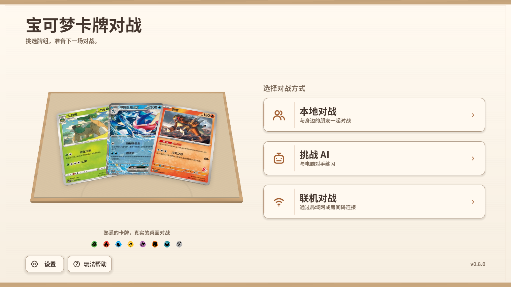
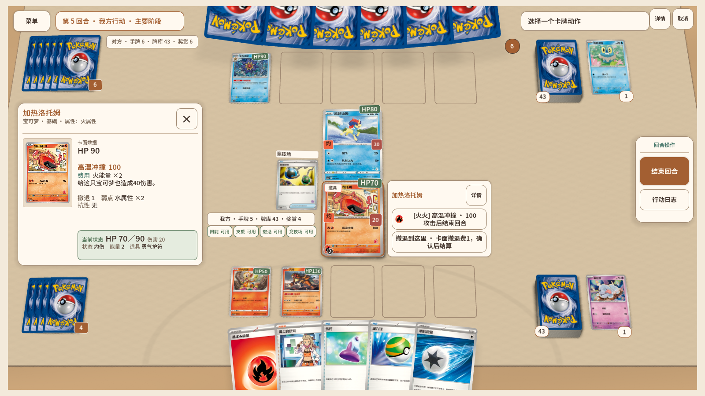

# Godot 开发指南

项目使用 Godot 4.7、GDScript 客户端和共享 C++ 规则核心。本文记录当前实现；历次迁移、审计和设计过程可从 Git 历史查看。

## 1. 启动与工程结构

在仓库根目录执行：

```powershell
.\tools\setup_godot_toolchain.ps1
.\tools\setup_native_ai_deps.ps1
.\tools\build_native_ai.ps1 -Target windows -Configuration debug
.\.tools\godot-4.7\Godot_v4.7-stable_win64.exe --editor --path .\godot
```

工具链与下载缓存位于 `.tools/`。保留其中的 Android SDK、JDK、Godot 导出模板、Python、签名材料和用户设置。版本以工具链锁文件为准。

- F5 从 `main.tscn` 启动完整游戏，F6 运行当前场景，F8 停止。
- `res://` 对应仓库的 `godot/`。`.tscn` 保存场景结构，`.tres` 保存主题等资源，`.gd` 保存脚本。
- Container 决定子节点排版；在 Inspector 调整导出参数。修改 `%NodeName` 前检查唯一节点标记和引用。
- 运行时通过 Remote Scene Tree、Debugger 和 Profiler 检查节点、错误和耗时。
- `res://tools/ui_workbench.tscn` 提供固定种子的 UI 与动画预览，不连接网络或修改正式对局。完整导航、弹窗和安全区仍应通过 F5 验证。

| 子系统 | 职责 |
| --- | --- |
| `native/ptcg_core` | 权威规则、内容编译、快照、选择与事务 |
| `native/challenge_core` | 当前 Challenge AI 和共享搜索策略 |
| `native/relay_server` | 独立 Relay 服务 |
| `godot/native/bindings` | Godot 类型与 C++ 接口转换 |
| `godot/authoring` | 卡牌、牌组、策略、VM 描述符的唯一作者源 |
| `godot/data` | 客户端及研究共用的生成数据与发布清单 |
| `godot/scenes/main` | 页面、弹窗、选择、对局生命周期 |
| `godot/scenes/battle`、`godot/presentation` | 三维牌桌、输入映射和动画队列 |
| `research/deep_ai` | 训练、回放、模型导出及 Challenge Arena 验证 |

产品运行时不依赖 Python。SCons 使用 Python 构建；研究依赖保持独立。

## 2. 页面、主题与交互



当前视觉为奶油米色、暖白面板、焦糖操作色及浅木／亚麻牌桌，没有主题切换功能。
语义颜色来自 `DesignTokens`，`FrontendPalette` 引用公共定义；前台和对战保留各自的 Theme，以支持编辑器预览和紧凑控件。

| 角色 | 色值 |
| --- | --- |
| 页面／面板 | `#F3EADB`／`#FFF9F0` |
| 正文／辅助文字 | `#45372F`／`#796757` |
| 主操作／合法目标 | `#A35F32`／`#49786B` |
| 成功／危险 | `#4F7153`／`#AD5147` |

- 修改颜色时同步 Theme、场景覆盖与单色 SVG。卡图、卡背和能量图标保留原色；可点击图标使用 `DesignTokens.preserve_art_icon()`。
- 富文本模板通过 `DesignTokens.rich_text()` 格式化，再插入已转义的卡文。徽章文字使用 `TEXT_ON_ACCENT`，特殊状态使用 `STATUS_INK`。
- 按钮各状态保持相同内边距；基础触控目标 48px，弹窗确认按钮 56px。正文／按钮对比度至少 4.5:1，控件边界和选中轮廓至少 3:1。
- `MainShellView` 管理页面与安全区，`ModalHost` 管理弹窗生命周期、主题、遮罩和输入阻断。普通弹窗可逐层返回；本地换手隐私遮罩完全不透明。
- 牌组画廊浏览高亮与已分配标签分开；双方可选择同一套牌。可执行卡牌动作来自规则返回的合法动作。
- `ChoiceSelectionModel` 保存选择状态，`ChoicePresenter` 绑定界面。UI 不得生成新的 option ID 或扩大合法选项集合。
- 滚动只由明确的 ScrollContainer 负责；布局改变不能重置用户阅读位置。小屏详情使用入口打开，宽屏可使用侧边面板。
- 动画设置只保存 `animation_mode`：`cinematic`、`standard`、`fast`、`reduced`。`reduced_motion` 是只读派生属性。旧布尔设置不迁移，缺少当前字段时提示并使用标准模式。

## 3. 三维牌桌与表现队列



实体卡、飞牌与桌面在一个 World3D 中渲染。屏幕上的 Control 是输入、HUD 和布局锚点；不要通过恢复二维卡图或每张卡增加视口来修正三维位置。

- `BattleTable` 连接牌桌组件，`Battle3DPresenter` 与 `BattleLayout3D` 负责投影和实体布局；改牌位应修改布局参数，不能只拖场景中的锚点。
- 卡位以桌布中心镜像排列；手牌允许贴边裁切，但必须保留可点击区域和浏览能力。稀疏备战槽保持原槽位，不能压缩索引。
- `CardInteractionRouter` 只匹配规则给出的合法动作。拖拽只改变视觉，规则成功后才提交来源卡与落点。
- `BattleViewModel.capture_player_view()` 创建独立且过滤隐藏信息的排队视图。`capture()` 用于显式借入快照；`state_for_render()` 返回消费者自己的副本。
- `BattleTransitionRequest.create()` 在表现入口完成事件规范化、顺序整理和玩家可见性过滤。下游预取、手牌身份匹配、播放共用这一批规范事件，不重复整理。
- `BattleTable.play_presentation()` 接收规范事件和此前的表现快照。独立预览先调用 `PresentationEvent.prepare_for_player()`，完整对局优先提交 transition。
- 每批次只克隆一次用于落地的状态；卡图预取通过视图收集公开牌、己方手牌及附件，不序列化整份状态，也不预取隐藏牌身份。
- 抽牌和飞牌以事件明确的卡牌列表与实体身份为准。同名卡离开又返回时不能用数量净差替代真实移动。
- 动画完成句柄、generation 检查、取消和重同步保护必须保留。预取完成及事件回调后仍需检查批次是否被取消；重复事件不能堵住队列。
- 飞牌落地、来源遮挡和三维姿态在 `frame_pre_draw` 对齐。伤害反馈在接触帧发生；不得为了少一次更新破坏 Tweens 与实体同步。
- 隐藏页面或应用暂停时停止视口和装饰更新；同一局隐藏后恢复不得重置自动画质。退出场景释放临时实体和句柄。

## 4. 卡牌内容、规则与 AI

```powershell
.\tools\content.ps1 lint
.\tools\content.ps1 status -Json
.\tools\content.ps1 test -CardId svi-chim
.\tools\content.ps1 export
.\tools\content.ps1 check
```

修改作者 JSON 后通过内容编译器生成数据，不手改 `godot/data`。新增卡图放入唯一卡图目录；更新审核清单后重新导出映射与哈希。新牌组必须为 60 张，并同步策略作者源。当前内容为 137 张卡、10 套牌、160 个效果、80 个 VM 操作。

`CardCatalog.shared()` 发布一份深度只读的卡牌数据和预计算查询；合成测试使用 `CardCatalog.new(true)` 获得可变副本。运行时或工作线程不得修改共享字典。

权威规则只在 C++ 会话执行，流程为 Action V4 → 原子结算 → ChoiceView v2／事件／状态投影。ChoiceResponse 必须携带原请求、revision 和合法选项。失败回滚、RNG、嵌套选择、快照和 journal 由规则核心管理，UI 只提交意图。

当前接口为 Protocol 6、Snapshot 3、Journal 1、RNG 2、Native ABI 2 和 Card IR 4。旧协议和快照明确拒绝；不添加迁移分支。玩法、临时效果及结算顺序见 [规则说明](RULES.md)。

隐私边界包括：对手手牌身份、双方牌库顺序和奖赏身份不可见；开局完成前，对手盖放宝可梦仅显示隐藏占位。事件中的 owner 是卡牌拥有者，可能不同于触发效果的 actor。浏览整副牌库的 `browse_card_refs` 仅提供给该选择的拥有者，不属于合法选择集合。

Challenge 默认使用 `strategic_intent_v3`；`turn_beam_v2` 仍承担比较与低置信度兜底，不能按名称删除。保留确定性种子、预算、取消、公开信息约束及缓存失效规则。研究的训练／导出保留手动入口，Challenge Arena 验证参与常规 CI。详见 [AI 核心](../native/challenge_core/README.md) 和 [研究说明](../research/deep_ai/README.md)。

## 5. 验证、性能与发布

```powershell
.\tools\test_fast.ps1
.\tools\test_standard.ps1
.\tools\test_godot_ai.ps1
.\tools\test_battle3d_graphics.ps1
.\tools\test_frontend_club_graphics.ps1
.\research\deep_ai\tools\test_research_smoke.ps1
```

- fast 验证产品边界、源码清单、VM 完整性、原生核心、Relay、内容和 Godot ABI。
- standard 检查生成数据、UI／交互合同与 LAN／Relay 整局；新增动画还要跑实际图形验证。
- 回归覆盖 1600×900、1280×720、900×540、2000×900、640×960、连续缩放、安全区、密集手牌、重复卡牌、附件、强制选择及换手。
- CPU 测量使用 `tools/benchmark_project.ps1 -BaselineProject <独立Godot目录> -Runs 3`；比较双方应使用相同版本的探针、硬件、配置和 fixture，并交替执行。
- headless 帧间隔包含调度时间，不代表 GPU 性能。实际图形探针在 1920×1080 各档预热后采样 300 帧，高／中档 P95 ≤ 20 ms，低档 ≤ 36 ms。
- 源码检查关注构建清单、依赖与 VM 操作归属，不使用文件行数或字节数决定架构拆分。

```powershell
.\tools\setup_android_toolchain.ps1
.\tools\package_release.ps1 -AndroidSigning test
.\tools\test_release.ps1
.\tools\package_relay.ps1
```

发布清单是版本、Android versionCode 和 schema 的唯一来源。客户端导出排除作者源、测试、工具、研究及旧 ONNX 运行库；作者源和生成数据仍保留在仓库中。构建脚本清除已知旧导出残留，发布验证检查运行目录、ZIP、APK、签名与校验和。

Relay 独立发布，TLS 由反向代理终止，部署见 [Relay 说明](../deploy/relay/README.md)。`test_release.ps1 -RequireAndroidDevice` 要求真机验证；没有设备时的 APK 静态检查不能证明触控、持续帧率和温升达标。

构建、截图和审计日志写入忽略目录。清理时保留最新通过验证的发布包、签名材料和研究回放／检查点；不能将研究的整个 build 目录视为缓存删除。历史过程文档与旧截图不继续随主分支维护。

### 当前精简结果

本次删除 34 个受版本控制的过时文件，源码和文档净减少约 9,100 行；本地清理的构建、
测试与审计产物按删除时的大小合计约 4.74 GiB。Windows ZIP 比此前减少约 289 KiB，
Android APK 减少约 46.5 KiB；运行时内存与性能结果见发布说明。

两个独立的临时 Git 仓库、工具链、签名材料、研究成果、最新发布包及指向现用资源缓存的
目录联接保持完整。详细删除清单和体积对比保存在 `build/cleanup-20260915/`；其中的数字
统计实际删除的产物，也包含本轮创建后回收的测量基线副本。

自动审批按策略拦截了旧目录联接和四个无源码对应的 Python 字节码缓存（合计约 127 KiB）的删除；这些项保留，未计入删除统计。
