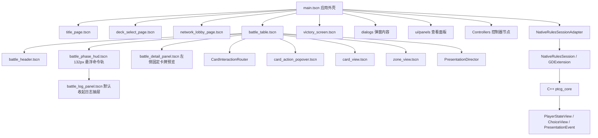
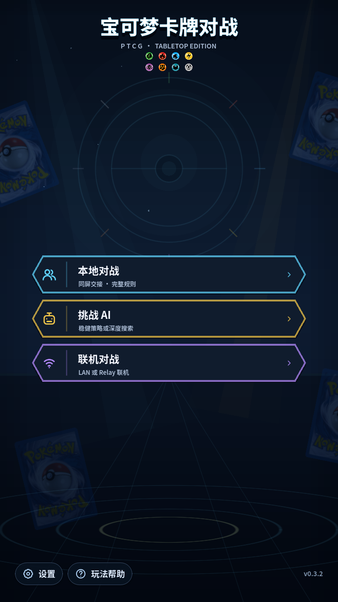
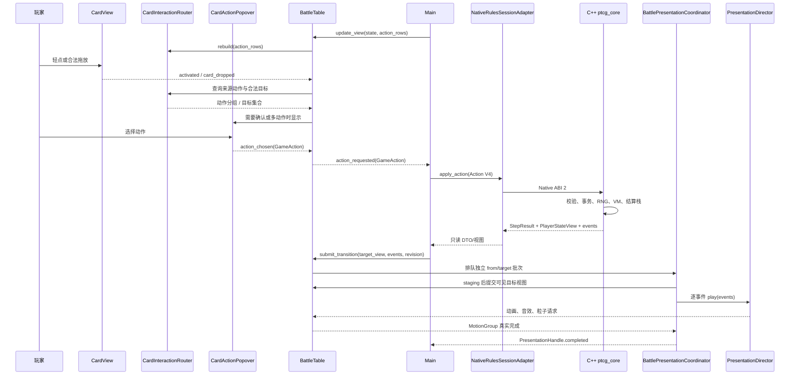
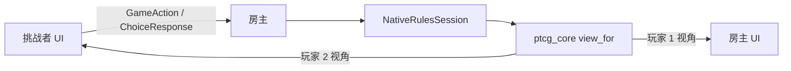

# Pokémon TCG Godot 4.7 新手开发手册

本手册面向会使用变量、函数、条件语句和数组，但没有 Godot 开发经验的维护者。
目标不是让你背下所有 API，而是让你能够在编辑器中安全地修改场景、UI、动画和
游戏逻辑，并知道每次修改后应该怎样验证。

> 项目使用 Godot 4.7。Godot 4 已经移除 VisualScript，因此复杂规则不会变成
> “拖节点编程”。本项目的分工是：场景树编辑结构，Inspector 编辑参数，
> AnimationPlayer 编辑固定时间轴，信号连接用户意图，GDScript 负责 UI、绑定和表现。
> 权威规则只在共享 C++ `ptcg_core` 中执行；Godot 不再实现卡牌效果或结算规则。

## 1. 第一次打开工程

在仓库根目录执行：

```powershell
.\tools\setup_godot_toolchain.ps1
.\.tools\godot-4.7\Godot_v4.7-stable_win64.exe --editor --path .\godot
```

工具链安装在 `.tools/`，不会修改系统 `PATH`。编辑器打开后，先认识这些区域：

| 区域 | 你会用它做什么 | 新手提示 |
|---|---|---|
| Scene | 查看和选择当前场景的节点树 | 节点越靠上越像“容器”，节点越靠下越像具体文字、按钮、图片 |
| FileSystem | 打开 `res://` 下的场景、脚本和资源 | `res://` 就是仓库里的 `godot/` 目录 |
| Viewport | 拖动、缩放和预览可视化界面 | 只要节点在 Container 下，拖动位置通常会被父容器重新排版 |
| Inspector | 修改选中节点的属性、导出参数和主题覆盖 | 本项目很多可调参数都放在根节点的 Inspector 分组中 |
| Node | 查看信号、分组和节点连接 | 想知道按钮点击连到哪里，先看这里的 Signals |
| Animation | 预览和编辑 `AnimationPlayer` 时间轴 | 先选中 `AnimationPlayer` 节点，底部才会出现动画列表 |
| Debugger | 看报错、断点、变量和调用栈 | 红色错误通常要先处理；黄色警告可以按影响逐个排查 |
| Remote Scene Tree | 运行游戏时查看真实节点 | 运行后在 Scene 面板顶部从 Local 切到 Remote |

运行方式：

- `F6`：运行当前场景，适合单独调试页面或组件。
- `F5`：从 `main.tscn` 运行完整游戏。
- 点击停止按钮或按 `F8`：停止运行。

`F6` 和 `F5` 的差别很重要。`F6` 只跑你当前打开的 `.tscn`，适合看标题页、
卡牌组件或 Workbench；如果这个场景依赖 `Main` 注入数据，它可能只能显示占位内容。
`F5` 会从项目主场景启动完整游戏，适合验证标题专用全屏背景、按钮跳转、设置保存、AI、
联机和真实对局。标题页单独按 `F6` 时使用 `EmbeddedBackdrop`；挂到 `Main` 后会关闭这份副本，
改由安全区外的 `TitleFullBleedBackdrop` 绘制，因此两种预览方式都要检查。

第一次建议在 FileSystem 中双击 `res://tools/ui_workbench.tscn`，再按 `F6`。
这是安全预览工作台，不会保存设置、创建网络房间或修改正式对局。

<!-- 这张图只用于说明 Workbench 结构；当前“午夜竞技场”正式效果见第 4 节。 -->


Workbench 顶部可以切换标题、选牌、网络、设置、选择、能量分配、帮助、卡牌检查器、
区域查看、牌组详情、战斗和胜利页面；右侧按钮可以单独触发抽牌、进化、攻击、伤害、
击倒和胜利演出。“0% / 50% / 100%”检查点会使用同一份 before/after fixture 停在动画
起点、接触中段或最终状态，适合稳定截图。它使用固定种子的预览状态，不读取正式存档，也不会连接网络。预览宿主
比 1600×900 主窗口窄，可快速发现标题页 Compact landscape / Dense 以及其他前台 compact
布局问题；但设置、帮助等面板在 Workbench 中是直接装入预览容器的，仍要按 `F5` 验证
全屏标题背景、`ModalSpec` 的主题切换、遮罩、鼠标/触控操作与安全区。

### 常见文件和路径

| 写法 | 含义 | 什么时候会碰到 |
|---|---|---|
| `res://scenes/title/title_page.tscn` | Godot 工程内路径 | FileSystem、脚本 preload、Inspector 资源引用 |
| `godot/scenes/title/title_page.tscn` | Windows 仓库路径 | VS Code、PowerShell、Git diff |
| `.tscn` | 场景文件，保存节点树和可视化属性 | 修改页面、组件、弹窗、动画节点 |
| `.gd` | GDScript 脚本 | 修改信号、导出参数、布局计算和游戏逻辑 |
| `.tres` | Godot 资源文件 | 修改主题、StyleBox、字体变体等资源 |
| `.import` | Godot 自动生成的导入记录 | 不手工编辑，资源重新导入时会变化 |

脚本中常见的 `%NodeName` 表示“唯一节点名”引用。它依赖场景树中某个节点启用了
`Unique Name in Owner`，所以这类节点可以移动和调样式，但不要随意改名或取消唯一标记。
普通节点路径如 `"SafeContent/PageFrame"` 则依赖父子层级；移动节点前要搜索脚本中是否引用了这条路径。

## 2. 工程地图



最常编辑的文件：

| 目的 | 场景或文件 |
|---|---|
| 应用背景、标题全屏背景、安全区、弹窗和加载层 | `scenes/main/main.tscn` |
| 标题字标、八种基本能量、轮换展示卡与三个主入口 | `scenes/title/title_page.tscn` |
| 牌组选择与 Challenge AI 配置 | `scenes/decks/deck_select_page.tscn` |
| 网络大厅与 LAN/Relay 选择 | `scenes/network/network_lobby_page.tscn` |
| 牌桌、固定牌位、手牌、转场协调器和表现层 | `scenes/battle/components/battle_table.tscn` |
| 战斗顶部栏、卡牌交互、卡牌预览、系统按钮和日志 | `scenes/battle/components/` |
| 单张卡牌的显示结构 | `ui/card_view.tscn` |
| 牌库、弃牌和奖赏区 | `ui/zone_view.tscn` |
| 设置、选择、隐私与暂停弹窗 | `ui/dialogs/` |
| 帮助、卡牌检查器、区域查看和牌组详情 | `ui/panels/` |
| 前台专用主题 | `ui/frontend/front_end_theme.tres` |
| 战斗与兼容基础主题 | `ui/game_theme.tres` |
| 语义颜色和运行时样式 | `ui/design_tokens.gd` |
| 前台背景、动效和弹窗规格 | `ui/frontend/` |
| 前台字体与原创线性图标 | `assets/ui/fonts/`、`assets/ui/icons/` |
| 安全预览 | `tools/ui_workbench.tscn` |

帮助、卡牌检查器、弃牌/隐藏区域查看和牌组详情现在位于 `ui/panels/`。入口仍在
可编辑页面中，例如标题页的 `HelpButton`、暂停面板的 `HelpButton`、牌组选择页的
`DetailsButton`；`Main` 只负责打开通用 `ModalLayer`
并把 `CardCatalog`、`GameState` 或 context 传给面板。这样既能在 Godot 中单独编辑面板，
又不会在 `.tscn` 中写死实时对局数据。

发布运行时统一使用 `CardDatabase.catalog`（与 `CardCatalog.shared()` 是同一只读实例）。
新 UI 组件应接受 catalog 注入，默认回退到 `CardCatalog.shared()`；只有需要写入合成卡牌的
测试夹具才使用可变的 `CardCatalog.new(true)`，不要修改运行时仓库。

`main.tscn` 根节点下还有 `Controllers`，里面放着 `ScreenRouter`、`MatchSession`、
`AIMatchDriver`、`NetworkSessionDriver` 和 `ModalHost`。它们是主流程职责的可见入口；
当前仍由 `Main` 保留兼容门面，后续扩展时优先把对应职责放到这些控制器。

### 前台视觉框架与兼容边界

标题、牌组、网络、设置、帮助、牌组详情和胜利页使用
`res://ui/frontend/front_end_theme.tres`。这个 Theme 只挂在前台页面根节点，或由
`ModalHost` 在打开前台弹窗时临时应用；`res://ui/game_theme.tres` 继续服务战斗界面和
兼容控件。不要把 `front_end_theme.tres` 设置到 `Main` 或 `BattleTable` 根节点，
否则会让本次明确隔离的战斗 HUD 继承前台样式。

前台 Theme 使用语义 variation，而不是逐按钮复制覆盖。例如主操作、次操作和危险操作
分别使用 `FrontPrimaryButton`、`FrontSecondaryButton`、`FrontDangerButton`；模式卡、
分区面板和状态面板也有对应 variation。新增控件时先复用现有 variation，确实需要新的
交互语义时再扩展 Theme，并同时补齐 normal、hover、pressed 和 disabled 状态。

标题页的青、金、紫斜切入口使用标题专用 `TitleModeButton` 绘制组件；不要为了首页效果修改共享的
`FrontModeTileButton`。三种入口都使用深蓝填充、白色标题和冷灰蓝副标题，属性色只用于边线、图标、
分隔线和箭头。`ModesGlass` 只是控制宽度与留白的 `MarginContainer`，不能改回包住三个入口的可见面板；
按钮内部也不要恢复顶部的长装饰线。

运行时 UI 采用鼠标与触控专用交互：桌面使用左键点击，移动端使用轻触；hover 只作为鼠标经过反馈，
pressed 同时服务点击和触摸。不要为普通按钮新增按键/控制器快捷操作、默认选中、高亮环或方向循环。
网络地址、端口和房间码等文本框仍需在点击或轻触后进入编辑状态并唤起移动端软键盘。Android 的
系统返回手势/返回键属于平台导航，必须继续由 `Main._notification()` 处理，不能随普通快捷操作一起删除。

前台资源位置：

| 资源 | 路径 | 说明 |
|---|---|---|
| 中文字体 | `assets/ui/fonts/NotoSansCJKsc-VF.ttf` | Noto Sans CJK SC 2.004 完整可变 TTF |
| 字重变体 | `assets/ui/fonts/noto_sans_cjk_sc_*.tres` | Regular 400、Medium 500、Semibold 600、Bold 700 |
| 字体来源与授权 | `assets/ui/fonts/SOURCE.md`、`assets/ui/fonts/OFL.txt` | 包含上游、SHA-256 与 SIL OFL 1.1 |
| 前台图标 | `assets/ui/icons/` | 项目原创 24×24 圆角描边 SVG；用户操作中应与可见文字并列 |
| 能量图标 | `assets/ui/energy/` | 8 种基础能量、无色和夜光能量；统一为 256×256 RGBA 透明 PNG |

字体层级统一为普通 UI、说明与战斗 HUD 使用 Semibold 600，按钮、表单选项、菜单、页面标题和
关键 CTA 使用 Bold 700；只有长段 `RichTextLabel` 保留 Medium 500，避免大段文字过密。
`game_theme.tres` 与 `front_end_theme.tres` 都必须绑定上述 `FontVariation`，不要直接绑定原始可变
TTF，也不要用描边模拟字重；原始字体的默认轴值可能不是 Regular。新增动态 Theme 时同步更新
`theme_factory.gd`，避免退回 Godot fallback。`variation_opentype` 的 `wght` 键必须使用 OpenType
整数 tag `0x77676874`（十进制 `2003265652`），不能写成字符串 `"wght"`；后者会让当前字体按
默认 Thin 100 渲染，即使资源文件表面上写了 600 / 700。

能量图标路径由共享的 `res://ui/energy_icon_catalog.gd`（`EnergyIconCatalog`）集中维护，可用于
牌组 tile、`CardView` 能量行和其他能量徽章。新 UI 不要复制一份 preload 字典；遇到 catalog
不认识的类型时保留文字或中性徽章回退，也不要把未知类型自动显示成无色。十张图标的文件名、
取样卡图和格式约定见 `assets/ui/energy/README.md`。夜光能量按 `svg2-lume` 卡 ID 精确映射，
不要把通用 `Rainbow` 类型直接映射为夜光能量。

标题页的 `TypeOrbs` 只使用八种基本能量，顺序固定为草、火、水、雷、超、斗、恶、钢；不加入无色与
夜光能量。图标保持素材自身的透明边缘，外层 `EnergyBadge` 使用空样式，不能增加黑色底圈、描边或
可点击状态。Wide / Compact 为单排八枚，Dense 为每排四枚的两排布局。

标题页使用独立的“午夜竞技场”深色背景：程序绘制 `#07101D → #0D1B30 → #030812` 深海军蓝渐变、
青蓝舞台光、少量金色辉光、星点、低透明宝可球同心徽记和底部竞技场环；徽记周围的八段低透明刻度
按基本能量顺序取色。背景保持纯程序化，不加载卡面、卡背或边缘牌扇装饰，也不再使用浅蓝天空、
白云或明亮日间背景。
`Main` 在通用 `Background` 与 `SafeArea` 之间放置
`TitleFullBleedBackdrop`，页面本身保留 `EmbeddedBackdrop` 供 `F6` / Workbench 预览；路由离开
标题页时必须隐藏前者。静态背景只在尺寸、画质或设置变化时重绘，不要增加逐帧全屏绘制或
高成本模糊 Shader。

其他前台继续复用 `res://ui/frontend/frontend_backdrop.tscn`。牌组、联机等任务型页面使用的
`neutral`、`title` 和 `victory` 变体都只绘制程序化背景，不实例化边角装饰卡牌，避免与表单、
结算面板和牌组内容竞争。标题页内容区的三个展示槽仍从 `CardCatalog.shared()` 中具备有效图片的宝可梦卡池轮换，
每隔约 5.5～8 秒依次替换一张，避免三槽重复，并让卡面与阴影共用同一纹理。背景与展示卡动效都必须
响应画质和减少动画设置：High/medium 可使用淡入淡出、轻微漂浮与鼠标视差；low、reduced motion
或隐藏 Hero 的 Dense 布局应停止轮换与对应 `_process()`，显示稳定静态状态。页面入场统一只改变
透明度和缩放，Container 子节点的位置仍交给布局系统。

项目基准仍是 1600×900、`canvas_items`、`expand`，不要为了适配单个页面改全局 stretch。
前台布局使用安全区内的可用尺寸，而不是物理窗口尺寸。标题页有三档：宽度至少 1180、
高度至少 650 且纵横比至少 1.5 时为 Wide；宽度至少 900 且高度至少 600 时为 Compact
landscape，同时要求纵横比至少 1.15；其余为 Dense。Wide / Compact 保留左右两栏，Dense 隐藏展示卡扇并把三个入口
居中单列，标题内容最大宽度为 1440。牌组、网络等页面仍保留各自的 wide/compact 主从重排，
不应把大屏页面整体等比缩小。`Main._apply_safe_area()` 会把平台安全区同步到页面、弹窗、
加载层和提示层；只有纯程序化背景允许越过安全区，新增全屏层也要接入这条路径。

通用弹窗通过 `res://ui/frontend/modal_spec.gd` 描述 `preferred_size`、前台/战斗 surface、
遮罩透明度、可取消性和堆栈行为。调用 `ModalSpec.frontend(...)` 时 `ModalHost` 临时应用前台 Theme，
关闭后恢复继承主题；战斗选择、隐私和暂停弹窗使用 `ModalSpec.battle(...)`，继续保持原有
遮罩与不可取消语义。compact 下前台 Modal 会占满安全内容区，战斗 Modal 仍保持自己的首选
尺寸。Modal 正文共用一个纵向 ScrollContainer，横向滚动被禁用，页脚按钮位于滚动区外；
面板不要再嵌套整页滚动。前台“牌组详情 → 卡牌检查器”通过 `Main` 的返回动作恢复详情滚动位置和
上下文，面板本身不要私自创建第二个 ModalLayer。

节点上的 `editor_description` 会在 Inspector 中解释用途。标有“不要删除”的节点
是运行时和自动测试的稳定契约，可以移动或调样式，但不要随意改名。


上图左侧是 `card_view.tscn` 的静态节点契约，右侧是根节点导出的布局与交互参数。
编辑器中的卡牌文字是有意义的占位内容，运行时会由 `configure(...)` 注入真实数据。

## 3. 节点、场景和实例

节点是一个功能单元，例如 `Label`、`Button`、`TextureRect`。场景是一棵可保存、
可复用的节点树。一个场景可以实例化另一个场景：

- `battle_table.tscn` 是战斗页面根场景，实例化固定的 `CardView`、`ZoneView` 和多个战斗 UI 子组件。
- 动态手牌也实例化 `card_view.tscn`，但数量取决于实时手牌。
- `main.gd` 根据页面状态实例化标题、选牌、战斗或胜利场景。

修改复用组件时要记住：修改 `card_view.tscn` 会影响场上宝可梦、手牌和选择弹窗。

判断一个文件该怎么打开：

- 想改“看起来是什么样”：优先打开 `.tscn`，在 Scene、Viewport 和 Inspector 中编辑。
- 想改“这个页面收到什么数据”：看同名 `.gd` 的 `configure(...)`。
- 想改“用户点击后通知谁”：看同名 `.gd` 的 `signal` 和 `_ensure_connections()`。
- 想改“前台按钮、面板的默认风格”：打开 `res://ui/frontend/front_end_theme.tres`。
- 想改“战斗与兼容控件的默认风格”：打开 `res://ui/game_theme.tres`。
- 想改“实时规则结果”：不要从场景开始；先看 Python 卡牌 DSL/IR 描述与 C++ `ptcg_core`，Godot 只适配会话和显示结果。

### Container 与锚点

`VBoxContainer`、`HBoxContainer` 和 `MarginContainer` 会自动排列子节点。放在
Container 里的控件，不要主要依赖手工坐标；应修改：

- `custom_minimum_size`
- `size_flags_horizontal` / `size_flags_vertical`
- Container 的 `separation`
- MarginContainer 的四边 margin

布局修改先按这个顺序判断：

| 你看到的现象 | 先检查 | 推荐修改 |
|---|---|---|
| 拖动控件后又弹回原位 | 父节点是不是 `VBoxContainer`、`HBoxContainer`、`GridContainer` 或 `MarginContainer` | 改 `custom_minimum_size`、size flags、父容器 separation 或 margin |
| 想让按钮更高、更宽 | 按钮本身和父容器 | 按钮 `custom_minimum_size`，必要时改父容器 separation |
| 想让一组控件整体离边缘远一点 | 最近的 `MarginContainer` | `theme_override_constants/margin_*` |
| 控件不在 Container 下 | Inspector 的 Layout、Anchors、Offsets、Position、Size | 先设置锚点，再调 offsets 或 size |
| 运行时位置和编辑器不一致 | 对应脚本是否有布局函数 | 搜索 `_layout`、`_place`、`custom_minimum_size` |

最安全的操作习惯：

1. 在 Scene 树中选中目标节点。
2. 看它的父节点类型。
3. 如果父节点名字带 `Container`，优先改尺寸、间距和 margin。
4. 如果父节点是普通 `Control` 或 `Panel`，再考虑 anchors、position 和 size。
5. 改完按 `F6` 看当前场景；如果是主流程跳转，再按 `F5` 看完整游戏。

牌桌中的固定牌位位于 `components/battle_table.tscn` 的 `BoardCanvas` 下，运行时由
`BattleTable._layout_board()` 根据窗口尺寸定位。场景中的坐标用于编辑器预览，真正运行时
尺寸由 `BattleTable` 根节点 Inspector 中的 `Table Layout` 参数控制。竞技场底板始终铺满
战斗视口；顶部信息和右侧 132px 命令轨作为悬浮层叠加，布局规划器只为交互内容预留安全边界，
不会再用 `HBoxContainer` 从牌桌宽度中切出常驻侧栏。想改战斗宝可梦、备战宝可梦和手牌的
尺寸时，先选 `BattleTable` 根节点改导出参数；只有想移动牌库、弃牌、奖赏和竞技场的算法
位置时，才进入 `_layout_board()` 和对应的牌区定位函数。

## 4. 第一个练习：修改标题页

先做一个最小闭环：打开场景、选节点、改 Inspector、运行当前场景、再从 Workbench 验证。




1. 打开 `res://scenes/title/title_page.tscn`。
2. 在 Scene 树中搜索 `TitleLabel`，选择顶部字标。
3. 在 Inspector 修改 Text、字体大小或描边；副标 `PTCG` 与主标题保持为两个独立 Label。
4. 展开 `TypeOrbsCenter/TypeOrbs`，确认八枚基本能量没有黑色底圈，Dense 时自动排成 4×2。
5. 展开 `HeroPanel/CardStage`，观察三个展示槽的尺寸、旋转和重叠；运行时卡面会从宝可梦卡池轮换。
6. 展开 `ModesPanel/ModeStack`，选择 `LocalTwoPlayerButton`、`AIButton` 或 `NetworkButton`，修改
   `custom_minimum_size.y`，观察三个斜切主入口的高度变化。
7. 确认 `ModesGlass` 没有可见面板外框，三个入口内部也没有顶部的长装饰线。
8. 选择 `FooterRow`，修改 `SettingsButton` / `HelpButton` 间距，并确认 `VersionLabel` 仍在右侧。
9. 按 `Ctrl+S` 保存场景。
10. 按 `F6` 查看带 `EmbeddedBackdrop` 的独立标题页，并用鼠标点击或触摸轻点检查入口。
11. 再运行 `ui_workbench.tscn`，检查标题页在 Compact landscape / Dense 宿主中的效果。
12. 最后按 `F5`，确认 `TitleFullBleedBackdrop` 覆盖整个窗口、`EmbeddedBackdrop` 已隐藏且四周
    没有深色边框。

如果希望让文字成为脚本可配置参数，选择根节点 `TitlePage`，查看
`Editable Copy` 分组。它来自：

```gdscript
@export_category("Editable Copy")
@export var game_title := "宝可梦卡牌对战"
@export var brand_subtitle := "P T C G  ·  TABLETOP EDITION"
```

`@export` 会把普通脚本变量暴露到 Inspector。适合导出的内容包括尺寸、间距、
动画速度和默认文字；不要导出规则状态或网络密钥。

标题页常改项：

| 想改什么 | 选中节点 | 推荐改法 |
|---|---|---|
| 主字标与 `PTCG` 副标 | `TitleLabel`、对应副标 Label | Text、Noto 700、描边与字号；不要烘焙进背景 |
| 午夜竞技场背景 | `TitleFullBleedBackdrop`、`EmbeddedBackdrop` | 深海军蓝渐变、舞台光、徽记、能量刻度和竞技场环；两份背景不要同时叠加 |
| 八种基本能量 | `TypeOrbsCenter/TypeOrbs` | 使用 `EnergyIconCatalog`；保持素材透明边缘，不增加黑色底圈或交互 |
| 三个轮换展示槽 | `HeroPanel/CardStage` | 最小尺寸、旋转、重叠与阴影；卡牌只展示，由脚本定时轮换 |
| 三个主入口 | `ModesPanel/ModeStack` 下的 `LocalTwoPlayerButton`、`AIButton`、`NetworkButton` | `TitleModeButton` 配色、最小高度和入口间距；不增加模式总外框或顶部装饰线 |
| 设置 / 帮助 / 版本号 | `FooterRow` 下的 `SettingsButton`、`HelpButton`、`VersionLabel` | separation、文字、最小尺寸与动态版本号 |
| Wide / Compact / Dense | `title_page.gd::_apply_responsive_layout()` | 修改断点、字号和卡宽时同步更新布局 contract |

如果 Inspector 里找不到某个属性，可以用顶部搜索框输入 `custom`、`separation`、
`margin` 或 `font`。Godot 的属性很多，搜索比一层层展开更稳。

## 5. 修改卡牌与牌桌

### CardView

打开 `ui/card_view.tscn` 可以看到：

- `Shadow`：卡牌阴影。
- `Frame/Image`：边框与卡图。
- 运行时覆盖层：`HPPill`、`DamageBadge`、`EnergyRow` 和 `ToolBadge` 显示场上 HP、伤害、能量和道具。
- `StatusRow`：运行时生成中毒、灼伤等状态徽章。
- `TargetGlow`：合法目标高亮。
- `SelectionRing`：选中状态。
- `ActionableMarker`：提示这张卡当前可以发起动作。
- `InteractionHint`：显示合法目标或不可用原因。
- `AnimationPlayer`：选中脉冲和合法目标脉冲时间轴。

卡图、HP 和状态不是写死在场景中的。控制器调用：

```gdscript
card_view.configure(card_id, pokemon_state, hidden, hand_index, player, slot)
```

静态结构在场景中编辑，动态数据在脚本中绑定。这是本项目最重要的 UI 模式。

战斗中的动作按钮不再创建在 `CardView` 内部。轻点卡牌后，`BattleTable` 使用
`CardInteractionRouter` 查询来源动作；需要确认或存在多个动作时，在牌桌根浮层显示
`CardActionPopover`。浮层固定在来源卡牌正上方并与卡牌水平居中；顶部安全区不足时才切换到
卡牌下方。这样浮层不会进入卡牌的最小尺寸计算，也不会挤压牌桌或手牌。
使用 `set_interaction_state(...)` 注入可操作、合法目标和禁用原因等只读表现状态；
`CardView` 不保存或执行规则动作。

卡牌输入约定：

- 轻点可操作卡牌：选中来源；只有一个需要目标的动作时直接高亮合法目标，其他情况显示贴卡浮层。
- 再次轻点同一张来源卡：立即清除 `SelectionRing`、关闭动作浮层和牌桌卡牌详情；不可操作卡、
  对手卡和只提供说明的来源也遵循同一卡二次轻点取消语义。
- 轻点动作浮层外空白：只关闭当前瞬态浮层；是否保留来源选择由 `BattleTable` 的交互状态统一决定。
- 长按至少 350ms：发出 `detail_requested(card_id)`，打开完整卡牌检查器，不执行回合动作。
- 手牌拖放：只有 `CardInteractionRouter` 判定合法的卡牌/牌位组合才接受；非法牌位不进入可投放状态。
- 来源选中使用 `SelectionRing`，合法目标使用 `TargetGlow` 和动作提示文字；不要只靠颜色表达状态。

常见修改入口：

| 想改什么 | 选中节点或位置 | 注意事项 |
|---|---|---|
| 卡牌阴影 | `Shadow` | 改 StyleBox、透明度和偏移，不影响规则 |
| 卡图区域 | `Frame/Image` | 运行时会注入真实 Texture，场景中只调拉伸方式和边距 |
| 场上 HP、伤害、能量、道具 | `CardView.gd` 的 `_ensure_overlay_nodes()`、`_layout_battle_overlay()` | 这些徽章运行时创建；样式和位置在脚本中统一调整 |
| 选中边框 | `SelectionRing` | 和 `selected_pulse` 动画一起看 |
| 合法目标高亮 | `TargetGlow` | 和 `target_pulse` 动画一起看 |
| 可操作标记和原因提示 | `ActionableMarker`、`InteractionHint` | 内容由 `set_interaction_state(...)` 注入，不在这里推导规则 |
| 贴卡动作按钮 | `card_action_popover.tscn` | 独立挂在牌桌浮层；不要放回 `CardView` 子节点 |
| 选中抬升和悬停缩放 | 根节点 `CardView` | Inspector 的 `Card Layout` 导出参数 |

### BattleTable

`scenes/battle/components/battle_table.tscn` 是战斗页面根场景，并直接持有
`BattlePresentationCoordinator`。规则动作、AI、Choice 和联机同步统一调用
`BattleTable.submit_transition(BattleTransitionRequest)`；静态预览和工具可直接调用
`update_view()`、`play_presentation()` 与 `capture_presentation_snapshot()`。

表现层采用“权威状态立即结算、可见状态按事件提交”的视觉事务：

- `BattleViewModel` 是当前玩家可见的不可变目标视图，不反向修改 `GameState`。
- `BattlePresentationCoordinator` 为每批请求保存独立的 from/target 快照并返回 `PresentationHandle`。
- `PresentationDirector` 逐事件调度；空间运动由 `MotionHandle` / `MotionGroup` 的真实 Tween 完成信号收尾。
- `HandMotionController`、`CardMotionLayer`、`CardMotionEntity` 和 `BoardAnchorResolver` 分别拥有手牌布局、运动代理和动态落点。
- `MotionPolicy` 统一 cinematic / standard / fast / reduced 节奏；reduced 仍在本帧末按同一事件顺序完成。

不要在规则提交后先调用 `update_view()` 刷出最终手牌，再补调 `play_presentation()`；这会重新制造
“先腾位置、后飞牌”的问题。需要等待 Choice、AI、回合交接或胜利页时，等待对应
`PresentationHandle.completed`，并再次核对 revision。

打开 `scenes/battle/components/battle_table.tscn`，可以直接看到：

- 双方战斗区和五个备战位。
- 双方横向重叠的六张奖赏卡，以及显示左侧面和下侧面厚度的牌库、弃牌堆。
- 手牌滚动区域。
- 顶部回合、玩家、阶段和当前任务提示。
- 右侧 132px 悬浮命令轨，以及默认收起、按需向左展开的行动日志抽屉；卡牌动作不进入右栏。
- 双方奖赏卡之间靠左固定的 `BattleDetailPanel` 卡图与效果预览。

顶部菜单是对局中的系统出口，必须在卡牌动作浮层、详情面板和表现动画输入遮罩存在时仍可点击。
`BattleRoot`、`Body`、`BoardPanel`、`BoardCanvas` 以及 `CardActionPopover` 的全屏结构层均使用
`MOUSE_FILTER_IGNORE`，只让具体卡牌、动作面板和按钮接收输入；`PresentationInputBlocker` 从
顶部 HUD 下方开始覆盖，不得重新扩展到菜单区域。
- 牌桌根层的 `CardActionPopover`。
- 表现效果层与输入遮挡层。

`BoardPanel` 和原创深色玻璃竞技场铺满整个战斗视口。`BattleHeader`、`BattlePhaseHud`、日志、
详情和动作浮层都位于牌桌之上的独立层；不要重新把它们放进会压缩 `BoardPanel` 的横向容器。
战斗位、备战位、手牌和牌区仍会避开命令轨的可视光晕与安全区，但竞技场背景、金属框、蜂窝纹、
中心圆环和红蓝导轨应连续延伸到视口边缘。

选择 `BattleTable` 根节点后，Inspector 的 `Table Layout` 可以修改：

- 牌桌边距和手牌底部预留。
- 战斗宝可梦尺寸。
- 备战宝可梦尺寸和间距。
- 牌区尺寸。
- 手牌尺寸、最小重叠间距和扇形角度。

命令轨的正式宽度固定为 `BattlePhaseHud.RAIL_WIDTH = 132.0`，日志抽屉宽度为 360px。
命令轨宽度由 `BattlePhaseHud.RAIL_WIDTH` 和布局安全宽度共同决定。
确需改变轨道宽度时，应同步 `BattlePhaseHud` 常量、`BattleTableLayout` 的保留安全宽度、布局契约
和全部战斗截图。

`Presentation` 分组还可以修改动态飞牌的最低弧线、距离比例、错峰高度和错峰时间。
`PresentationDirector` 节点则暴露电影、标准、
快速和减少动画四档速度；standard / fast 默认分别为 0.82 / 0.58，reduced 为零空间运动。
保持默认值即可获得当前节奏；修改后应重跑截图回归。

修改后运行 Workbench 的“战斗场景”，同时观察 16:9 与超宽屏截图，避免只在
自己的窗口尺寸上看起来正确。

战斗界面从 0.4.x 起采用“组件组合”的结构：

| 想改什么 | 打开哪里 |
|---|---|
| 顶部菜单、回合/玩家/阶段和任务提示 | `scenes/battle/components/battle_header.tscn` |
| 牌桌、牌位、牌区、手牌和表现层 | `scenes/battle/components/battle_table.tscn` |
| 右侧 132px 悬浮命令轨 | `scenes/battle/components/battle_phase_hud.tscn` |
| 默认收起、向左展开的行动日志抽屉 | `scenes/battle/components/battle_log_panel.tscn` |
| 双方奖赏卡之间靠左固定的卡图与效果预览 | `scenes/battle/components/battle_detail_panel.tscn` |
| 卡牌动作索引与合法目标匹配 | `scenes/battle/components/card_interaction_router.gd` |
| 贴卡动作浮层 | `scenes/battle/components/card_action_popover.tscn` |

`BattleHUD` 是右侧悬浮命令坞。132px 的 `PhasePanel` 保留兼容节点名
`PhaseAdvanceButton`，按钮根据状态显示“完成准备”“结束回合”“结算中”或“等待对手”；
只有前两种可执行系统动作通过 `phase_action_requested(GameAction)` 上报。`LogPanel` 启动时隐藏，
轻点“行动日志”后才以 360px 抽屉向命令轨左侧展开，再次轻点、按关闭按钮或点击抽屉外区域时
收起。不要向命令轨或日志加入卡牌详情、阶段格或卡牌动作入口；日志只展示结果，不提供规则操作。

`DetailPanel` 位于 `battle_table.tscn` 根节点的 `OverlayPanels` 下。它固定使用双方奖赏卡之间的
左侧走廊，并以六张奖赏的最大占位计算上下边界，因此奖赏减少时不会漂向屏幕中央，也不会进入
主战斗区。标准布局为 372×312；走廊不足时回退到 188×196 的紧凑布局，仍不足时再在走廊内
等比缩放。轻点手牌或场上宝可梦时显示卡图、卡文和实时状态；再次轻点同一来源或按关闭按钮时，
详情与来源高亮一起清除。无论查看己方还是对方卡牌，预览都不得跟随来源移动到下方或竞技场中央。
顶部 `BattleHeader` 显示“第 N 回合 · 玩家 N · 当前阶段”，任务可通过
`update_header(..., task_hint)` 或 `set_task_hint(...)` 注入；不要恢复重复品牌标题或 AI 状态 Chip。

`CardInteractionRouter` 每次随合法 `action_rows` 重建索引。系统动作 `END_TURN` 和
`SETUP_DONE` 单独交给右栏；其余动作必须映射到可见来源：`hand:<index>`、
`pokemon:<player>:<slot>` 或 `stadium`。它同时提供来源动作分组、合法目标和拖放匹配，
UI 不得自行放宽目标条件。`CardActionPopover` 使用 200–260px 宽度、至少 48px 高的按钮，
超过四项时滚动；按上、右、左、下顺序寻找安全位置，避开合法目标，并用短连线指回来源卡。
路由必须覆盖 `PLAY_BASIC`、`EVOLVE`、`ATTACH_ENERGY`、`PLAY_TRAINER`、`USE_ABILITY`、
`USE_STADIUM`、`RETREAT`、`DECLARE_ATTACK` 和 `PROMOTE`；新增卡牌动作时也必须加入动作可达性测试。

公开边界保持不变：`BattleTable.update_view(...)` 及 `action_requested(GameAction)`、
`hand_card_selected`、`pokemon_selected`、`card_drop_requested`、`detail_requested` 等对外信号
继续存在。`CardActionPopover.action_chosen` 和右栏 `phase_action_requested` 最终都转发为
`action_requested(GameAction)`；规则、AI 和网络层不需要知道动作来自轻点、浮层还是拖放。

效果结算同样优先使用牌桌对象：单选且能唯一映射到场上宝可梦的 `ChoiceView` 通过
`BattleTable.set_choice_targets(...)` 高亮对应卡牌，轻点后仍提交原 `option_id`。隐藏区卡牌、
同一宝可梦上无法仅靠卡牌区分的多个附着物，以及多选请求继续使用 `ChoicePanel`；能量分配会把
原生 `energy:<index>:<card>->pokemon:...` 选项按目标分组，每只宝可梦只显示一次，并同时展示
名称、位置、已有能量和分配后只读预览。`coin_flip` 使用独立硬币翻转表现。撤退动作会要求点选本次支付所丢弃的附着能量卡，
然后才开放确认按钮，整个过程不修改 `GameAction` schema。

战斗界面最容易误解的一点：`OpponentActive`、`OwnActive`、`OpponentBench0` 等固定卡位
虽然在场景树里能拖动，但运行时会被 `_layout_board()` 重新计算位置。想调整体比例时，
先选根节点 `BattleTable`，修改 Inspector：

| 导出参数 | 影响 |
|---|---|
| `table_side_margin` / `table_top_margin` / `table_bottom_margin` | 牌桌边缘安全距离 |
| `hand_bottom_padding` | 手牌与底部边缘的额外距离 |
| `active_card_size` | 双方战斗宝可梦大小 |
| `bench_card_size` | 双方备战宝可梦大小 |
| `zone_size` | 牌库、弃牌、奖赏和竞技场大小 |
| `bench_spacing` | 备战区卡牌间距 |
| `hand_card_size` | 手牌卡牌大小 |
| `hand_minimum_spacing` | 手牌最小重叠间距 |
| `hand_rotation_degrees` | 手牌扇形角度 |

只有当这些参数不能表达你的目标时，再改 `battle_table.gd`。例如“把双方弃牌区放到另一侧”
属于布局算法变化，需要看 `_layout_board()` 中的 `_place_zone(...)` 调用。

双方 `ZoneView` 使用一致的实体堆叠语言：牌库和弃牌堆都以 `down_left` 方向露出左侧面与下侧面，
并按实际卡牌数量增加可见厚度；渲染层数和总深度有上限，避免满牌库越出安全区。弃牌仍显示当前
顶牌，隐藏牌库只显示卡背。奖赏区使用 `prizes` / `fan_right` 模式，在固定托盘内最多横向重叠
六张卡背；拿取奖赏后从扇列边缘减少，并保留计数徽章。调整 `zone_size` 后必须同时检查牌面、
左/下侧厚度、横向奖赏最大边界和详情走廊，不能只看根 `Control` 的矩形。


## 6. 信号：让 UI 报告用户意图

页面不应直接启动规则或网络。它只发出信号：

```gdscript
signal mode_selected(mode: String)

func _ready() -> void:
    %LocalTwoPlayerButton.pressed.connect(mode_selected.emit.bind("local"))
```

`Main` 实例化页面后接收信号：

```gdscript
var page := TITLE_SCENE.instantiate() as TitlePage
screen_host.add_child(page)
page.mode_selected.connect(_show_deck_select)
```

推荐的数据方向：

```text
Main.configure(page)  -> 页面显示数据
用户点击              -> 页面发出信号
Main 接收信号         -> 调用规则、AI 或网络
Main.update_view()    -> 页面重新显示状态
```

不要在 Button 脚本里直接修改 `GameState`。这样才能保证本地、AI 和联网模式使用
同一套规则。

什么时候只改场景，什么时候必须改脚本：

| 目标 | 改哪里 | 稳定边界 |
|---|---|---|
| 调整前台文字、间距、面板外观 | `.tscn`、Inspector、`front_end_theme.tres` | 不改变信号和规则，也不影响战斗 Theme |
| 调整战斗控件默认外观 | 战斗 `.tscn`、Inspector、`game_theme.tres` | 不把前台 variation 引入 `BattleTable` |
| 调整可配置尺寸或动画速度 | 场景根节点的 `@export` 参数 | 参数可被 Inspector 保存 |
| 调整运行时布局算法 | 对应 `.gd` 的 `_layout_*`、`_place_*` 函数 | 改完要看多种窗口比例 |
| 新增用户交互 | 页面 `.tscn` 新增控件，页面 `.gd` 新增或连接 `signal`，`Main` 处理 | 页面只报告意图，不改规则状态 |
| 新增组合卡牌效果 | Python 类型化卡牌 DSL、场景测试、生成的 Card IR v3 | 不修改 GDScript/C++ 规则代码 |
| 新增通用规则原语 | VM 描述符、一个 C++ handler、语言无关 golden | 绑定层不复制语义 |
| 新增联网行为 | `NetworkMatchController` 和协议层 | 客户端只提交动作/选择，不提交完整状态 |

本项目稳定接口的使用边界：

- 页面输入使用 `configure(...)`。
- 页面输出使用 `signal`。
- 用户动作使用 `GameAction` 表达。
- 对局状态只通过 `NativeRulesSessionAdapter.apply_action()` 或 `apply_choice()` 修改；Challenge AI 的 `GameEngine` 仅是同一原生会话的 DTO 门面。
- 可视化动画只消费 `PresentationEvent` 和表现事件，不得直接修改 `GameState`。

牌组页仍用 `configure(catalog, mode)` 输入数据，并用
`start_requested(mode, first_deck_key, second_deck_key, forced_first_player)` 输出开始意图。
页面内部已不再用两个可见 `OptionButton` 作为状态来源；`Main` 和测试只能使用以下公开接口：

```gdscript
page.deck_count()
page.selected_deck_key(0)
page.select_deck(1, "water")
```

玩家索引为 0 或 1，`select_deck(...)` 返回是否成功；两个槽位允许选择同一套牌。选择状态只
通过这些公开接口读写，场景中不存在额外的隐藏 `OptionButton` 状态源。

## 7. AnimationPlayer 与 Tween

使用 AnimationPlayer 的场景：

- 页面淡入。
- 弹窗打开。
- 卡牌选中脉冲。
- 胜利面板入场。
- 固定节点上可反复预览的动画。

在底部切换到 Animation 面板，选择 `enter`、`modal_open`、`modal_close`、
`selected_pulse` 或 `target_pulse`，即可移动关键帧、修改时长和缓动。`RESET`
动画保存编辑器和运行时的默认值，不要轻易删除。

前台页面还有 `res://ui/frontend/frontend_motion.gd` 作为统一动效策略。它读取
`AppSettings.animation_mode` 和画质档位，页面入场只允许动画 `modulate:a` 与 `scale`；
不要给 Container 管理的子节点写 `position` 轨道，否则响应式档位切换时会和布局互相覆盖。

固定动画的新手工作流：

1. 打开目标场景，例如 `res://ui/card_view.tscn` 或 `res://scenes/title/title_page.tscn`。
2. 在 Scene 树中选中 `AnimationPlayer`。
3. 在底部 Animation 面板左侧选择动画名，例如 `enter`、`selected_pulse` 或 `target_pulse`。
4. 点击播放按钮预览当前效果。
5. 想改时长，在时间轴右侧或动画设置里修改 Length。
6. 想改关键帧，先把时间指针拖到目标时间，再选中被动画控制的节点。
7. 在 Inspector 修改属性后，点击属性旁边的小钥匙图标写入关键帧。
8. 想改缓动，选中关键帧后调整 Transition / Easing。
9. 保存场景，再按 `F6` 或在 Workbench 中预览。

`RESET` 动画代表“默认状态”。Godot 会用它记录运行前应该恢复到什么值。删除或乱改
`RESET` 后，常见症状是卡牌高亮残留、页面打开前位置不对、动画播放一次后回不去。


`target_pulse` 只负责合法目标的固定呼吸效果；目标是否合法仍由规则结果决定。
不要在动画轨道中写规则状态、调用伤害逻辑或切换当前玩家。

使用 Tween 的场景：

- 抽牌从实时牌库位置飞向实时手牌位置。
- 根据当前目标计算的攻击、换位和击倒轨迹。
- 浮动伤害、动态镜头冲击。

判断方法：动画目标在编辑时已知，用 AnimationPlayer；必须读取实时对局坐标，
用 Tween。

项目中的典型对应关系：

| 想改的效果 | 推荐位置 | 原因 |
|---|---|---|
| 标题与胜利页淡入 | 对应场景的 `AnimationPlayer / enter` | 只写透明度与缩放，并检查 animation mode |
| 牌组、网络等前台入场 | `frontend_motion.gd` 或页面内遵循同一策略的 Tween | 统一 reduced/low-quality 行为 |
| 弹窗打开和关闭 | `main.tscn` 的 ModalLayer 与 `ModalHost` | 前台/战斗规格共享外壳但隔离 Theme |
| 卡牌选中呼吸 | `card_view.tscn` 的 `selected_pulse` | 复用组件固定状态 |
| 合法目标闪烁 | `card_view.tscn` 的 `target_pulse` | 复用组件固定状态 |
| 抽牌飞向手牌 | `BattlePresentationCoordinator` + `HandMotionController` | 旧手牌保持原位，到 55% 接触点才逐张插入 anchor |
| 出牌、击倒、奖赏飞牌 | `PresentationDirector` + `CardMotionLayer` | 同一个 `CardMotionEntity` 从真实源姿态连续移动 |
| 镜头与动态落点 | `BattleCameraRig` + `BoardAnchorResolver` | 牌桌和 Effects 同步位移，resize 时重新解析目标 |

减少动画模式下不要强制播放时间轴。前台优先使用共享策略：

```gdscript
if FrontendMotion.is_reduced():
    FrontendMotion.settle(page)
else:
    FrontendMotion.play_enter(page)
```

## 8. 一次点击如何进入规则引擎



长按卡牌 350ms 走 `detail_requested` 打开检查器，不进入上述动作执行链。桌面移动 8px 开始拖牌；
触屏移动 12px 后，明显横向手势滚动手牌，向牌桌上方的手势才开始拖牌。拖动期间源卡 Content
立即隐藏并退出布局，自有 `CardMotionEntity` 是唯一完整卡面；不要重新使用 `set_drag_preview()`。
右侧
`PhaseAdvanceButton` 只处理 `SETUP_DONE` / `END_TURN`，经 `phase_action_requested` 汇入同一个
`action_requested(GameAction)` 出口。拖放也必须先由 Router 精确匹配到唯一合法动作；
视觉预览不能提前移动卡牌或修改 `GameState`。

核心类型：

- `GameAction`：玩家要做什么以及来源、目标。
- `StepResult`：动作是否成功、提示、待处理选择和表现事件。
- `ChoiceView` / `ChoiceResponse`：复杂效果中的公开选择合同。
- `GameState`：Godot 只读 DTO 投影；完整权威状态由 C++ 会话持有。
- `Snapshot 3`：包含可序列化结算栈、continuation、revision、RNG 和幂等记录。
- `CardInteractionRouter`：只读索引合法动作、来源卡、目标卡位和拖放匹配。
- `CardActionPopover`：显示来源卡的可执行动作，不保存或推导规则状态。

`ptcg_core` 会在动作/选择事务内保存快照，失败或取消时原子恢复；UI 不能在提交前
自行移动卡牌、扣除资源或推进 revision。

## 9. 原生规则会话与嵌套选择

卡牌效果由 Card IR v3 的通用 VM 指令驱动，唯一执行器位于 C++ `ptcg_core`。典型流程：

1. Godot 提交完整 Action V4；核心核对 schema、revision、actor、来源、目标和合法动作。
2. 核心在事务内执行 VM 与结算栈，并独占 RNG。
3. 如果需要玩家选择，生成可序列化 ChoiceView v2 与 continuation 并暂停。
4. UI 按对象路由：唯一场上目标直接高亮卡牌；隐藏区、歧义目标和多选显示
   `choice_panel.tscn`；能量分配与硬币分别使用专用卡牌面板和硬币动画。
5. `NativeRulesSessionAdapter.apply_choice()` 把 ChoiceResponse 原样交给核心验证 request ID、revision 和选项。
6. 核心继续结算，直到栈为空、出现下一次选择或对局结束。

结算栈必须可序列化，因为它用于：

- 动作失败回滚。
- 联机状态同步。
- 嵌套选择。
- AI 模拟。

Card IR、Snapshot 和 journal 中不得保存 Callable、匿名回调或节点引用，只能保存描述符操作名、
实体引用和有界对象/数组。C++ 源码不得按发布卡牌 ID 分派规则。

### 中国大陆规则配置的关键时序

当前 `GameState.rules_profile_id` 固定为 `CN_MAINLAND_3_1_0`，`rules_options` 至少包含
`apply_type_matchups`。弱点/抗性默认关闭是项目休闲规则特例；联机由房主开局前锁定，不能在
对局中修改。

- 开局阶段依次为 `TURN_ORDER → INITIAL_PLACEMENT → BONUS_DRAW → BONUS_PLACEMENT → COMPLETE`。
  硬币获胜者先选择先攻/后攻，之后才发 7 张手牌。再战按轮相抵，设置 6 张奖赏卡后选择
  奖励抽 `0..N`，奖励基础宝可梦只能追加到备战区。先攻第一回合照常抽牌，但不能通常进化、
  使用支援者或攻击。
- 每个攻击目标使用独立伤害包，顺序是“基础伤害/公式 → 攻击方修正 → 弱点 → 抗性 →
  防守方修正/防止”。备战区只跳过弱点与抗性。放置伤害指示物和直接昏厥不能调用伤害接口伪装。
- 多目标伤害先全部计算再同时落伤；招式其余效果结束后再统一处理受伤触发、昏厥触发、弃置、
  逐张奖赏卡、胜负与晋升。双方条件数相同且大于 0 时写入 `DRAW` / `winner=-1`。
- 进化、撤退和强制换位都必须调用统一清理入口，清除特殊状态与受到的临时招式效果，但保留
  伤害、能量、道具和进化链。

能量费用、撤退、公式与 AI 都通过 `EnergyView` 读取有效能量：双重涡轮提供两个无色单位；
夜光能量仅在该宝可梦没有其他特殊能量时提供任意类型，第二张夜光也会令两张都降为无色。

### 隐藏信息

`NativeRulesSession.view_for(viewer)` 负责玩家视角：

- 自己的手牌身份可见。
- 对手手牌只显示数量。
- 双方牌库顺序和奖赏身份不可见。
- 开局 `COMPLETE` 前，对手盖放宝可梦只能序列化为严格的 `{"hidden":true}`；不能附带
  `card_id`、实体引用或可推断身份的日志/事件。

表现事件还会经过 `PresentationEvent.for_player()`。新增抽牌、搜索或奖赏动画时，
必须测试事件中没有泄漏隐藏卡牌 ID。

## 10. AI 与联机

AI 通过 `AICoordinator` 在线程中运行。主线程只提交可序列化请求并轮询结果：

```text
Main -> AICoordinator.start(request)
后台 Thread -> Challenge AI
Main._process() -> poll_result()
Main -> GameEngine.apply_action/apply_choice()
```

不要把 Node、Texture 或其他 Godot 场景对象传入 AI 线程。0.6.0 的旧 Deep 模型仍绑定旧规则，
`deep_runtime_enabled=false`；发布 UI 不显示 Deep 入口，历史调用稳定回退 Challenge。

标题页只显示一个“挑战 AI”入口，并以 `challenge` 作为进入牌组页的默认模式。AI 类型由
牌组选择页的 `AIModeOption` 固定为 `challenge`。`FirstPlayerOption` 只显示“由硬币胜者选择”，
最终通过 `start_requested(mode, deck1, deck2, forced_first, apply_type_matchups)` 把
`forced_first=-1` 和默认关闭的弱点/抗性选项交给 `Main`，不要在 UI 内提前决定先攻方或启动 AI。

联机采用房主权威：



客户端不能提交伤害、抽牌结果、随机数或完整状态。UI 改造不得绕过
`NetworkMatchController.submit_action()` 和 `submit_choice()`。
Protocol v6 在欢迎/选牌/状态消息中携带规则配置、合法动作分组与 ChoiceView v2。旧 Protocol v5 和 Snapshot 2 只能返回
明确不兼容诊断，不做字段猜测或自动迁移。

网络大厅的视觉状态由 `NetworkLobbyPage.ConnectionState` 表达：

```text
IDLE -> VALIDATING -> CONNECTING -> WAITING -> CONNECTED
                                     \-----> ERROR
```

标题页只显示一个“联机对战”入口，并以 `lan` 作为进入大厅的默认方式。网络大厅使用
`NetworkKindOption` 在“局域网 LAN”与“远程 Relay”间选择，compact 第一步同时包含联机方式
和身份。页面通过 `kind_changed(kind)` 通知 `Main` 关闭旧 transport 并同步方式；只允许在
`IDLE` / `ERROR` 切换，连接、等待或已连接时必须锁定选项。

wide 布局左侧的 `IntroPanel` 是只读的联机方式概览卡：`IntroIcon`、`KindLabel`、`KindCode`、
三条 Feature 和 `IntroTip` 必须随 LAN / Relay 及房主 / 挑战者身份同步更新。该区域不接收
鼠标或触摸事件，compact 下整体隐藏。中文说明使用 `AUTOWRAP_WORD_SMART` 并限制可见行数；不要恢复
“大图标 + 居中长句”的海报式布局，也不要让说明文字越过 `IntroPanel` 进入右侧表单。

切换 LAN / Relay 时保留身份、牌组和两种方式各自的地址草稿，但要清除房间码、字段校验错误、
旧状态消息和已生成的房间信息。状态区、字段锁定和 Relay 房间码统一通过
`set_connection_state(state, message, room_code)` 更新；
连接请求还携带房主的弱点/抗性选项；挑战者只读显示房主配置。页面信号参数有调整时，要同步
`Main`、场景 contract 和网络 contract，不能绕过房主权威校验。
页面先做字段级提示，`Main` 仍必须做第二层权威校验。离开网络路由后 `Main` 会清空页面引用，
因此异步回调更新 UI 前必须同时确认当前路由和实例仍有效，不能缓存控件节点后跨页面写入。

## 11. 新增卡牌或效果

`godot/data/*.json` 是生成文件，不要直接修改。卡牌作者源位于 Python 类型化 DSL，
所有效果编译为 Card IR v3；Python 和 GDScript 都不执行规则。

推荐流程：

1. 在 Python 卡牌 DSL 中加入卡牌规格；纯组合卡只改这一份规格。
2. 增加一份语言无关场景测试，覆盖合法、非法与选择链。
3. 运行 `card lint/test/status`；已有 VM 原语应直接组合，不添加语言分支。
4. 只有确实缺少通用原语时，才更新一份描述符、一个 C++ handler 和对应 golden。
5. 导出 Godot 数据：

```powershell
.\.tools\python311\python.exe -B .\python\scripts\export_godot_data.py
```

6. 检查生成数据是否同步：

```powershell
.\.tools\python311\python.exe -B .\python\scripts\export_godot_data.py --check --skip-images
```

7. 运行 C++、Godot、AI 和网络回归。纯组合卡不得修改 C++、GDScript 或 Python 规则执行代码。

新效果至少测试：

- 合法动作是否正确出现。
- 非法目标是否被拒绝。
- 选择的最小/最大数量。
- 取消时是否恢复动作前快照。
- 联机视角是否泄漏隐藏信息。
- AI 是否能完成选择。
- 表现事件是否只描述结果，不修改规则。

## 12. 调试方法

### 断点

在脚本编辑器行号左侧点击设置断点。推荐断点：

- `Main._execute_action()`
- `NativeRulesSessionAdapter.apply_action()` / `apply_choice()`
- `godot_rules_session.cpp` 的绑定边界
- `ptcg_rules_session.cpp` 的 Action/Choice 事务入口
- 对应的通用 C++ VM handler（仅调试新原语时）
- `BattleTable.update_view()`

运行后查看 Debugger 的 Variables、Stack Trace 和 Errors。


### 远程场景树

游戏运行时，Scene 面板顶部从 Local 切换为 Remote，可以查看真实节点：

- 动态手牌是否持续累积。
- 弹窗关闭后内容是否释放。
- 表现效果和飞行卡牌是否清理。
- 当前页面是否只有一个实例。

### 常见问题

| 症状 | 优先检查 |
|---|---|
| 编辑器能看到，运行时消失 | `visible`、Container 尺寸、脚本是否覆盖属性 |
| 控件位置不听拖拽 | 它是否位于 Container 下 |
| `%NodeName` 为 null | 是否删除或重命名了唯一节点；是否在 `_ready()` 前访问 |
| 点击没有反应 | Button 信号是否连接；遮挡层的 mouse filter |
| 动作完成但画面没更新 | 是否提交了包含最新 `BattleViewModel` 的 transition，并等待了正确 revision 的 Handle |
| 动画重复播放 | Presentation event ID 是否去重 |
| 动画永久忙碌 | `MotionGroup` 是否 seal；Tween 是否被旧动画 kill 后未取消 Handle |
| 抽牌先出现空位 | 是否绕过 `submit_transition()` 提前刷新最终手牌 |
| 拖牌出现两张完整卡面 | 源 `CardView` 的 drag mask 与自有 proxy 是否由同一个 `DragSession` 管理 |
| 联机显示错误卡牌 | `StateSerializer.for_player()` 和事件可见性 |

本项目部分页面会在 `_ready()` 前调用 `configure()`。对应脚本使用显式
`get_node()` 解析关键节点，避免仅依赖尚未赋值的 `@onready`。

## 13. 测试、截图与构建

日常修改至少执行：

```powershell
.\tools\test_godot.ps1
```

该入口会运行规则/UI 主回归、battle table layout、presentation event、CardView layers、
battle transition、Workbench transition、网络协议和前台布局 contract。前台布局会在
1280×720、1600×900、1024×768、2000×900、标题页
720×1280 / 800×1280 竖屏兜底、
窄 Workbench 宿主和模拟四边 48px 安全区下检查关键控件边界、重叠、横向滚动与最小命中区。
标题页会覆盖 Wide、Compact landscape、Dense 三档，并验证主入口、本地/AI/联机后续路径、
鼠标/触控交互和至少 48px 的命中区；其他前台页面仍验证各自的 wide/compact 切换。测试还覆盖
弹窗历史恢复、Theme 隔离、关键对比度、AI 类型切换状态保留，以及 LAN/Relay 切换时的字段
锁定和 transport 清理。布局 contract 是结构回归，仍需配合截图观察视觉层级、长文案与卡图构图。

战斗布局 contract 还必须单独覆盖 1280×720、1600×900、2000×900、紧凑横屏和四边安全区。
关键状态包括准备/空场、常规主阶段、满备战区、长手牌与重叠高亮、高弃牌数量、奖赏减少、日志抽屉、AI 等待、
己方/对方卡牌详情、动作/目标浮层和主要战斗表现。结构断言至少确认全屏 `BoardPanel`、132px
悬浮命令轨、默认隐藏的日志、固定左侧详情走廊、六张横向奖赏，以及牌库/弃牌完整左下厚度边界。

涉及 AI、规则或网络时执行：

```powershell
.\tools\test_godot_ai.ps1
.\tools\test_godot_network.ps1
```

生成固定 UI 截图需要图形渲染器，不能使用 dummy headless：

```powershell
.\.tools\godot-4.7\Godot_v4.7-stable_win64.exe `
  --path .\godot `
  --script res://tests/ui_preview.gd
```

`ui_preview.gd` 在截图期间临时固定为 High 画质与 reduced motion，并另存一张 low/reduced 标题
基线；页面切换后会等待布局帧完成，
避免入场 Tween 造成标题或弹窗只截到半透明中间态；结束时会恢复原设置。新增前台截图也必须
走同一段 settle 流程，不要用“多等一个不确定的秒数”掩盖竞态。

截图输出到 `build/ui-preview/`，包括 1280×720 标题基线、Wide / Compact landscape / Dense
标题、牌组和网络页，网络等待/错误、设置顶部/底部、帮助、详情、加载、Toast、隐私交接、
16:9/20:9 战斗、复杂选择、战斗动画、胜利页和 Workbench。新版战斗界面的正式审核清单如下：

| 截图 | 必查内容 |
|---|---|
| `battle-empty.png`、`battle-setup.png`、`battle-setup-1280x720.png` | 空场与准备阶段构图、全屏竞技场、顶部信息和默认收起日志 |
| `battle-main.png`、`battle-main-1280x720.png`、`battle-main-20x9.png`、`battle-main-compact.png` | 1600×900、1280×720、2000×900、900×540 主战斗构图；132px 命令轨不压缩牌桌 |
| `battle-full-bench.png`、`battle-discard-stack-30.png` | 双方五个备战位满场，以及弃牌数量增加后的左/下侧厚度与安全边界 |
| `battle-prizes-3.png` | 双方各三张奖赏仍横向重叠，详情走廊不随数量漂移 |
| `battle-overlapping-highlights.png` | 长手牌、卡牌父级顺序、选中框和合法目标不穿过相邻卡面 |
| `battle-card-preview.png`、`battle-card-preview-1280x720.png`、`battle-card-preview-compact.png` | 己方卡牌详情固定在左侧走廊；紧凑尺寸和等比回退不侵入竞技场 |
| `battle-card-preview-opponent.png` | 对方卡牌详情仍使用同一固定走廊，不跳到屏幕下方或中央 |
| `battle-log-open.png`、`battle-log-closed.png` | 360px 日志从命令轨向左展开，关闭后不残留占位；输入遮挡另由交互契约验证 |
| `battle-attack-actions.png`、`battle-promotion.png`、`retreat-confirmation.png` | 动作浮层、详情、撤退费用提示、战斗位和合法目标之间的避让关系 |
| `choice-energy.png`、`choice-energy-1280x720.png`、`choice-energy-compact.png` | 原生能量 option 按宝可梦分组；已有/分配后能量、窄屏折叠说明和固定确认栏清晰可读 |
| `battle-ai.png`、`ai-thinking.png` | AI 等待状态、任务提示和命令轨状态，不新增规则功能 |
| `draw.png`、`discard.png`、`shuffle.png`、`energy-attach.png`、`evolve.png` | 牌库/弃牌厚度、飞牌端点、附着与进化表现 |
| `attack.png`、`impact.png`、`ko.png`、`end.png` | 攻击、命中、气绝和胜利表现不破坏牌桌布局 |

其中 `battle-main.png` 是更新 `docs/images/godot-guide/battle-preview.png` 的候选来源；必须在三种
宽高比、日志、详情和牌堆专项截图全部审核通过后，才替换正式文档图片。标题截图还要确认午夜背景没有意外边框、
大块空白或重复层，八枚能量没有黑色底圈，三入口没有总外框或顶部装饰线，并用
`title-rotated.png` 检查展示卡确实完成替换。截图用于检查遮挡、溢出和布局，不能代替 Android
横屏安全区、触控与真机帧率测试。

本手册使用的稳定图片位于 `docs/images/godot-guide/`。修改场景结构或动画面板后，
应重新生成运行时截图，并在 Godot 4.7 编辑器中更新对应界面截图；不要直接引用
会被清理的 `build/ui-preview/` 文件。当前标题页正式基线为
`title-midnight-arena.png` 与 `title-midnight-arena-dense.png`；战斗页正式基线为
`battle-preview.png`，其来源和替换条件见上方审核清单。

Windows 与 Android 调试构建：

```powershell
.\tools\build_godot.ps1 -Target all -Configuration debug
.\tools\smoke_godot_build.ps1
```

发布前执行：

```powershell
.\tools\package_release.ps1 -AndroidSigning test
.\tools\test_release.ps1
```

## 14. Windows 和 Android 打包发布教程

发布打包分两层：

- 开发调试包：用于自己测试，输出到 `godot/dist/windows/` 和 `godot/dist/android/`。
- 正式发布包：用于分发，输出到 `godot/dist/release/`，并生成 ZIP、APK 和 SHA-256 清单。

0.7.0 以 Godot 客户端和 Challenge AI 为运行基线。Deep AI 训练基础设施已重构为
高吞吐信息集 AlphaZero v3，但在正式强度和发布设备门槛完成前，
manifest 仍将 `deep_runtime_enabled` 设为 false。旧模型只读保留。
发布包不会包含 Python 运行时、PyTorch、训练脚本、测试脚本或工具链目录。

### 第一次发布前准备

从仓库根目录执行：

```powershell
.\tools\setup_godot_toolchain.ps1
.\tools\setup_android_toolchain.ps1
.\tools\setup_ai_toolchain.ps1
.\tools\setup_native_ai_deps.ps1
```

这些脚本把 Godot、JDK、Android SDK/NDK、Python AI 工具链、`godot-cpp` 和
ONNX Runtime 下载到 `.tools/`。它们不要求你手工配置系统 `PATH`。

Windows 原生 AI 还需要本机安装 Visual Studio C++ Build Tools。脚本会通过
`vswhere.exe` 寻找 `Microsoft.VisualStudio.Component.VC.Tools.x86.x64`；如果报
`Visual C++ Build Tools are missing`，先安装 Visual Studio Build Tools 的
“Desktop development with C++”工作负载。

发布前先确认基础检查通过：

```powershell
.\tools\test_godot.ps1
.\tools\test_godot_ai.ps1
.\tools\test_godot_network.ps1
```

如果刚改过卡牌或卡组，先确认生成数据同步：

```powershell
.\.tools\python311\python.exe -B .\python\scripts\export_godot_data.py --check --skip-images
```

训练 Deep AI 时使用精确锁定的 `DL` Conda 环境；ONNX 导出与校验沿用同一
固定依赖合约。环境固定禁用用户目录包：

```powershell
$env:PYTHONNOUSERSITE = '1'
conda run -n DL python -c "import torch; assert torch.cuda.is_available(); print(torch.cuda.get_device_name(0))"
conda run -n DL python -c "import onnx, onnxruntime; print(onnx.__version__, onnxruntime.__version__)"
```

唯一可写训练入口是 universal 信息集 AlphaZero v3。先校验冻结教师 replay，再执行：

```powershell
$env:PYTHONNOUSERSITE = '1'
conda run -n DL python -B .\python\scripts\train_deep_ai_v3.py verify-replay `
  --replay .\python\data\ai_training\bootstrap-v3
.\tools\train_deep_ai_v3.ps1 -Preset pilot
```

只做 smoke 时仍要求原生 actor，输出到 `build/`：

```powershell
$env:PYTHONNOUSERSITE = '1'
.\tools\train_deep_ai_v3.ps1 -Preset smoke
```

训练器会把 checkpoint、证据、ONNX 和 runtime manifest 写入候选目录，不直接
覆盖在线模型。详见 `deep_ai_alphazero_v3.md`；v2 run 会被明确拒绝且不支持迁移。

### 生成开发调试包

调试包适合自己快速验收，不适合作为最终分发包：

```powershell
.\tools\build_native_ai.ps1 -Target all -Configuration debug
.\tools\build_godot.ps1 -Target all -Configuration debug
.\tools\smoke_godot_build.ps1
```

输出位置：

| 平台 | 输出 |
|---|---|
| Windows | `godot/dist/windows/PokemonTCG.exe`、`godot/dist/windows/PokemonTCG.pck` |
| Android | `godot/dist/android/PokemonTCG.apk` |

只想导出 Windows：

```powershell
.\tools\build_native_ai.ps1 -Target windows -Configuration debug
.\tools\build_godot.ps1 -Target windows -Configuration debug
```

只想导出 Android：

```powershell
.\tools\build_native_ai.ps1 -Target android -Configuration debug
.\tools\build_godot.ps1 -Target android -Configuration debug
```

Android 调试 APK 可以用 ADB 安装：

```powershell
.\.tools\android-sdk\platform-tools\adb.exe install -r .\godot\dist\android\PokemonTCG.apk
```

如果设备上已有不同签名的同包名版本，覆盖安装会失败。测试机上可以先卸载：

```powershell
.\.tools\android-sdk\platform-tools\adb.exe uninstall com.pokemontcg.game
```

卸载会清掉该包名下的设置和存档；发布验收时要记录这一点。

### 生成 Windows 发布 ZIP

如果只想打 Windows 发布包，不生成 Android APK：

```powershell
.\tools\package_release.ps1 -AndroidSigning none
```

脚本会执行：

1. `build_native_ai.ps1 -Target all -Configuration release`。
2. `build_godot.ps1 -Target windows -Configuration release`。
3. Windows release 冒烟启动。
4. 复制 `PokemonTCG.exe`、`PokemonTCG.pck`、发布所需原生库、发布说明和许可证。
5. 压缩为发布 ZIP。
6. 写出 `SHA256SUMS.json`。

输出位置：

| 文件 | 用途 |
|---|---|
| `godot/dist/release/PokemonTCG-Windows-x86_64-0.6.0.zip` | 可分发 Windows ZIP |
| `godot/dist/release/windows/PokemonTCG.exe` | 未压缩 Windows release 可执行文件 |
| `godot/dist/release/windows/PokemonTCG.pck` | Godot 资源包 |
| `godot/dist/release/SHA256SUMS.json` | ZIP、EXE、PCK、DLL 和模型校验清单 |

给玩家分发 Windows 版时，优先发 ZIP，不要只发 `.exe`。ZIP 中还包含 `.pck`、AI 原生库、
ONNX Runtime、许可证和 `BUILD_INFO.json`。

### 生成 Android 测试签名 APK

用于内部测试、真机验收和发给测试者：

```powershell
.\tools\package_release.ps1 -AndroidSigning test
.\tools\test_release.ps1
```

测试签名模式会在 `.tools/signing/` 下生成本地测试 keystore 和随机密码。它只适合本项目本机测试，
不要当作正式应用商店签名。脚本会输出：

| 文件 | 用途 |
|---|---|
| `godot/dist/release/PokemonTCG-Android-arm64-0.6.0-test.apk` | Android 9+ ARM64 测试签名 APK |
| `godot/dist/release/android/PokemonTCG.apk` | Godot 导出的原始 release APK |
| `godot/dist/release/SHA256SUMS.json` | 发布校验清单 |

安装测试签名 APK：

```powershell
.\.tools\android-sdk\platform-tools\adb.exe install -r .\godot\dist\release\PokemonTCG-Android-arm64-0.6.0-test.apk
```

查看设备是否连接：

```powershell
.\.tools\android-sdk\platform-tools\adb.exe devices
```

查看应用日志：

```powershell
.\.tools\android-sdk\platform-tools\adb.exe logcat -s godot PokemonTCG AndroidRuntime
```

测试签名和正式签名不能互相覆盖安装。同一台设备从测试包切到正式包时，通常需要先卸载：

```powershell
.\.tools\android-sdk\platform-tools\adb.exe uninstall com.pokemontcg.game
```

### 生成 Android 正式签名 APK

正式发布前需要你自己准备 Android release keystore。密钥文件和密码不要提交到仓库，
只通过当前 PowerShell 会话或 CI Secret 注入：

```powershell
$env:GODOT_ANDROID_KEYSTORE_RELEASE_PATH = "D:\secure\pokemontcg-release.jks"
$env:GODOT_ANDROID_KEYSTORE_RELEASE_USER = "your-key-alias"
$env:GODOT_ANDROID_KEYSTORE_RELEASE_PASSWORD = "your-keystore-password"
.\tools\package_release.ps1 -AndroidSigning production
```

正式签名输出文件名：

```text
godot/dist/release/PokemonTCG-Android-arm64-0.6.0-production.apk
```

正式签名注意事项：

- keystore 丢失后，应用商店同包名升级会非常麻烦，必须离线备份。
- `GODOT_ANDROID_KEYSTORE_RELEASE_PASSWORD` 当前同时作为 store password 和 key password 使用。
- 不要把 keystore 放到 `godot/`、`docs/`、`tools/` 或任何会被提交的目录。
- 正式包仍然固定包名 `com.pokemontcg.game`、`versionCode=8`、`versionName=0.6.0`、仅 `arm64-v8a`。

### 发布后校验

每次生成测试签名完整发布包后运行：

```powershell
.\tools\test_release.ps1
```

它会检查：

- Windows release 可执行文件能启动 release 冒烟测试。
- Windows ZIP 中包含 `.exe`、`.pck`、发布清单要求的原生库、发布说明和许可证。
- Windows ZIP 不包含 Python、PyTorch、测试、工具目录或 console exe。
- Android APK 包名、版本号、SDK、ABI 正确。
- Android APK 签名可验证。
- Android APK 的资源与 manifest 一致，且 Deep 运行时保持关闭并声明 Challenge 回退。
- `SHA256SUMS.json` 中每个文件的 SHA-256 与实际文件一致。

`test_release.ps1` 从 `release_manifest.json` 读取版本和 Android versionCode，默认检查
`test` 签名 APK。若生成的是 `production` 正式签名 APK，仍需对实际产物再做一次签名和
元数据检查。

手工抽查校验值：

```powershell
Get-FileHash .\godot\dist\release\PokemonTCG-Windows-x86_64-0.6.0.zip -Algorithm SHA256
Get-FileHash .\godot\dist\release\PokemonTCG-Android-arm64-0.6.0-test.apk -Algorithm SHA256
Get-Content .\godot\dist\release\SHA256SUMS.json
```

正式签名 APK 的手工验签示例：

```powershell
.\.tools\android-sdk\build-tools\35.0.0\apksigner.bat verify `
  --verbose `
  --print-certs `
  .\godot\dist\release\PokemonTCG-Android-arm64-0.6.0-production.apk
```

如果本地 Build Tools 版本不是 `35.0.0`，以 `.tools/android-sdk/build-tools/` 下实际目录为准。

### Android 真机发布验收

APK 构建成功不等于 Android 发布完成。至少按 `docs/ANDROID_TEST_CHECKLIST.md` 做一轮真机验收，
其中最重要的是：

- 冷启动、横屏、安全区、系统返回手势/返回键和设置保存。
- 本地双人和 Challenge AI 离线对局；历史 Deep 入口不可见，旧调用稳定回退 Challenge。
- 检查 `deep_runtime_enabled=false`、`deep_fallback=challenge`、兼容模型 0、历史模型 10；不把
  旧模型 load+infer 当作 0.6.0 发布条件。
- 标题和战斗音乐各保持前台至少 3 分钟，确认没有音频崩溃。
- 抽牌、攻击、击倒、奖赏、胜利演出在目标设备帧率可接受。
- 切后台、锁屏、恢复、断网、网络切换和覆盖安装。
- Win↔Android、Android↔Android 的 LAN/Relay 对局，如果这次发布包含联网验收。

记录设备型号、Android 版本、APK SHA-256、平均/最低 FPS、峰值内存、温度和复现步骤。
截图或日志中不得出现对手手牌、牌库顺序或奖赏身份。

### 常见打包问题

| 症状 | 原因 | 处理 |
|---|---|---|
| `Godot 4.7 is not installed` | 没跑工具链安装 | 运行 `.\tools\setup_godot_toolchain.ps1` |
| `JDK 17 is missing` | Android 工具链未安装 | 运行 `.\tools\setup_android_toolchain.ps1` |
| `Android NDK 28.1 is missing` | SDK/NDK 不完整 | 重跑 `setup_android_toolchain.ps1`，必要时加 `-Force` |
| `AI Python toolchain is missing` | AI Python 未安装 | 运行 `.\tools\setup_ai_toolchain.ps1` |
| `godot-cpp is missing` | 原生 AI 依赖未安装 | 运行 `.\tools\setup_native_ai_deps.ps1` |
| `Visual C++ Build Tools are missing` | Windows 原生库缺 C++ 编译器 | 安装 Visual Studio Build Tools 的 C++ 工作负载 |
| `Production Android signing requires ...` | 正式签名环境变量缺失 | 设置 keystore 路径、alias 和密码 |
| ADB 覆盖安装失败 | 设备上已有不同签名包 | 卸载 `com.pokemontcg.game` 后再安装 |
| `test_release.ps1` 找不到 APK | 只打了 Windows 包或签名模式不匹配 | 用 `-AndroidSigning test` 重新完整打包，或按实际产物调整验收流程 |
| APK 过大 | 内置卡图、ONNX 模型和原生库 | 发布前不要手工删除资源；先确认是否真的需要裁剪 |

## 15. 建议的学习路线

按顺序完成以下练习：

1. 修改标题文字和按钮高度。
2. 调整牌组选择页的画廊/详情间距，并在 Workbench 检查 compact 切换。
3. 修改 `front_end_theme.tres` 中一个语义按钮 variation 的圆角。
4. 在 `CardView` Inspector 中调整选中抬升高度。
5. 编辑标题页 `enter` 动画。
6. 给 TitlePage 底栏增加一个只发信号的辅助按钮，同时保持三个主入口不变。
7. 在 Workbench 中加入一个新的样例表现事件。
8. 跟踪一次 `GameAction` 到 `StepResult`。
9. 用 Workbench 回放一份 MatchJournal，并阅读对应的通用 C++ VM handler/golden。
10. 在不改规则的前提下，为一个表现事件增加动画。

每完成一步都运行 `test_godot.ps1`。这种节奏略显谨慎，但它能让你大胆试验，而不必
担心一处 UI 修改悄悄破坏 AI、联机或隐藏信息。

## 16. 操作配方：修改 UI 排布

Godot UI 修改先判断节点属于哪一种布局：

| 场景 | 主要修改方式 | 注意事项 |
|---|---|---|
| 标题、选牌、网络、设置 | Container 自动排布 | 改 `custom_minimum_size`、`separation`、margin，不要硬拖坐标 |
| 战斗牌桌固定卡位 | `BattleTable._layout_board()` | 场景坐标只供预览；运行时由脚本按窗口重排 |
| 手牌 | `BattleTable` 的 Hand 导出参数 | 改 `hand_card_size`、`hand_minimum_spacing`、`hand_rotation_degrees` |
| 卡牌组件 | `card_view.tscn` + `CardView` 导出参数 | 改复用组件会影响手牌、场上和选择面板 |
| 弹窗内容 | `ModalLayer` + 动态节点 | 改外壳在 `main.tscn`，改内容在 `main.gd` 或对应 panel 脚本 |

常用流程：

1. 在 Workbench 中打开对应预览，确认要改的是哪个页面。
2. 在 Scene 树中选择容器节点，先看 Inspector 的 `custom_minimum_size`、margin 和 separation。
3. 如果拖动位置没有效果，说明它在 Container 下，应修改父容器参数。
4. 如果运行时位置和编辑器不同，搜索对应脚本中的布局函数，例如 `_layout_board()`。
5. 改完运行 `tools/test_godot.ps1`；涉及前台/弹窗或战斗画面时再运行 UI 截图脚本。

### 配方：修改标题页按钮和面板

1. 打开 `res://scenes/title/title_page.tscn`。
2. 选择 `HeaderPanel`，调整“宝可梦卡牌对战”与 `PTCG` 双层字标；文字继续使用 Noto 700，
   不要烘焙进背景图。
3. 选择 `TypeOrbsCenter/TypeOrbs`，调整八种基本能量的间距和响应式尺寸。图标必须继续通过
   `EnergyIconCatalog` 加载，外层不能增加黑色底圈，也不能加入无色或夜光能量。
4. 选择 `HeroPanel/CardStage`，修改三个展示槽的尺寸和重叠。卡牌不可交互，也不要在背景层
   再复制一组；实际卡面由 `title_page.gd` 从有效宝可梦卡池定时轮换。
5. 选择 `ModesPanel/ModeStack`，修改三个纵向入口的间距；`ModesGlass` 只能负责留白，不能显示
   包住三种模式的外框。
6. 选择 `LocalTwoPlayerButton`、`AIButton` 或 `NetworkButton`，修改 `custom_minimum_size.y` 或
   `TitleModeButton` 的标题专用斜切样式。首页不要重新加入 Deep、LAN、Relay 独立按钮。
   保留正常、hover、pressed、disabled 反馈，不要恢复按钮顶部的长装饰线或任何默认高亮。
7. 选择 `FooterRow`，调整 `SettingsButton`、`HelpButton` 和右侧 `VersionLabel`；版本文字由
   `configure(version_text)` 动态注入，不要在场景中写死发布版本。
8. Wide、Compact landscape、Dense 的字号、卡宽、按钮高度、Hero 显隐和外边距由
   `title_page.gd::_apply_responsive_layout()` 决定；不要只在 `.tscn` 写死宽度覆盖它。
9. 按 `F6` 预览 `EmbeddedBackdrop`；再用 Workbench 看 Compact / Dense，最后按 `F5` 确认
   `TitleFullBleedBackdrop` 全屏且内嵌副本已关闭。用左键和触摸分别检查主入口与底栏按钮。

如果你只是改按钮文字，可以直接改 Button 的 Text。但如果按钮文字由脚本覆盖，运行时会以脚本为准；
这时要搜索对应脚本，例如 `title_page.gd`。

### 配方：修改牌组画廊与详情布局

1. 打开 `res://scenes/decks/deck_select_page.tscn`。
2. 选择 `SlotPanel/Slots`，调整玩家 1 与玩家 2（或 AI）的槽位切换按钮。
3. 选择 `MasterDetail/GalleryPanel`，调整单一牌组画廊；tile 场景位于
   `res://ui/frontend/deck_gallery_tile.tscn`。tile 根节点使用专用 `DeckGalleryTileButton`
   variation：普通、hover、pressed 与 disabled 负责交互状态；能量属性色只用于 `EnergyBadge`
   和卡图细边框，不要恢复每张 tile 顶部的全宽彩色横线。`AssignmentBadge` 只表示已分配槽位，
   pressed 仍只表示当前正在配置的槽位所选牌组，两种状态不能合并。
4. 选择 `MasterDetail/DetailPanel`，调整选中牌组的摘要和最多四张核心卡。
5. 选择 `ActionBar`，调整独立底部 CTA、固定的 Challenge `AIModeOption` 与“由硬币胜者选择”
   先后攻提示，不要把它们放入画廊滚动区。不要重新暴露旧 Deep 入口或手动指定先攻。
6. wide 模式使用画廊/详情主从布局；compact 在全幅画廊与详情之间切换并恢复滚动位置。
   切换逻辑在 `deck_select_page.gd::_apply_responsive_layout()`。
7. 按 `F6` 预览；再从标题页用 `F5` 分别进入本地和 AI 模式，验证两个槽位、同牌组选择、
   Challenge 固定模式、`forced_first=-1` 和 `start_requested` 参数顺序。

十套发布牌组的代表卡配置位于 `res://ui/frontend/deck_visual_catalog.gd`。新增发布牌组时优先
在这里显式配置；缺失时才走稳定回退算法。不要在 `.tscn` 写死卡组列表，也不要读取隐藏的
`DeckOneOption` / `DeckTwoOption`；脚本和测试使用 `selected_deck_key()`、`select_deck()` 和
`deck_count()`。

### 配方：修改网络方式选择

1. 打开 `res://scenes/network/network_lobby_page.tscn`。
2. 选择 `NetworkKindOption`，确认选项 metadata 分别为 `lan` 和 `relay`；只改显示文案时不要
   改协议值。
3. 调整 compact 分步布局时，把“联机方式”和“身份”留在同一步，避免用户进入下一步后才发现
   选错 transport。
4. 保持 `IDLE` / `ERROR` 可切换，`VALIDATING`、`CONNECTING`、`WAITING`、`CONNECTED` 锁定。
5. 分别切换 LAN / Relay，确认身份、牌组和各自地址草稿保留，而房间码、字段错误和旧连接
   状态被清除。
6. 按 `F6` 检查字段显隐，再从标题页按 `F5` 走 LAN 与 Relay 流程，确认房主可在开局前设置
   弱点/抗性，挑战者只能确认房主配置；信号参数为
   `connect_requested(kind, role, address, port, room_code, deck_key, apply_type_matchups)`。

### 配方：修改战斗界面 HUD、卡位和手牌

1. 打开 `res://scenes/battle/components/battle_table.tscn`。
2. 选择根节点 `BattleTable`。
3. 确认右侧命令轨保持 `BattlePhaseHud.RAIL_WIDTH = 132.0`；
   不能单独改变新版命令轨。确需改宽度时同步修改命令轨常量、布局安全宽度和布局契约。
4. 在 `Table Layout / Table Margins` 中调整牌桌安全边距和手牌底部预留。
5. 在 `Table Layout / Board Cards` 中调整 `active_card_size`、`bench_card_size`、`zone_size` 和 `bench_spacing`。
6. 在 `Table Layout / Hand` 中调整 `hand_card_size`、`hand_minimum_spacing` 和 `hand_rotation_degrees`。
7. 系统按钮外观在 `battle_phase_hud.tscn`，日志外观在 `battle_log_panel.tscn`；日志必须默认收起，
   展开时向左覆盖为抽屉，命令轨不得加入卡牌动作入口。
8. 卡图与效果预览在 `battle_detail_panel.tscn` 调整；它必须继续挂在 `OverlayPanels`，固定在双方
   奖赏卡之间靠左的走廊，并保留 372×312 → 188×196 → 等比缩放的紧凑回退。
9. 动作浮层尺寸、按钮高度、滚动数量和指向线在 `card_action_popover.tscn` 及同名脚本中调整。
10. 选中与合法目标反馈在 `CardView` 的 `SelectionRing`、`TargetGlow`、`ActionableMarker` 和 `InteractionHint` 调整。
11. 在 `ZoneView` 检查双方牌库和弃牌均露出左/下侧厚度，厚度随数量变化；双方奖赏均为最多六张
    向右横向重叠的卡背，而不是单张厚牌堆。
12. 按 `F6` 或在 Workbench 选择“战斗场景”，验证首次轻点选中、同一卡二次轻点同时清除高亮和
    详情、空白关闭浮层、350ms 长按，以及合法/非法拖放。
13. 运行 UI 截图脚本检查 1600×900、1280×720 和 2000×900，确认命令轨不压缩全屏竞技场、
    日志默认收起、预览不进入战斗区、所有堆叠完整留在安全区内。

不要只拖 `OpponentActive`、`OwnActive`、`OwnDeck` 或 `Stadium` 来定最终位置。
这些节点运行时会由 `_layout_board()` 重排。拖动只适合改善编辑器里的预览摆放。

### 示例：调整战斗区尺寸和手牌弧度

1. 打开 `res://scenes/battle/components/battle_table.tscn`。
2. 选择根节点 `BattleTable`。
3. 在 Inspector 的 `Table Layout / Board Cards` 中调整：
   - `active_card_size`：战斗宝可梦卡牌尺寸。
   - `bench_card_size`：备战区卡牌尺寸。
   - `bench_spacing`：备战区间距。
4. 在 `Table Layout / Hand` 中调整：
   - `hand_card_size`：手牌卡牌尺寸。
   - `hand_minimum_spacing`：手牌重叠的最小间距。
   - `hand_rotation_degrees`：扇形旋转幅度。
5. 按 `F6` 运行战斗场景或打开 Workbench 的“战斗场景”预览。

如果想改牌库、弃牌、奖赏的位置，不要只拖场景节点；应修改
`BattleTable._layout_board()` 中对应的牌区定位。修改后检查 16:9 和 20:9 截图，并以
`ZoneView.get_stack_visual_max_rect()` 的完整可视边界判断遮挡；根节点矩形不包含向左、向下伸出的
全部纸边，也不能代表六张奖赏卡的最大横向占位。

`BattleDetailPanel` 与 `CardActionPopover` 都位于牌桌根浮层，不参与 `Body` 或 `CardView`
的最小尺寸计算。`BattleDetailPanel` 使用固定左侧走廊，不再跟随来源卡寻找候选位置；窗口收紧时
只切换紧凑布局并在走廊内缩放。`CardActionPopover` 始终跟随来源卡牌的上方中心锚点，顶部
空间不足时只允许切换到下方锚点，不再搜索竞技场中央或侧边空位；其安全区同时排除顶部菜单。
调整浮层时要同时检查双方战斗位、五个备战位、全部手牌、奖赏最大占位和安全区边缘。

### 配方：修改 CardView 卡牌组件

1. 打开 `res://ui/card_view.tscn`。
2. 选择根节点 `CardView`，在 Inspector 调整 `selected_lift`、`hover_lift`、`selected_scale` 和 `hover_scale`。
3. 选择 `Shadow`，修改阴影 StyleBox 或颜色透明度。
4. 选择 `Frame`，修改卡牌边框、圆角或背景。
5. 如需调整场上 HP、伤害、能量或道具徽章，编辑 `CardView.gd` 的 `_ensure_overlay_nodes()` 和 `_layout_battle_overlay()`。
6. 选择 `TargetGlow`、`SelectionRing` 和 `ActionableMarker`，调整合法目标、选中和可操作效果的静态样式。
7. 选择 `InteractionHint` 调整目标标签与禁用原因；动作按钮应在独立的 `card_action_popover.tscn` 中修改。
8. 按 `F6` 看组件占位内容；再打开 Workbench 的战斗页，确认轻点不会改变卡牌尺寸，长按 350ms 打开检查器，拖放只接受合法目标。

`CardView` 是复用组件。一次修改会影响场上宝可梦、手牌、选择弹窗和检查器中的卡牌预览。
改前先确认你想要的是全局统一变化，而不是只改某一个页面。

### 配方：修改设置、暂停、选择和隐私弹窗

1. 打开 `res://ui/dialogs/settings_panel.tscn` 修改设置内容。
2. 打开 `res://ui/dialogs/pause_panel.tscn` 修改暂停内容。
3. 打开 `res://ui/dialogs/choice_panel.tscn` 修改复杂选择内容。
4. 打开 `res://ui/dialogs/privacy_panel.tscn` 修改本地热座隐私交接提示。
5. 设置是前台 surface；暂停、选择和隐私是战斗 surface。不要因为共用外壳就给后者套前台 Theme。
6. 这些面板大多是 `VBoxContainer` 根节点，优先改 `custom_minimum_size`、separation 和子节点最小高度。
7. 通用弹窗外壳在 `res://scenes/main/main.tscn` 的 `ModalLayer`，尺寸、遮罩与可取消性由调用处的
   `ModalSpec.frontend(...)` / `ModalSpec.battle(...)` 决定。
8. 内容改完后先在 Workbench 切换“设置”“选择”“能量分配”，再按 `F5` 检查真实弹窗 Theme、
   鼠标/触控按钮和移动端系统返回手势/返回键。

弹窗按钮的“确认”“取消”“关闭”通常由 `Main` 的通用 ModalLayer 管理。面板内容负责显示字段，
不要在面板场景里直接写保存设置、提交选择或关闭对局的规则。

### 配方：修改帮助、检查器和查看面板

1. 打开 `res://ui/panels/help_panel.tscn` 修改快速开始、回合流程、卡牌与区域、联机四类内容。
2. 打开 `res://ui/panels/card_inspector_panel.tscn` 修改卡牌检查器的大图、卡文和附属卡布局。
3. 打开 `res://ui/panels/zone_inspector_panel.tscn` 修改弃牌/牌库/奖赏/竞技场查看布局。
4. 打开 `res://ui/panels/deck_detail_panel.tscn` 修改牌组详情统计、核心卡和完整列表布局。
5. `Main` 负责按 `ModalSpec` 打开通用 `ModalLayer`、设置标题和关闭按钮；面板只接收 context 并显示内容。
6. 修改后在 Workbench 切换“帮助”“卡牌检查器”“区域查看”“牌组详情”四个预览页。

隐藏区域的规则不要在面板里绕过。`zone_inspector_panel.tscn` 对 `hidden=true` 的区域只展示数量和卡背；
如果要显示真实卡牌，必须确认它来自公开区域或当前玩家允许查看的私有区域。

### 配方：修改前台或战斗主题

1. 先判断目标属于前台还是战斗：标题、牌组、网络、设置、帮助、详情和胜利使用
   `res://ui/frontend/front_end_theme.tres`；战斗 HUD 与战斗弹窗使用 `res://ui/game_theme.tres`。
2. 在 Inspector 中选择 Button、Label、PanelContainer、OptionButton 等类型，再选择或修改对应
   Theme Type Variation。
3. 修改字体大小、颜色、StyleBox、圆角、边框或默认间距，并补齐 hover、pressed、disabled；
   LineEdit 还要保留点击或轻触后的清晰编辑态。
4. 保存后运行 Workbench，切换同一 surface 的多个页面确认影响范围。
5. 修改前台 Theme 后运行 `test_godot.ps1` 的隔离检查，并人工打开一次战斗预览，确认 HUD 未变化。
6. 如果只想改单个控件，优先选用已有语义 variation；仍无法表达时再做局部 Theme Override。

这里没有一个同时控制整个项目的“全局 Theme”。前台主题挂载在页面根节点，并由 `ModalHost`
临时应用到前台弹窗；关闭后会恢复继承主题。不要把前台 Theme 提升到 `Main` 根节点来追求省事。

### 配方：判断主题覆盖写在哪里

| 目标 | 推荐位置 |
|---|---|
| 所有前台主操作统一圆角、字体和颜色 | `front_end_theme.tres` 的 `FrontPrimaryButton` variation |
| 所有战斗控件统一默认外观 | `res://ui/game_theme.tres` |
| 只有标题页主按钮变大 | `title_page.tscn` 中对应 Button 的最小尺寸或 `TitleModeButton`；不要改 `FrontModeTileButton` |
| 只有战斗 HUD 日志变小 | `battle_log_panel.tscn` 中 `LogLabel` 或父容器 |
| 只有卡牌组件高亮更明显 | `card_view.tscn` 的 `TargetGlow`、`SelectionRing` 和动画 |
| 运行时按画质或设置切换 | 脚本和 `AppSettings`，不要只靠 Theme |

### 配方：修改游戏图标

本项目当前主图标是：

```text
res://assets/app_icon.svg
```

Godot 主配置在 `res://project.godot` 中引用它：

```ini
config/icon="res://assets/app_icon.svg"
```

最简单的修改方式是保持文件名不变，直接替换 `godot/assets/app_icon.svg`。推荐使用
512×512 的正方形 SVG 或高分辨率 PNG，图形主体要留出边距，避免在 Android 圆角图标、
Windows 任务栏或启动器中被裁切。不要手工编辑 `.import` 文件；替换资源后让 Godot 重新导入。

如果要在 Godot 编辑器中修改引用路径：

1. 把新图标放到 `godot/assets/`，例如 `app_icon_new.svg`。
2. 打开 Godot，进入 `Project > Project Settings`。
3. 搜索 `Application > Config > Icon`。
4. 把 Icon 改成 `res://assets/app_icon_new.svg`。
5. 保存项目，确认 `project.godot` 中的 `config/icon` 已更新。

发布包如果需要平台专用图标，再打开 `Project > Export`：

| 平台 | 导出预设字段 | 推荐资源 |
|---|---|---|
| Windows | `Application / Icon` | `.ico` 文件，例如 `res://assets/app_icon.ico` |
| Windows 控制台包装器 | `Application / Console Wrapper Icon` | 通常和 Windows `.ico` 相同 |
| Android 传统启动图标 | `Launcher Icons / Main 192x192` | 192×192 PNG |
| Android 自适应前景 | `Launcher Icons / Adaptive Foreground 432x432` | 透明背景 PNG，主体居中 |
| Android 自适应背景 | `Launcher Icons / Adaptive Background 432x432` | 纯色或简单背景 PNG |

当前 `export_presets.cfg` 的这些平台专用字段为空，所以默认会优先使用项目主图标。若你填了
平台专用图标，导出时会以导出预设里的字段为准。建议优先在 Godot 的 Export 面板中填写，
不要手工编辑 `export_presets.cfg`，除非你很确定字段名和路径。

修改图标后的验证流程：

1. 运行一次导入和测试：

```powershell
.\tools\test_godot.ps1
```

2. 如果只想快速确认编辑器能看到新图标，打开 Godot 后在 FileSystem 里选择图标资源，
   看 Inspector 预览是否正确。
3. 如果要确认 Windows 图标，重新导出 Windows 包，然后查看 `dist/windows/PokemonTCG.exe`
   的文件图标。Windows 资源管理器可能缓存旧图标，必要时改文件名或重启资源管理器。
4. 如果要确认 Android 启动图标，重新导出并安装 APK。设备可能缓存旧启动器图标；
   测试时可以先卸载旧包 `com.pokemontcg.game` 再安装。

发布前还要确认图标素材授权。个人调试可以临时使用占位图，但公开发布时不要直接使用没有授权的官方商标、
卡图或第三方 Logo。

## 17. 操作配方：修改动画效果

本项目把动画分成两类：

| 动画类型 | 修改位置 | 适合内容 |
|---|---|---|
| 固定时间轴 | `AnimationPlayer` | 页面入场、弹窗打开、卡牌选中呼吸、合法目标脉冲 |
| 实时轨迹 | Tween / `PresentationDirector` | 抽牌飞行、弃牌、击倒、伤害浮字、镜头冲击 |

固定动画的修改步骤：

1. 打开对应场景，例如 `card_view.tscn`。
2. 选择 `AnimationPlayer`。
3. 在 Animation 面板中选择 `selected_pulse` 或 `target_pulse`。
4. 调整关键帧、时长、颜色或缩放。
5. 保留 `RESET` 动画，它负责运行时恢复默认状态。

实时表现的修改步骤：

1. 打开 `presentation/presentation_director.gd` 查看事件类型到音效、粒子和时长的映射。
2. 打开 `scenes/battle/components/battle_table.gd`，搜索 `_on_card_motion_requested()`。
3. 调整弧线高度、错峰、旋转或落点粒子时，优先改根节点导出的 Presentation 参数。
4. 不要在表现动画中修改 `GameState`。规则结果只能来自 `GameEngine.apply_action()` 或 `apply_choice()`。

减少动画模式必须被尊重。新增动画前先检查 `AppSettings.reduced_motion`，或让
`PresentationDirector` 统一缩短时长。

## 18. 操作配方：新增一个简单 UI 功能

这个练习演示“新增一个标题页底栏辅助按钮，点击后打开提示弹窗”。它故意不碰规则、AI 和网络，
也不改变本地、AI、联机三个主入口，只走页面信号到 `Main` 的标准 UI 路径。示例按钮叫
`BeginnerTipButton`。

### 第一步：在标题页复制一个按钮

1. 打开 `res://scenes/title/title_page.tscn`。
2. 在 Scene 树中找到 `FooterRow`，里面已有 `SettingsButton`、`HelpButton` 和 `VersionLabel`。
3. 右键 `HelpButton`，选择 Duplicate，得到一个新按钮。
4. 把新按钮重命名为 `BeginnerTipButton`。
5. 在 Inspector 中把 Text 改成 `新手提示`。
6. 右键该节点，启用 `Access as Unique Name` / `Unique Name in Owner`，这样脚本可以用 `%BeginnerTipButton` 找到它。
7. 保存场景。

如果新按钮挤不下，先选 `FooterRow` 调 separation 或最小宽度，并在 Workbench 检查 Compact
landscape 与 Dense 底栏；不要急着写脚本。用户操作图标应与 `新手提示` 文字并列，可复用
`assets/ui/icons/info.svg`。

### 第二步：让标题页发出信号

打开 `res://scenes/title/title_page.gd`，新增一个信号：

```gdscript
signal beginner_tip_requested
```

在 `_connect_actions()` 的 `bindings` 数组里加入一行：

```gdscript
[%BeginnerTipButton, beginner_tip_requested.emit],
```

完整模式应该仍然是：按钮被点击，页面只发信号，不打开弹窗、不改规则、不切换页面。

### 第三步：让 Main 接收信号

打开 `res://scenes/main/main.gd`，在 `_show_title()` 中连接新信号：

```gdscript
page.beginner_tip_requested.connect(_show_beginner_tip)
```

然后在 `main.gd` 中新增一个处理函数：

```gdscript
func _show_beginner_tip() -> void:
    _play_click()
    _open_modal(
        "新手提示",
        "关闭",
        "",
        false,
        ModalSpec.frontend(Vector2(620, 420)),
    )
    modal_body.add_child(_modal_label(
        "先从 Workbench 预览页面，再回到具体场景修改布局。改 UI 后运行 Godot 测试。",
        16,
        DesignTokens.TEXT,
    ))
    modal_confirm.pressed.connect(func() -> void:
        _close_modal()
    , CONNECT_ONE_SHOT)
```

如果只是想复用现有帮助面板，也可以把连接写成：

```gdscript
page.beginner_tip_requested.connect(_show_help)
```

但新手练习建议先写一个小弹窗，这样能看懂 `ModalLayer` 的工作方式。

### 第四步：验证

1. 打开 `title_page.tscn` 按 `F6`，确认按钮显示出来。
2. 打开 `ui_workbench.tscn` 按 `F6`，切到标题页，确认按钮布局没有挤压。
3. 按 `F5` 运行完整游戏，点击新按钮，确认弹窗能打开和关闭。
4. 运行：

```powershell
.\tools\test_godot.ps1
```

如果运行时报 `%BeginnerTipButton` 为 null，优先检查节点名是否完全一致，以及是否启用了
`Unique Name in Owner`。如果按钮显示但点击没反应，检查 `_ensure_connections()` 是否连接了新信号，
以及 `_show_title()` 是否把信号连接到 `Main` 的处理函数。

## 19. 操作配方：新增卡牌、卡组和卡图

Godot 的 `data/*.json` 是生成物。新手最容易犯的错是直接改 `godot/data/cards.json`；
这样下一次导出会被覆盖，也不会同步 Card IR 合同与场景测试。正确路径如下。

### 新增或修改卡牌

1. 在 `python/card_data/templates/` 中找到对应属性或训练家模板文件，加入卡牌基础数据。
2. 使用 `python/card_data/authoring_dsl.py` 暴露的类型化规格组合已有效果/VM 原语。
3. 增加语言无关场景测试，至少验证合法动作、非法目标、隐藏信息和选择链。
4. 运行作者工具：`card_author.py lint`、目标卡 `test` 与 `status --json`。
5. 运行导出：

```powershell
.\.tools\python311\python.exe -B .\python\scripts\export_godot_data.py
```

6. 检查生成物是否一致：

```powershell
.\.tools\python311\python.exe -B .\python\scripts\export_godot_data.py --check --skip-images
```

7. 运行 C++ 与 Godot 测试：

```powershell
.\tools\test_ptcg_core.ps1
.\tools\test_godot.ps1
```

### 新增一套基于既有卡牌的预组卡组

1. 打开 `python/data/deck_definitions.py`。
2. 新增一个 `MY_DECK = [("card_id", count), ...]`，总数必须是 60。
3. 把新卡组加入 `ALL_CARD_IDS` 的 deck 列表。
4. 打开 `python/scripts/export_godot_data.py`，在 `DECKS` 中加入新 key、显示名、能量类型和卡组常量。
5. 如果该卡组要给 Deep AI 使用，还需要训练或导出对应模型；没有模型时不要把它标记为 Deep AI 已部署。
6. 运行导出和 `--check`。

最小示例结构：

```python
MY_FIRE_DECK = [
    ("svi-chim", 4),
    ("svi-monf", 3),
    ("svi-infr", 3),
    ("sv1-151", 4),
    ("sv1-153", 4),
    ("sv1-180", 4),
    ("sv1-ener-2", 18),
    # 继续补足到 60 张
]
```

新增卡图时，先把图片放在 Python 数据目录，并更新 `python/data/card_image_mapping.json`。
导出脚本会复制图片到 `godot/assets/cards/`。如果卡图缺失，Godot 会显示文字占位，
但发布前应让 `test_godot.ps1` 的卡图存在性检查通过。

## 20. 新增查看面板的维护规则

本轮新增的查看能力有四类：

- 帮助面板：标题页和暂停菜单进入，内容在 `ui/panels/help_panel.tscn`。
- 卡牌检查器：长按卡牌至少 350ms 后由兼容信号 `detail_requested(card_id)` 进入，内容在 `ui/panels/card_inspector_panel.tscn`。
- 区域查看：点击弃牌、牌库、奖赏或竞技场进入，内容在 `ui/panels/zone_inspector_panel.tscn`，入口由 `ZoneView.inspect_context` 提供。
- 牌组详情：牌组选择页按钮进入，内容在 `ui/panels/deck_detail_panel.tscn`。

隐藏信息规则很重要：

- 弃牌区和竞技场可以传 `card_ids`。
- 牌库和奖赏只能传 `count` 与 `hidden=true`。
- 联网视角中对手手牌、双方牌库和奖赏不得出现真实卡牌 ID。
- 新增任何检查器字段前，先确认它来自公开状态还是当前玩家私有状态。

如果你要新增“查看手牌”“查看奖赏”等功能，先问清楚它是不是规则允许公开的内容。
本地调试方便不等于发布版安全。

## 21. 常见排错扩展

| 症状 | 可能原因 | 修复方式 |
|---|---|---|
| `%HelpButton` 为 null | 场景节点改名或不再 unique | 恢复节点名，或同步脚本中的 `%NodeName` |
| 弃牌区点击没有反应 | `ZoneView.inspect_context` 为空 | 检查 `BattleTable._refresh_field()` 是否传入 context |
| 牌库/奖赏显示了真实卡 | context 中传入了 `card_ids` | 对隐藏区传空数组，只传 count |
| 选择面板确认按钮灰掉 | 选择数量不在 min/max 范围 | 检查 `ChoiceView.min_select/max_select` 和 `selected_choice_ids` |
| 分配能量提交错误 | option ID 被 UI 重写 | UI 只能重复已有 option ID，不要生成新 ID |
| 动画在减少动画模式仍播放 | 没检查 `AppSettings.reduced_motion` | 跳过 Tween 或使用 reduced speed |
| 导出后卡组没出现 | 没加入 `export_godot_data.py` 的 `DECKS` | 同步 `deck_definitions.py` 和导出脚本 |
| `--check` 报 stale | 生成数据没提交或改了 Python 权威数据 | 重新运行导出并检查 diff |

## 22. 新手安全检查清单

改之前：

- 先在 `res://tools/ui_workbench.tscn` 找到对应页面，确认要改的是哪个场景或组件。
- 看节点的 `editor_description`。标注“不要删除”的节点可以调样式和尺寸，但不要删、改名或取消唯一节点。
- 搜索脚本引用。改节点名之前用 `rg "%NodeName|NodeName" godot` 确认有没有 `%Name` 或路径依赖。
- 判断修改类型：纯视觉改 `.tscn` / Theme；交互改 signal；组合卡改 DSL/场景测试；新规则原语改 C++/golden；联网改协议控制器。

改的时候：

- Container 下的控件优先改 `custom_minimum_size`、size flags、separation 和 margin。
- 普通 `Control` 下的控件再改 anchors、offsets、position 和 size。
- 战斗牌桌先改 `BattleTable` 的 Inspector 导出参数，再考虑 `_layout_board()`。
- 卡牌、牌组和效果数据不要直接改 `godot/data/*.json`；它们由 Python 权威数据导出。
- 动画里不要调用规则结算、扣血、抽牌或切换玩家；动画只表现已经发生的结果。
- UI 不要直接改 `GameState`，只发 `signal` 或提交 `GameAction` / `ChoiceResponse`。

改完之后：

- 保存场景，先按 `F6` 看当前页面或组件。
- 再运行 Workbench，检查对应页面在固定预览状态下是否正常。
- 改了主流程、按钮跳转或弹窗时，按 `F5` 从完整游戏走一遍。
- 日常 UI 修改运行：

```powershell
.\tools\test_godot.ps1
```

- 涉及前台布局、弹窗、战斗布局或动画时运行固定 reduced-motion UI 截图脚本：

```powershell
.\.tools\godot-4.7\Godot_v4.7-stable_win64.exe `
  --path .\godot `
  --script res://tests/ui_preview.gd
```

- 涉及 AI 或网络时补跑：

```powershell
.\tools\test_godot_ai.ps1
.\tools\test_godot_network.ps1
```

- 提交前看一次 diff，确认没有误改 `.import`、生成数据、导出产物或无关文件。
