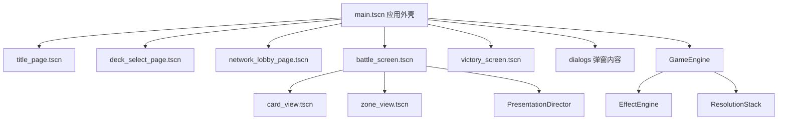
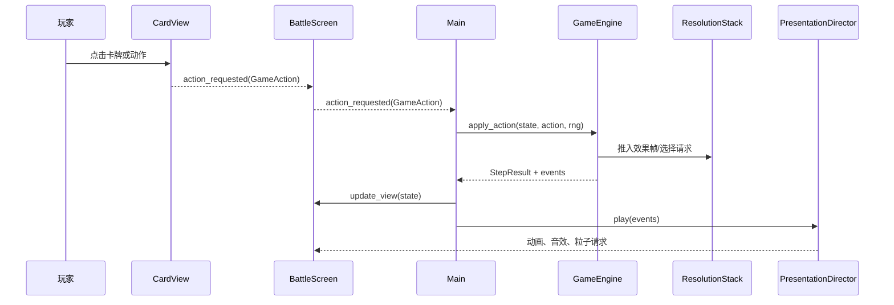
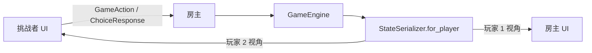

# Pokémon TCG Godot 4.7 新手开发手册

本手册面向会使用变量、函数、条件语句和数组，但没有 Godot 开发经验的维护者。
目标不是让你背下所有 API，而是让你能够在编辑器中安全地修改场景、UI、动画和
游戏逻辑，并知道每次修改后应该怎样验证。

> 项目使用 Godot 4.7。Godot 4 已经移除 VisualScript，因此复杂规则不会变成
> “拖节点编程”。本项目的分工是：场景树编辑结构，Inspector 编辑参数，
> AnimationPlayer 编辑固定时间轴，信号连接用户意图，GDScript 实现可测试的规则。

## 1. 第一次打开工程

在仓库根目录执行：

```powershell
.\tools\setup_godot_toolchain.ps1
.\.tools\godot-4.7\Godot_v4.7-stable_win64.exe --editor --path .\godot
```

工具链安装在 `.tools/`，不会修改系统 `PATH`。编辑器打开后，先认识四个区域：

- 左上角 Scene：当前场景的节点树。
- 左下角 FileSystem：工程文件，对应仓库中的 `godot/`。
- 中央 Viewport：可视化布局与动画预览。
- 右侧 Inspector：当前节点或脚本导出参数。

运行方式：

- `F6`：运行当前场景，适合单独调试页面或组件。
- `F5`：从 `main.tscn` 运行完整游戏。
- 点击停止按钮或按 `F8`：停止运行。

第一次建议在 FileSystem 中双击 `res://tools/ui_workbench.tscn`，再按 `F6`。
这是安全预览工作台，不会保存设置、创建网络房间或修改正式对局。


Workbench 顶部可以切换标题、选牌、网络、设置、选择、战斗和胜利页面；右侧按钮
可以单独触发抽牌、进化、攻击、伤害、击倒和胜利演出。它使用固定种子的预览状态，
不读取正式存档，也不会连接网络。

## 2. 工程地图



最常编辑的文件：

| 目的 | 场景或文件 |
|---|---|
| 应用背景、安全区、弹窗和加载层 | `scenes/main/main.tscn` |
| 标题与模式按钮 | `scenes/title/title_page.tscn` |
| 牌组选择 | `scenes/decks/deck_select_page.tscn` |
| 网络大厅 | `scenes/network/network_lobby_page.tscn` |
| 牌桌、固定牌位和 HUD | `scenes/battle/battle_screen.tscn` |
| 单张卡牌的显示结构 | `ui/card_view.tscn` |
| 牌库、弃牌和奖品区 | `ui/zone_view.tscn` |
| 设置、选择、隐私与暂停弹窗 | `ui/dialogs/` |
| 全局可编辑主题 | `ui/game_theme.tres` |
| 语义颜色和运行时样式 | `ui/design_tokens.gd` |
| 安全预览 | `tools/ui_workbench.tscn` |

节点上的 `editor_description` 会在 Inspector 中解释用途。标有“不要删除”的节点
是运行时和自动测试的稳定契约，可以移动或调样式，但不要随意改名。


上图左侧是 `card_view.tscn` 的静态节点契约，右侧是根节点导出的布局与交互参数。
编辑器中的卡牌文字是有意义的占位内容，运行时会由 `configure(...)` 注入真实数据。

## 3. 节点、场景和实例

节点是一个功能单元，例如 `Label`、`Button`、`TextureRect`。场景是一棵可保存、
可复用的节点树。一个场景可以实例化另一个场景：

- `battle_screen.tscn` 实例化了固定的 `CardView` 和 `ZoneView`。
- 动态手牌也实例化 `card_view.tscn`，但数量取决于实时手牌。
- `main.gd` 根据页面状态实例化标题、选牌、战斗或胜利场景。

修改复用组件时要记住：修改 `card_view.tscn` 会影响场上宝可梦、手牌和选择弹窗。

### Container 与锚点

`VBoxContainer`、`HBoxContainer` 和 `MarginContainer` 会自动排列子节点。放在
Container 里的控件，不要主要依赖手工坐标；应修改：

- `custom_minimum_size`
- `size_flags_horizontal` / `size_flags_vertical`
- Container 的 `separation`
- MarginContainer 的四边 margin

牌桌中的固定牌位位于普通 `Control` 下，运行时由 `BattleScreen._layout_board()`
根据窗口尺寸定位。场景中的坐标用于编辑器预览，真正运行时尺寸由 Inspector 中的
`Table Layout` 参数控制。

## 4. 第一个练习：修改标题页

1. 打开 `res://scenes/title/title_page.tscn`。
2. 在 Scene 树中选择 `TitleLabel`。
3. 在 Inspector 修改 Text、字体大小或颜色。
4. 选择 `TitlePanel`，修改最小尺寸或 StyleBox。
5. 按 `F6` 查看结果。
6. 再运行 `ui_workbench.tscn`，检查标题页在预览框中的效果。

如果希望让文字成为脚本可配置参数，选择根节点 `TitlePage`，查看
`Editable Copy` 分组。它来自：

```gdscript
@export_category("Editable Copy")
@export var game_title := "宝可梦卡牌对战"
@export var subtitle := "真实卡图 · 原生规则 · 离线 AI · 跨平台联机"
```

`@export` 会把普通脚本变量暴露到 Inspector。适合导出的内容包括尺寸、间距、
动画速度和默认文字；不要导出规则状态或网络密钥。

## 5. 修改卡牌与牌桌

### CardView

打开 `ui/card_view.tscn` 可以看到：

- `Shadow`：卡牌阴影。
- `Frame/Image`：边框与卡图。
- `InfoPanel`：场上宝可梦的名称、HP 和能量摘要。
- `StatusRow`：运行时生成中毒、灼伤等状态徽章。
- `TargetGlow`：合法目标高亮。
- `SelectionRing`：选中状态。
- `ActionOverlay`：卡牌上的上下文动作按钮。
- `AnimationPlayer`：选中脉冲和合法目标脉冲时间轴。

卡图、HP 和状态不是写死在场景中的。控制器调用：

```gdscript
card_view.configure(card_id, pokemon_state, hidden, hand_index, player, slot)
```

静态结构在场景中编辑，动态数据在脚本中绑定。这是本项目最重要的 UI 模式。

### BattleScreen

打开 `scenes/battle/battle_screen.tscn`，可以直接看到：

- 双方战斗区和五个备战位。
- 双方牌库、弃牌、奖品和竞技场。
- 手牌滚动区域。
- 回合阶段、详情和行动日志。
- 表现效果层与输入遮挡层。

选择根节点后，Inspector 的 `Table Layout` 可以修改：

- HUD 宽度。
- 战斗宝可梦尺寸。
- 备战宝可梦尺寸和间距。
- 牌区尺寸。
- 手牌尺寸、最小重叠间距和扇形角度。

`Presentation` 分组还可以修改动态飞牌的最低弧线、距离比例、错峰高度、错峰时间，
以及主要/次要操作按钮的触控高度。`PresentationDirector` 节点则暴露电影、标准、
快速和减少动画四档速度。保持默认值即可获得当前节奏；修改后应重跑截图回归。

修改后运行 Workbench 的“战斗场景”，同时观察 16:9 与超宽屏截图，避免只在
自己的窗口尺寸上看起来正确。


## 6. 信号：让 UI 报告用户意图

页面不应直接启动规则或网络。它只发出信号：

```gdscript
signal mode_selected(mode: String)

func _ready() -> void:
    %LocalTwoPlayerButton.pressed.connect(mode_selected.emit.bind("local"))
```

`Main` 实例化页面后接收信号：

```gdscript
var page := TITLE_SCENE.instantiate() as TitlePage
screen_host.add_child(page)
page.mode_selected.connect(_show_deck_select)
```

推荐的数据方向：

```text
Main.configure(page)  -> 页面显示数据
用户点击              -> 页面发出信号
Main 接收信号         -> 调用规则、AI 或网络
Main.update_view()    -> 页面重新显示状态
```

不要在 Button 脚本里直接修改 `GameState`。这样才能保证本地、AI 和联网模式使用
同一套规则。

## 7. AnimationPlayer 与 Tween

使用 AnimationPlayer 的场景：

- 页面淡入。
- 弹窗打开。
- 卡牌选中脉冲。
- 胜利面板入场。
- 固定节点上可反复预览的动画。

在底部切换到 Animation 面板，选择 `enter`、`modal_open`、`modal_close`、
`selected_pulse` 或 `target_pulse`，即可移动关键帧、修改时长和缓动。`RESET`
动画保存编辑器和运行时的默认值，不要轻易删除。


`target_pulse` 只负责合法目标的固定呼吸效果；目标是否合法仍由规则结果决定。
不要在动画轨道中写规则状态、调用伤害逻辑或切换当前玩家。

使用 Tween 的场景：

- 抽牌从实时牌库位置飞向实时手牌位置。
- 根据当前目标计算的攻击、换位和击倒轨迹。
- 浮动伤害、动态镜头冲击。

判断方法：动画目标在编辑时已知，用 AnimationPlayer；必须读取实时对局坐标，
用 Tween。

减少动画模式下不要强制播放时间轴。代码应检查：

```gdscript
if not AppSettings.reduced_motion:
    animation_player.play("enter")
```

## 8. 一次点击如何进入规则引擎



核心类型：

- `GameAction`：玩家要做什么以及来源、目标。
- `StepResult`：动作是否成功、提示、待处理选择和表现事件。
- `ChoiceRequest` / `ChoiceResponse`：复杂效果中的显式选择。
- `GameState`：完整规则状态。
- `ResolutionStack`：可序列化的效果与继续执行帧。

`GameEngine.apply_action()` 会先保存 `state.snapshot()`。动作失败时恢复快照，因此
UI 不能在调用规则前自行移动卡牌或扣除资源。

## 9. EffectEngine 与嵌套选择

卡牌效果由 `EffectEngine` 根据 `effect_type` 分派。典型流程：

1. 训练家卡或招式把效果帧推入 `ResolutionStack`。
2. `EffectEngine` 处理栈顶效果。
3. 如果需要玩家选择，生成 `ChoiceRequest` 并暂停。
4. UI 展示 `choice_panel.tscn`。
5. `GameEngine.apply_choice()` 验证 request ID 和选项。
6. 结算栈继续执行，直到为空或出现下一次选择。

结算栈必须可序列化，因为它用于：

- 动作失败回滚。
- 联机状态同步。
- 嵌套选择。
- AI 模拟。

新增效果时不要保存 Callable、匿名回调或节点引用。应保存字符串操作名、实体引用和
普通 Dictionary/Array 数据。

### 隐藏信息

`StateSerializer.for_player()` 负责玩家视角：

- 自己的手牌身份可见。
- 对手手牌只显示数量。
- 双方牌库顺序和奖品身份不可见。

表现事件还会经过 `PresentationEvent.for_player()`。新增抽牌、搜索或奖品动画时，
必须测试事件中没有泄漏隐藏卡牌 ID。

## 10. AI 与联机

AI 通过 `AICoordinator` 在线程中运行。主线程只提交可序列化请求并轮询结果：

```text
Main -> AICoordinator.start(request)
后台 Thread -> Challenge/Deep AI
Main._process() -> poll_result()
Main -> GameEngine.apply_action/apply_choice()
```

不要把 Node、Texture 或其他 Godot 场景对象传入 AI 线程。Deep AI 模型不可用时，
运行时会回退到 Challenge AI，并在 UI 中显示原因。

联机采用房主权威：



客户端不能提交伤害、抽牌结果、随机数或完整状态。UI 改造不得绕过
`NetworkMatchController.submit_action()` 和 `submit_choice()`。

## 11. 新增卡牌或效果

`godot/data/*.json` 是生成文件，不要直接修改。权威数据仍在 Python 工程。

推荐流程：

1. 在 Python 数据与规则中加入卡牌或效果。
2. 为 Python 行为补测试。
3. 如有新 `effect_type`，在 Godot `EffectEngine` 增加相同语义。
4. 更新规则黄金 fixture。
5. 导出 Godot 数据：

```powershell
.\.tools\python311\python.exe -B .\python\scripts\export_godot_data.py
```

6. 检查生成数据是否同步：

```powershell
.\.tools\python311\python.exe -B .\python\scripts\export_godot_data.py --check --skip-images
```

7. 运行 Godot、AI 和网络回归。

新效果至少测试：

- 合法动作是否正确出现。
- 非法目标是否被拒绝。
- 选择的最小/最大数量。
- 取消时是否恢复动作前快照。
- 联机视角是否泄漏隐藏信息。
- AI 是否能完成选择。
- 表现事件是否只描述结果，不修改规则。

## 12. 调试方法

### 断点

在脚本编辑器行号左侧点击设置断点。推荐断点：

- `Main._execute_action()`
- `GameEngine.apply_action()`
- `GameEngine.apply_choice()`
- `EffectEngine` 对应效果分支
- `BattleScreen.update_view()`

运行后查看 Debugger 的 Variables、Stack Trace 和 Errors。


### 远程场景树

游戏运行时，Scene 面板顶部从 Local 切换为 Remote，可以查看真实节点：

- 动态手牌是否持续累积。
- 弹窗关闭后内容是否释放。
- 表现效果和飞行卡牌是否清理。
- 当前页面是否只有一个实例。

### 常见问题

| 症状 | 优先检查 |
|---|---|
| 编辑器能看到，运行时消失 | `visible`、Container 尺寸、脚本是否覆盖属性 |
| 控件位置不听拖拽 | 它是否位于 Container 下 |
| `%NodeName` 为 null | 是否删除或重命名了唯一节点；是否在 `_ready()` 前访问 |
| 点击没有反应 | Button 信号是否连接；遮挡层的 mouse filter |
| 动作完成但画面没更新 | 是否调用 `BattleScreen.update_view()` |
| 动画重复播放 | Presentation event ID 是否去重 |
| 联机显示错误卡牌 | `StateSerializer.for_player()` 和事件可见性 |

本项目部分页面会在 `_ready()` 前调用 `configure()`。对应脚本使用显式
`get_node()` 解析关键节点，避免仅依赖尚未赋值的 `@onready`。

## 13. 测试、截图与构建

日常修改至少执行：

```powershell
.\tools\test_godot.ps1
```

涉及 AI、规则或网络时执行：

```powershell
.\tools\test_godot_ai.ps1
.\tools\test_godot_network.ps1
```

生成固定 UI 截图需要图形渲染器，不能使用 dummy headless：

```powershell
.\.tools\godot-4.7\Godot_v4.7-stable_win64.exe `
  --path .\godot `
  --script res://tests/ui_preview.gd
```

截图输出到 `build/ui-preview/`，包括标题、网络、设置、选牌、隐私交接、16:9、
20:9、复杂选择、战斗动画、胜利页和 Workbench。截图用于检查遮挡、溢出和布局，
不能代替 Android 真机帧率测试。

本手册使用的稳定图片位于 `docs/images/godot-guide/`。修改场景结构或动画面板后，
应重新生成运行时截图，并在 Godot 4.7 编辑器中更新对应界面截图；不要直接引用
会被清理的 `build/ui-preview/` 文件。

Windows 与 Android 调试构建：

```powershell
.\tools\build_godot.ps1 -Target all -Configuration debug
.\tools\smoke_godot_build.ps1
```

发布前执行：

```powershell
.\tools\package_release.ps1 -AndroidSigning test
.\tools\test_release.ps1
```

## 14. 建议的学习路线

按顺序完成以下练习：

1. 修改标题文字和按钮高度。
2. 调整牌组选择页的两栏间距。
3. 修改 `game_theme.tres` 的按钮圆角。
4. 在 `CardView` Inspector 中调整选中抬升高度。
5. 编辑标题页 `enter` 动画。
6. 给 TitlePage 增加一个只发信号的新按钮。
7. 在 Workbench 中加入一个新的样例表现事件。
8. 跟踪一次 `GameAction` 到 `StepResult`。
9. 阅读一个简单 EffectEngine 分支并补测试。
10. 在不改规则的前提下，为一个表现事件增加动画。

每完成一步都运行 `test_godot.ps1`。这种节奏略显谨慎，但它能让你大胆试验，而不必
担心一处 UI 修改悄悄破坏 AI、联机或隐藏信息。
