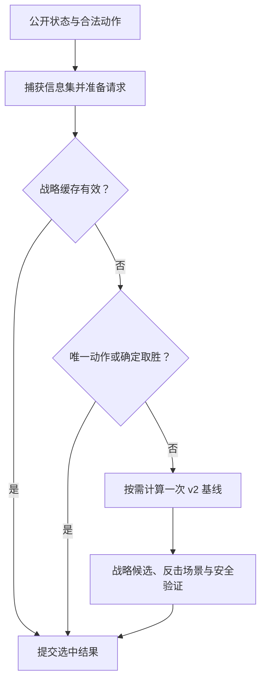

# 传统 AI 架构精简与验证

修改前基线：`52d094b93cdf2f29a25672d545f871ed3edb225a`。
目标是保持出牌行为，删除重复计算和重复实现。游戏继续默认使用
`strategic_intent_v3`，原生接口仍支持 `turn_beam_v2`，搜索深度、采样数量、评分权重和规则协议保持不变。

## 架构与删减依据

Godot 的 `AICoordinator` 负责异步任务和取消，`ChallengeAIClient` 是原生绑定适配器；
`ChallengeController` 负责公开信息、跨动作记忆和决策提交；搜索、战术与选择策略由
`challenge_core` 提供，所有模拟均经过 `ptcg_core` 的权威规则。

原来的 v3 每次先递归执行完整 v2，再检查战略缓存；为了撤回未采用的结果，还复制并回滚整张
计划缓存和防循环记录。现在默认路径为：



具体删除与合并：

- 取消控制器递归和整表回滚。计划消费、替换与删除按条目暂存，采用相应结果时提交；旧回退继续保留其缓存和防循环行为。
- 有效战略缓存、唯一合法动作和已证明的直接胜利不再触发旧策略计算。
- 固定序列回放按稳定动作签名匹配合法动作，删除用于匹配时无贡献的全量评分和排序。
- 相同旧方案的反击与恢复场景按原采样编号惰性复用，缓存只存在于一次决策内；最差样本提前淘汰条件保持不变。
- 真实选牌和模拟选牌共用一套类型化分派；共享单步规则模拟、随机事件识别和结果序列化。
- 清理未使用的推理参数、冗余引擎常量、未引用结构和只写字段。

仍然保留 v2 比较/回退、完整序列安全验证、已知手牌和奖赏记忆、防循环保护。
这些部分会影响合法性或出牌选择，本轮没有将它们视为无意义策略删除。

## 代码规模

按实际源文件行数统计，包含空行和新增共享头文件，排除测试、文档、研究工具及二进制：

| 生产代码 | 修改前 | 修改后 | 净减少 |
| --- | ---: | ---: | ---: |
| 原生传统 AI C++ | 19,902 | 19,700 | 202 |
| Godot AI 适配层 | 620 | 616 | 4 |
| 合计 | 20,522 | 20,316 | 206 |

## 行为验证

- 原生策略与信息集：109 个场景通过。
- 完整控制器：10 项专项测试通过，覆盖战略接管、缓存消费/失效、已知手牌变化、非递增版本、取消恢复、换局、旧回退和诊断防循环记录。
- 研究、Arena、IPC 和公平性：原有 50 项测试通过；其中构建校验要求当前 Agent 与真实源码哈希一致，测试入口现在会先刷新该 Agent。
- Godot：十套牌完整对局回归及原生规则会话契约通过。
- Windows x86_64、Android ARM64 的调试和发布原生库均编译通过，仓库中的四份运行库已同步。
- 源码边界、产品边界和 `git diff --check` 通过。

逐决策审计使用两个外部 Agent，每次提供相同公开请求并只执行基线动作；检查第一处分歧，
避免后续随机局面掩盖变化。双方每个座位分别持有控制器，信息可见性、搜索预算和种子一致。

| 引擎 | 完整对局 | 动作与选牌核对 | 差异 | 基线节点 | 当前节点 |
| --- | ---: | ---: | ---: | ---: | ---: |
| strategic_intent_v3 | 10 | 1,459 | 0 | 523,082 | 522,379 |
| turn_beam_v2 | 10 | 1,498 | 0 | 499,834 | 499,834 |

共 2,957 次核对未发现动作或选牌差异。计入实际工作量的搜索诊断哈希允许变化。

## 配对对局与耗时

最终构建与冻结基线进行了 160 局 `pr` 配对评估：双方均为 v3、节点配置 192、信念样本配置 3，
采用 `implementation-only`，对局间 8 个 worker、每次搜索 1 个 worker。

- 胜/负/平：80 / 80 / 0；得分率 0.500。
- 配对置信区间：[0.500, 0.500]；这是有限样本结果，不作为棋力提升声明。
- 非法动作、非法选牌、控制器/规则错误、截断、持续超时均为 0。
- 搜索 P95 比值：当前/基线 = 0.959。
- 总报告节点：3,817,281 → 3,808,683。

| 决策阶段 | 基线 P50 ms | 当前 P50 ms | 基线 P95 ms | 当前 P95 ms |
| --- | ---: | ---: | ---: | ---: |
| 搜索 | 637.182 | 633.753 | 2593.048 | 2486.180 |
| 强制/确定动作 | 93.364 | 92.084 | 1447.675 | 1446.572 |
| 缓存命中 | 44.185 | 31.465 | 233.795 | 226.851 |
| 真实选牌 | 14.453 | 14.429 | 33.125 | 33.674 |

耗时来自同机并行验证负载，受调度和硬件影响。强制动作和缓存阶段仍包含 v2 回退的保护检查，
并非所有缓存命中都属于可直接跳过旧策略的 v3 战略缓存。

另一个受控的“附能 → 攻击”案例中，第二步命中战略缓存：两版均选择同一攻击，
旧搜索节点由 1 降为 0，
耗时 9.422 ms → 3.280 ms。该案例用于验证执行路径，单次耗时不代替上述分位数。

## 复现与证据

冻结基线声明位于 `research/deep_ai/arena/baselines/challenge_pre_simplification.json`。
常规检查使用 `tools/test_challenge_core.ps1`、`tools/test_godot_ai.ps1` 和
`research/deep_ai/tools/test_research_smoke.ps1`。

```powershell
.\research\deep_ai\tools\run_challenge_arena.ps1 `
    -Preset pr -Baseline challenge_pre_simplification `
    -CandidateEngine strategic_intent_v3 -BaselineEngine strategic_intent_v3 `
    -ComparisonMode implementation-only -Workers 8 `
    -Output build\challenge-arena\simplification-verification
```

逐决策工具为 `research/deep_ai/scripts/compare_challenge_decisions.py`，接受
`--baseline`、`--candidate` 两个 Agent 构建清单、`--engine` 和 `--output`，默认覆盖十套牌。

本次本地原始证据位于 `build/ai-simplification/`：
`final-pr/arena-summary.json`、`final-pr/arena-manifest.json`、`final-pr/arena-games.jsonl`、
`final-parity-v3/summary.json`、`final-parity-v2/summary.json`、`cache-proof/summary.json`。
Arena 运行指纹：`0b546462a41ec8cd6b7633a09caf2280d8eeb29367dc03862a6b8a593ff53538`。
中间构建的冒烟测试和已停止的中间批次不计入上述最终 160 局结果。
